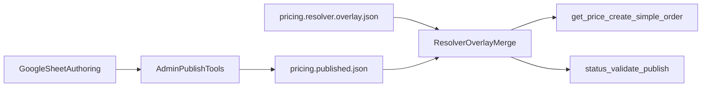

# Riders Pricing Architecture

## Runtime Model

The long-term Riders pricing runtime is:

- Served from `pricing.published.json`
- Extended at runtime by `pricing.resolver.overlay.json`
- Loaded by `delivery/plugins/riders-tools/index.ts`
- Exposed to customers through `get_price` and `create_simple_order`

Google Sheets is still used for authoring and publishing, but it is not the preferred live serving source anymore.



## Source Of Truth

### `pricing.published.json`

`delivery/workspaces/riders/data/pricing.published.json`

- Canonical published area catalog
- Stable runtime pricing snapshot
- Safe rollback target
- Output of the publish flow from structured admin input or Google Sheet normalization

### `pricing.resolver.overlay.json`

`delivery/workspaces/riders/data/pricing.resolver.overlay.json`

- Curated alias and ambiguity metadata
- Pricing groups for same-price/same-governorate area families
- Safe direct aliases for common shorthand
- Geo hints for grouped booking alignment

Do not use the overlay to guess broad areas that should remain ambiguous. If a customer phrase can reasonably refer to multiple places, route it to a clarification prompt instead.

## Resolver Precedence

The runtime now lets curated resolver metadata override raw exact-name matches when needed. This is intentional so operator-defined ambiguity rules such as `الوفرة` and `سعد العبدالله` can force clarification even if the published catalog contains an exact row with that same text.

High-level matching order:

1. Resolver metadata
2. Exact published row match
3. Canonicalized published row match
4. Legacy fuzzy / embedding fallback

## Operator Workflow

### Validate Current Runtime

Use these admin tools first:

- `admin_pricing_source_status`
- `admin_validate_pricing_resolver_overlay`

Expected healthy state:

- `source_mode = published_preferred`
- `active_source = published_snapshot`
- `pricing_resolver_overlay.state = active`

### Publish Pricing Changes

Preferred workflow:

1. Update the Google Sheet or prepare a structured snapshot payload.
2. Dry-run one of:
   - `admin_publish_pricing_sheet_rows`
   - `admin_publish_pricing_snapshot`
3. Validate the overlay with `admin_validate_pricing_resolver_overlay`.
4. Publish live.
5. Re-check `admin_pricing_source_status`.

### Cache Behavior

- Published writes clear the in-memory pricing cache.
- `admin_refresh_pricing_cache` remains available as an explicit operator refresh step.
- The overlay path is part of the cache key, so overlay changes are picked up after cache refresh or process restart.

## Deployment And Rollback

Deployment is performed by `delivery/scripts/deploy.sh`.

It now:

- Deploys `pricing.published.json`
- Deploys `pricing.resolver.overlay.json`
- Persists `RIDERS_PRICING_RESOLVER_OVERLAY_PATH`
- Defaults live pricing to `published_preferred`
- Backs up live pricing data before overwrite under `/opt/riders-delivery/backups/<timestamp>/`

Rollback procedure:

1. Restore the previous `pricing.published.json` and `pricing.resolver.overlay.json` from the latest backup directory.
2. Restart `riders-delivery`.
3. Run `admin_pricing_source_status` and a focused pricing smoke.

## Release-Candidate Test Path

Preferred RC command:

```bash
npm test --prefix /Users/azizalmulla/Desktop/claw/delivery/plugins/riders-tools
```

Equivalent direct runner:

```bash
node /Users/azizalmulla/Desktop/claw/delivery/scripts/run-pricing-rc-suite.mjs
```

The RC suite covers:

- config alignment
- overlay status / validator behavior
- published resolver behavior
- local resolver / geo / admin smokes
- published snapshot pricing transcript checks

## Go-Live Blockers

These are still treated as live-cutover blockers:

- Production Google Sheets auth must move away from ad hoc `gog` operator auth to dedicated production credentials or be formally quarantined from production use.
- Destructive live smoke must be run only against a dedicated test account/number.
- Logs and monitoring must be reviewed during the final cutover window.
- The live deploy decision remains separate from release-candidate readiness.

Use `PRICING_GO_LIVE_CHECKLIST.md` during the actual cutover window.
