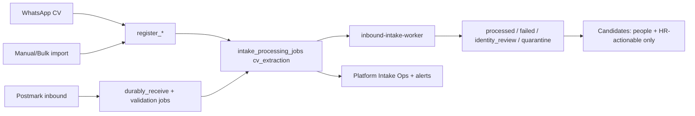

# CV Intake Canonical Queue and HR Visibility Hardening

**Date:** 2026-07-27 (UTC)  
**Stamp:** `20260727T151811Z`  
**Host:** `root@76.13.63.68`  
**Evidence:** `/opt/wathefni/var/evidence/cv-intake-canonical-harden-20260727T151811Z/`  
**Dashboard asset:** `dashboard-20qNbk2Q.js`  
**Concurrency:** unchanged (`WATHEFNI_INTAKE_TENANT_CONCURRENCY=1`, worker `--limit 1`)  
**Legacy prehire timer:** remains **disabled** (no second path)

---

## Final PASS / FAIL

| Gate | Result |
|---|---|
| One canonical durable queue (no competing prehire drain restored) | **PASS** |
| WA / manual / import enqueue durable `cv_extraction` (idempotent) | **PASS** |
| Durable receive refuses zero-job durable commits | **PASS** |
| Known orphans reconciled | **PASS** |
| `processed` / ready held not HR attention | **PASS** (`attention_count=0`) |
| Queued/processing invisible to normal HR attention | **PASS** |
| Intake Operations hidden from normal HR (API 403 + nav gate) | **PASS** |
| Platform support can open Intake Operations | **PASS** |
| Platform monitoring + real delivery (Postmark + journal) | **PASS** |
| Stuck/orphan alerts proven before reconcile cleared them | **PASS** |
| Replay/idempotency for extraction enqueue | **PASS** |
| Health 200 | **PASS** |
| Rollback artifacts retained | **PASS** |
| Concurrency not raised | **PASS** |
| Claim bug (`metadata` column) fixed so jobs complete | **PASS** |

**Verdict: PASS**

---

## Before / after architecture

### Before
- Email: durable `intake_processing_jobs` (correct).
- WhatsApp / manual / bulk import: set `pending_async_processing` and relied on **disabled** `wathefni-prehire-cv-process.timer`.
- Durable submissions could exist historically with **zero jobs**.
- Wave 3 claim path wrote `intake_processing_jobs.metadata` which **did not exist** → claim transaction aborted → workers reported `lease_lost` and jobs never completed.
- HR banner counted queued/processing and mapped `processed` → queued.

### After
- **Canonical path:** accepted CVs enqueue idempotent durable jobs (`candidate-document:{id}:extract`) on the same Postgres leased queue, or reach an explicit terminal/held state (e.g. identity review).
- **No** restoration of legacy prehire CV timer.
- `durably_receive_postmark` asserts ≥1 job before durable commit.
- Claim stamps `metadata` safely (column added + savepoint).
- HR attention = actionable only; Intake Ops = platform support only.
- Ops monitor delivers via **Postmark email** + **journal CRITICAL** (Healthchecks URL optional).



---

## Known-record reconciliation

| Record | Before | Action | After |
|---|---|---|---|
| `…837eb9b1…` | `processed` + `needs_role` (valid general candidate) | Verify only | Still `processed` / `needs_role`; **ready_held**; not attention |
| `…06ffffc3…` | `pending_async_processing` despite `candidate_documents.extraction_status=ok` | Sync flags from trustworthy docs (no re-OCR) | `processed`; **ready_held** |
| `f01ed86e-…` | `durable` + **0 jobs**; doc `scan_pending` | Idempotent enqueue `intake_validation` → worker drain | Jobs completed; status **`identity_review_required`** (open review; explicit hold) |

Residue after harden:

| Check | Count |
|---|---|
| `pending_async_processing` apps | **0** |
| Durable/receiving submissions with zero jobs | **0** |
| Active intake jobs | **0** |
| HR `attention_count` | **0** |

Evidence: `reconcile-report.json`, `worker-drain-fixed.json`, `attention-after.json`.

---

## HR attention rules

`unified_candidates.intake_operations_summary`:

**Never attention:** queued, pending, processing, retrying, waiting_*, `pending_async_processing`, ready/processed held general candidates.

**Attention only:** incomplete extraction, failed/dead letter, unsupported/unreadable, password-protected, quarantined/malware.

Candidates banner renders **only when** `attention_count > 0`.  
For normal HR, banner has **no** Intake Ops deep-link.

---

## Access-control behavior

| Actor | Bootstrap `is_platform_admin` | `/intake-operations` | `/attention` | Nav Intake Operations |
|---|---|---|---|---|
| Platform admin phone (`96599338566`) | `true` | **200** | 200, `intake_ops_visible: true` | Visible |
| Normal HR owner (`66363363`) | `false` | **403** `platform_support_only` | 200, `intake_ops_visible: false`, count 0 | Hidden |

Evidence: `api-access-proof.json`.

Gate: `WATHEFNI_PLATFORM_ADMINS` via `context_is_platform_admin` / access payload flag (not `candidate.import`).

---

## Monitoring and alert delivery

Enhanced `/opt/wathefni/orchestrator/ops/inbound-ops-monitor.py`:

**New/covered alerts:** pending job too old; running beyond SLA; stuck `pending_async_processing`; durable submission without jobs; intake timer inactive; orchestrator inactive; queue depth high; dead letters; repeated OCR failures; repeated CK failures; legacy prehire timer active; existing malware/scan/isolation alerts.

**Delivery (proven, not JSON-only):**

1. **Postmark email** to `WATHEFNI_OPS_ALERT_EMAIL` on alert-set changes  
   - Proof: `message_id=3f80ab3e-a283-43f0-85cd-a882bf942b4a`, `error_code=0`
2. **syslog CRITICAL** via `logger -t wathefni-inbound-ops-monitor`  
   - Proof: journal lines for `stuck_pending_async_processing` and `durable_submission_without_jobs` at `15:19:23Z` (before reconcile cleared them)
3. Local `latest.json` / `alerts.latest.json` / `ALERT_ACTIVE` retained as evidence
4. Optional `WATHEFNI_OPS_ALERT_HEALTHCHECK_URL` (not configured yet; Postmark+journal are active)

Audience field: `platform_operations` — never candidate messaging, never HR UI.

---

## Production proof checklist

| Proof | Evidence |
|---|---|
| Health 200 before/after | `health-before.json`, `health-final.json` |
| Attention 0 / ready_held 2 | `attention-after.json` |
| HR 403 / platform 200 | `api-access-proof.json` |
| Dashboard hides Intake Ops for non-admins | `dashboard-20qNbk2Q.js` contains platform-only copy + `is_platform_admin` |
| Monitor caught orphans then cleared | `monitor-journal-stuck-proof.txt` → later metrics `stuck_pending_async_count=0`, `durable_submissions_without_jobs=0` |
| Postmark delivery | monitor `delivery.postmark.ok=true` |
| Idempotent enqueue | reconcile `idempotency_proof` + existing completed job key reuse |
| Claim/metadata fix | `worker-drain-fixed.json` completed validation/scan/identity |
| Concurrency unchanged | `TENANT_CONCURRENCY=1`; prehire timer disabled |
| Backups | `$EVIDENCE/backup/*`, `$EVIDENCE/dashboard-prev/` |

---

## Rollback

```bash
EVIDENCE=/opt/wathefni/var/evidence/cv-intake-canonical-harden-20260727T151811Z
systemctl stop wathefni-orchestrator.service
cp -a $EVIDENCE/backup/app.py /opt/wathefni/orchestrator/app.py
cp -a $EVIDENCE/backup/unified_candidates.py /opt/wathefni/orchestrator/unified_candidates.py
cp -a $EVIDENCE/backup/unified_candidates_routes.py /opt/wathefni/orchestrator/unified_candidates_routes.py
cp -a $EVIDENCE/backup/durable_email_ingress.py /opt/wathefni/orchestrator/durable_email_ingress.py
cp -a $EVIDENCE/backup/inbound-ops-monitor.py /opt/wathefni/orchestrator/ops/inbound-ops-monitor.py
rm -rf /var/www/wathefni-dashboard
mkdir -p /var/www/wathefni-dashboard
rsync -a $EVIDENCE/dashboard-prev/ /var/www/wathefni-dashboard/
systemctl start wathefni-orchestrator.service
# Optional: drop metadata column only if no dependents require it
curl -fsS http://127.0.0.1:8010/health
```

Reconciled application/submission row updates are data fixes; reverse only with an explicit ops decision (do not auto-rollback candidate truth).

---

## Remaining limitations

1. **Identity reviews** (including `f01ed86e` open review) remain platform-ops alerts; not auto-closed.
2. **Healthchecks ops URL** not yet provisioned; Postmark+journal are the live delivery path.
3. **Parallelism** still intentionally serial (`concurrency=1`); not raised in this task.
4. WhatsApp/manual malware path is not identical to email ClamAV envelope; they share the durable extraction job after attach.
5. `open_identity_reviews` alert stays noisy until reviews are worked; that is intentional platform signal.

---

## Exact code / config changes

- `wathefni-orchestrator/app.py` — `ensure_application_cv_extraction_job`, register enqueue, cv_extraction without intake safety when application-attached, `context_is_platform_admin`, access `is_platform_admin`
- `wathefni-orchestrator/durable_email_ingress.py` — durable-without-jobs guard; `metadata` column; claim savepoint
- `wathefni-orchestrator/unified_candidates.py` — HR attention math
- `wathefni-orchestrator/unified_candidates_routes.py` — platform-only Intake Ops
- `wathefni-orchestrator/ops/inbound-ops-monitor.py` — thresholds + Postmark/journal delivery
- `wathefni-orchestrator/ops/reconcile-cv-intake-orphans.py` — one-shot reconcile
- Dashboard: hide Intake Ops; banner only when actionable; optional `onOpen`

---

## Stop

Hardening complete. No concurrency raise. No Candidate profile work. No color changes.
