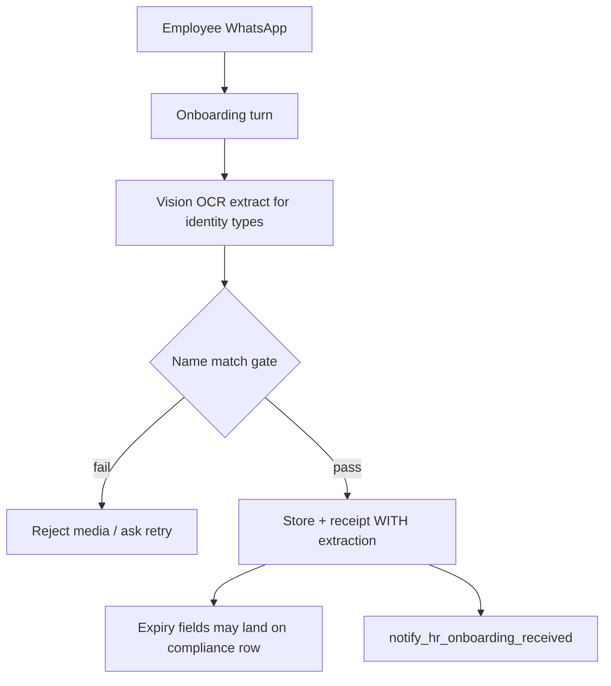
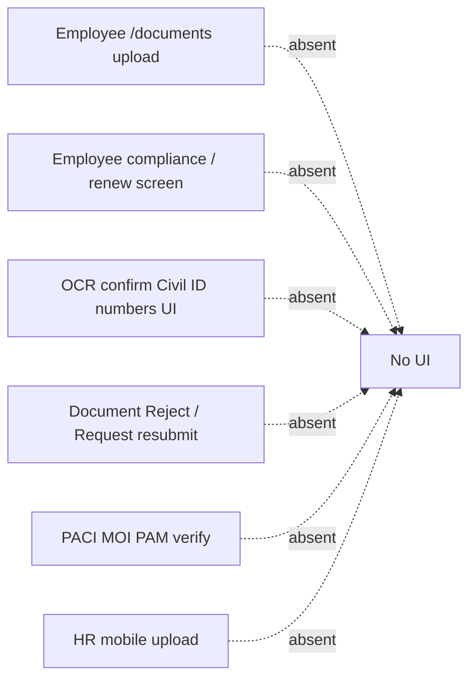

# Employee Document Journey Verification

**Date:** 2026-07-25  
**Mode:** read-only product verification — **no code changes, no deploy, no implementation**  
**Authority inspected:** live production orchestrator (`root@76.13.63.68` · health 200), `apps/wathefni-employee-mobile`, `apps/wathefni-hr-mobile`, `apps/wathefni-dashboard`, `wathefni-orchestrator`  
**Production artifact context:** Kuwait first-client foundation green `73cccafd…` is live; this report evaluates the **document UX/API journey**, not foundation hire snapshots alone.

---

## Executive verdict

A real Kuwait client **cannot complete a full, governed document journey today** for all seven types end-to-end.

| Layer | Reality |
|---|---|
| Employee upload | **Only** Employee mobile **Onboarding** (`/onboarding` → Upload / Replace). **Not** Documents vault. **Not** a Compliance screen (capability reserved, no UI). |
| HR upload | **Dashboard only** (Onboarding, Compliance, Employee 360). HR mobile is **review/view only**. |
| HR review | Onboarding: Mark received / Waive. Compliance: **Mark reviewed** (needs_review only). **No Reject / Request re-upload** document action. |
| OCR | WhatsApp onboarding path can extract metadata. Employee-app and HR dashboard uploads **skip OCR**. Kuwait `stage_ocr_identity_value` / `confirm_identity_field` have **no product UI or HTTP routes**. |
| Expiry | Dashboard Compliance only. Employee app has **no** expiry/renewal UI. |
| “Verified” | Means **HR-reviewed / checklist received** — **never** PACI/MOI/PAM government verification. |
| Residence / work permit handoff | Seeded on onboarding template + compliance seed for Art.18, but live upload dual-write to `compliance_documents` **still omits** `residence` and `work_permit` (hardcoded allowlist). |

**Pilot readiness:** usable for **Civil ID + passport + employment contract via onboarding**, with HR dashboard tracking for some compliance types — **not** a complete upload→OCR-confirm→approve/reject→expiry→renewal product for all seven types.

---

## Verification method

| Method | Used |
|---|---|
| Trace reachable UI routes/components in employee, HR mobile, dashboard | Yes |
| Confirm live production route strings and dual-write allowlist in deployed `app.py` | Yes |
| Confirm production health | Yes (`200`) |
| Interactive synthetic upload/review against live tenants | **Not run** (would mutate production; no deploy/change window). Scenario outcomes below are **code-path verified** against the reachable APIs/UI. |

---

## Current journey diagrams

### A. Employee mobile onboarding upload (primary employee path)

```mermaid
flowchart TD
  A[Employee App Home] --> B["/onboarding"]
  B --> C{Item owner=employee and can_upload?}
  C -->|yes| D["Upload / Upload photo / Replace"]
  D --> E["POST /app/onboarding/documents"]
  E --> F[Store file under company employee docs]
  F --> G[Update onboarding_items → received]
  G --> H[employee_documents upsert]
  H --> I{Type in civil_id passport medical education_cert?}
  I -->|yes| J[compliance_documents → received]
  I -->|no| K[No compliance dual-write]
  J --> L[HR may see Compliance / Onboarding]
  K --> M[HR sees Onboarding checklist only]
  E --> N[extraction={} — no sync OCR]
```

### B. HR dashboard upload + compliance review

```mermaid
flowchart TD
  A[Dashboard Post-Hire] --> B["Onboarding | Compliance | Employees → profile"]
  B --> C["Upload / Replace DocumentUploadButton"]
  C --> D["POST /dashboard/posthire/employees/{key}/documents"]
  D --> E[Same receipt path as employee — extraction={}]
  E --> F{needs_review / missing_expiry / expiring / expired}
  F --> G["Mark reviewed — compliance.manage"]
  F --> H["Send reminder — WhatsApp/outbound to employee"]
  G --> I["status=valid renewal_status=reviewed"]
```

### C. WhatsApp onboarding media (parallel path, if channel enabled)



### D. What does **not** exist



---

## Exact screens and routes

### Employee mobile (`apps/wathefni-employee-mobile`)

| Surface | Route | Upload? | APIs |
|---|---|---|---|
| Onboarding checklist | `/onboarding` | **Yes** — Upload / Upload photo / Replace / Retry; picker Take photo / Photos / Browse Files | `GET /app/onboarding`, `POST /app/onboarding/documents` |
| Documents vault | `/documents` | **No** — View/share only | `GET /app/documents`, `GET /app/documents/{file_id}` |
| Compliance | — | **No screen** | `compliance_actions` capability documented as planning-only |

### HR mobile (`apps/wathefni-hr-mobile`)

| Surface | Route | Upload? | Actions |
|---|---|---|---|
| Onboarding queue | `/onboarding` | No | Open review |
| Onboarding detail | `/onboarding/{employeeKey}` | No | Review → mark received / waive |
| Document reviews | `/documents` | No | Opens only when `source === 'compliance'` |
| Document detail | `/documents/{employeeKey}/{documentType}` | No | Review (= mark compliance reviewed), preview/download |

### Dashboard (`apps/wathefni-dashboard`)

| Nav id | Label | Module gate | Upload | Review / reminders |
|---|---|---|---|---|
| `onboarding` | Onboarding | `onboarding` | Yes — Upload/Replace | Mark received, Waive, Send reminder |
| `compliance` | Compliance | `compliance` | Yes — Upload/Replace | Filters Expired / Expiring soon / Missing / Needs review / Valid; Mark reviewed; Send reminder; Remind all in view |
| `employees` → profile | Employees | workforce | Yes — Documents + Onboarding sections | Same actions as above on profile |

HR upload API: `POST /dashboard/posthire/employees/{employee_key}/documents`  
Requires: module `onboarding` + permission `onboarding.manage` + flag `WATHEFNI_DOC_UPLOAD`.

---

## Permission map

| Actor | Can upload | Can mark onboarding received/waive | Can mark compliance reviewed | Can send reminders | Can full-reveal Civil ID numbers (foundation) |
|---|---|---|---|---|---|
| Employee (own app) | Onboarding items only | No | No | No | No product UI |
| Dashboard owner / hr_manager | Yes (`onboarding.manage`) | Yes | Yes (`compliance.manage`) | Yes | Library perms exist; **not in ROLE_PERMISSIONS / no UI** |
| Dashboard viewer / manager | No manage | No | No | No | No |
| HR mobile with `document_review` | No | Onboarding review outcomes | Yes when `needs_review` | No dedicated remind UI | No |
| Unauthorized / other tenant | API tenant + self-scope / RBAC deny | Deny | Deny | Deny | Deny |

---

## Upload → review → expiry flow (shared)

1. **Upload** (employee onboarding app, HR dashboard, or WhatsApp media).  
2. **Store** under `WORKSPACE/data/companies/{COMPANY}/employees/{phone}/documents/{item_id}/` (or Drive if configured) + `file_registry` + `document_storage_operations`.  
3. **Onboarding item** → `received` (if checklist item).  
4. **employee_documents** → one current row per `document_type` (in-place replace).  
5. **compliance_documents** dual-write **only if** type ∈ `{civil_id, passport, medical, education_cert}` on **live production**.  
6. **OCR:** skipped for app/dashboard; optional on WhatsApp; foundation identity OCR **not productized**.  
7. **Review:** onboarding received/waive **or** compliance Mark reviewed (needs_review).  
8. **Expiry:** from OCR (WhatsApp/backfill) or HR-entered/compliance fields; scan classifies; HR digest + manual employee reminder.  
9. **Renewal:** replace file → overwrite current receipt row; old files may remain on disk by checksum; **no** first-class version timeline UI; reminders re-open when status returns to outstanding.

---

## Document-by-document matrix

Legend: ✅ reachable · ⚠️ partial · ❌ missing/broken for pilot

### 1. Civil ID

| Question | Answer |
|---|---|
| **1. Employee upload** | Employee mobile → **Onboarding** → item `civil_id` (“Civil ID”) → **Upload / Replace**. Required in Default Kuwait template. Not Documents vault. |
| **2. HR upload** | Dashboard Onboarding / Compliance / Employee 360 → **Upload/Replace**. Permission `onboarding.manage`. Same receipt path (no OCR). |
| **3. After upload** | File on disk/Drive; `onboarding_items.received`; `employee_documents`; **compliance dual-write yes**; OCR only if WhatsApp path; fields from app upload are **not** OCR-pending identity numbers. |
| **4. HR review** | Onboarding: Mark received / Waive. Compliance: Mark reviewed when `needs_review`. No Reject. Audit via action/outbound logs; no dedicated “document rejected” event. |
| **5. Expiry** | Warning **30 days**. Source: WhatsApp OCR / extract backfill / existing column — **not** employee-entered in app. Confirm = HR Mark reviewed for missing_expiry. Statuses: `missing` → `received` → `missing_expiry`/`needs_review` → `valid` / `expiring_soon` / `expired`. Reminder: HR digest + employee WhatsApp/outbound. Expired stays outstanding until replaced/reviewed. |
| **6. Legitimacy** | File type/size client checks (PDF/JPG/PNG/DOC ≤15MB). WhatsApp name-match OCR. **No PACI verify.** “Verified/reviewed” = **HR-reviewed only**. |
| **7. Renewal** | Replace overwrites current ED/CD row; prior file may remain on disk; new expiry restarts classification/reminders. |
| **8. Visibility** | Employee: onboarding chip received/rejected guidance; vault lists file; **no** expiry stages. HR: checklist + compliance buckets. Foundation Civil ID mask/reveal: **backend only**. |

**Working today:** ⚠️ onboarding + compliance track for file presence; OCR-confirm identity numbers ❌; employee expiry ❌.

### 2. Passport

| Question | Answer |
|---|---|
| **1. Employee upload** | Onboarding item `passport` (optional in template) → Upload/Replace. |
| **2. HR upload** | Same dashboard upload. |
| **3. After upload** | Dual-write to compliance **yes**. OCR WhatsApp only. |
| **4–8** | Same pattern as Civil ID; warning window **60 days**. |

**Working today:** ⚠️ same as Civil ID with longer warning.

### 3. Residence

| Question | Answer |
|---|---|
| **1. Employee upload** | Onboarding shows item `residence` (“Residence permit (Article 18 expats)”, **optional**). Employee i18n has **no** dedicated key → falls back to server label / “Employee document”. Upload works if item present. |
| **2. HR upload** | Dashboard can upload with `item_id=residence`. Sensitive-replace confirm set still lists `residency`/`iqama`, **not** `residence` (weaker confirm UX). |
| **3. After upload** | Onboarding + `employee_documents` yes. **Compliance dual-write: NO on live production** (allowlist omits `residence` despite `doc_type_map`). Art.18 compliance seed may create a **separate missing** residence row that upload does **not** update. |
| **4. HR review** | Onboarding mark only, unless a compliance row exists from seed/manual — then Mark reviewed. |
| **5. Expiry** | Intended 30 days on compliance — **broken handoff** if upload never updates compliance. Soft onboarding task `residency_expiry` is checklist UX, not synced. |
| **6–8** | No government verify. Employee sees generic label. Expat journey incomplete for expiry tracking. |

**Working today:** ⚠️ onboarding file receive · ❌ reliable compliance/expiry handoff · ❌ OCR confirm residence number UI.

### 4. Work permit

Same structure as Residence: optional onboarding item; **no** live dual-write to compliance; Art.18 seed can create orphan `missing` compliance row; 30-day window unused until handoff fixed.

**Working today:** ⚠️ / ❌ same as Residence.

### 5. Employment contract

| Question | Answer |
|---|---|
| **1. Employee upload** | Onboarding required `employment_contract` → Upload/Replace. |
| **2. HR upload** | Dashboard onboarding upload; often HR-owned `offer_letter` is separate. Foundation Arabic contract link is **hire snapshot upload metadata**, not this employee onboarding path. |
| **3. After upload** | Onboarding + `employee_documents` only. **Not** compliance-synced. No OCR expected for legal PDF in this path. |
| **4. HR review** | Mark received / Waive on onboarding — not compliance Mark reviewed. |
| **5. Expiry** | **Not** in compliance expiry engine. |
| **6. Legitimacy** | File type only; counsel approval is process outside product. |
| **7–8** | Replace overwrites receipt; employee sees onboarding complete for item; HR sees checklist. |

**Working today:** ✅ as onboarding file checklist · ❌ not a compliance/expiry document · foundation Arabic contract path is separate (snapshot-linked), not the employee app contract item.

### 6. Medical certificate

| Question | Answer |
|---|---|
| **1. Employee upload** | **Not** in Default Kuwait document checklist. Template has HR task `medical_check`, not an employee document item. Employee cannot upload unless custom template adds it. |
| **2. HR upload** | Dashboard Compliance/Documents can upload with `item_id=medical` → dual-write **yes**. |
| **3–8** | Compliance track possible via HR upload; employee self-serve ❌; OCR type supported in extractor but dashboard skips OCR. |

**Working today:** ⚠️ HR-driven compliance only · ❌ employee journey.

### 7. Education certificate

| Question | Answer |
|---|---|
| **1. Employee upload** | **Absent** from Default Kuwait template. |
| **2. HR upload** | Possible as `education_cert` → dual-write **yes**. |
| **3–8** | Same as medical — HR-only unless template customized. |

**Working today:** ⚠️ HR-driven only · ❌ default employee journey.

---

## Scenario matrix (code-path verified)

| Scenario | Expected reachable outcome today |
|---|---|
| Kuwaiti national | Onboarding requires Civil ID, photo, contract, bank; passport/residence/work_permit optional. Compliance seed (foundation): `civil_id` (no residence/WP). |
| Article 18 expatriate | Same onboarding template (residence/WP optional, not forced required). Compliance seed: civil_id + passport + residence + work_permit — **upload of residence/WP does not update those compliance rows**. |
| Employee upload | Works for seeded onboarding document items via `/onboarding`. |
| HR upload | Works on dashboard; same no-OCR receipt; requires `onboarding.manage`. |
| OCR correct | Only WhatsApp (or internal extract worker); may populate expiry; **no confirm UI**. |
| OCR wrong | WhatsApp name mismatch can block accept. Wrong expiry can land until HR Mark reviewed / replace. No field-level confirm. |
| No expiry date | Compliance → `missing_expiry` / needs_review; HR reminded; employee may get reminder if outstanding. |
| Expired document | Status `expired`; HR digest; Send reminder; employee has no renew screen beyond onboarding Replace if item still open. |
| Renewed document | Replace file; COALESCE expiry; classification refreshes; old disk object may remain. |
| Rejected document | **No HR Reject action.** Employee UI can show rejected guidance for re-upload if status set elsewhere; product path is waive/received/mark reviewed. |
| Unauthorized user | Employee limited to self; HR needs module+permission; cross-tenant blocked by `company_code`. |
| Tenant isolation | Receipt and lists scoped by company; file download checks subject ownership. |

---

## What is fully working

- Employee **onboarding document upload** (mobile).  
- Employee **documents vault view/download**.  
- HR dashboard **upload + onboarding mark/waive + compliance remind/mark reviewed**.  
- HR mobile **compliance needs_review → Review**.  
- Compliance expiry **classification + HR digest + employee reminder send** for types that land in `compliance_documents`.  
- Dual-write for **civil_id, passport, medical, education_cert**.  
- Tenant scoping and basic file-type/size gates.  
- Explicit **non-existence** of government API verification (honest).

---

## What exists only in backend / partial

| Capability | Gap |
|---|---|
| `doc_type_map.UPLOAD_SYNCED_COMPLIANCE_TYPES` includes residence/work_permit | **Not used** by live `record_employee_document_receipt` |
| Kuwait `stage_ocr_identity_value` / `confirm_identity_field` | No HTTP + no UI + perms not in ROLE_PERMISSIONS |
| `employee_document_metadata` | Not written on upload |
| Soft onboarding expiry tasks (`civil_id_expiry`, …) | Not auto-synced from compliance |
| Employee `compliance_actions` | Capability only |
| Internal `POST /orchestrator/posthire/documents/extract` | Worker/backfill, not HR product UI |
| Foundation Arabic contract snapshot link | Hire/governance path — not employee onboarding contract UX |

---

## Broken or missing UX steps

1. **Residence / work permit** uploads do not update compliance (pilot Art.18 expiry tracking broken).  
2. **No employee renew / expiry** surface.  
3. **No OCR confirmation** for Civil ID / passport / residence numbers.  
4. **No document Reject / request resubmit** (unlike leave/timesheets).  
5. **Medical / education** not on default employee checklist.  
6. HR mobile **cannot upload**.  
7. Dashboard sensitive-replace list still uses `residency`/`iqama`, not canonical `residence`.  
8. Employee i18n missing residence/work_permit/medical/education labels.  
9. “Verified” language in ops/compliance UI must not be read as government verification.  
10. Version history is disk/hash level only — UI shows current file.

---

## Can a real client complete the journey today?

| Journey | Pilot answer |
|---|---|
| Kuwaiti national: Civil ID + contract via employee app; HR sees onboarding | **Mostly yes** |
| National: Civil ID expiry tracked in Compliance after upload | **Yes** (dual-write) if module enabled |
| Art.18: Residence + work permit file collected in onboarding | **Yes (optional items)** |
| Art.18: Residence/WP expiry reminders after employee upload | **No** (dual-write gap) |
| Employee self-serve renew before expiry | **No** |
| HR confirms OCR Civil ID as authoritative identity | **No product UI** |
| Medical / education via employee | **No** (default template) |
| Government-verified documents | **No** (by design) |

**Overall:** **Not fully.** A careful pilot can collect identity/contract files through onboarding and run HR compliance for Civil ID/passport (and HR-uploaded medical/education), but cannot honestly sell a complete governed residence/work-permit expiry + OCR-confirmed identity + employee renewal journey.

---

## Smallest fixes required before pilot

Ordered by pilot impact (verification only — **do not implement here**):

1. **Wire live dual-write** to use `UPLOAD_SYNCED_COMPLIANCE_TYPES` (add `residence`, `work_permit`) so Art.18 uploads update compliance.  
2. Make residence/work_permit **required for `article_18_expatriate`** onboarding (or category-aware template), keep optional for nationals.  
3. Add employee i18n labels for residence / work_permit; fix dashboard sensitive-replace keys to include `residence`.  
4. Minimal HR **Reject / request re-upload** on onboarding (or compliance) with employee-visible status.  
5. Compliance **missing_expiry** editing: HR can set expiry without Mark reviewed alone.  
6. Decide OCR scope for pilot: either enable extract on dashboard upload **or** explicit “no OCR — HR enters expiry” copy.  
7. Defer foundation identity confirm UI unless Civil ID number governance is in pilot P0.  
8. Document in client runbook: medical/education are **HR-upload** unless template customized; “verified” = HR-reviewed.

---

## Stop

Verification complete. **No implementation. No deploy.**
