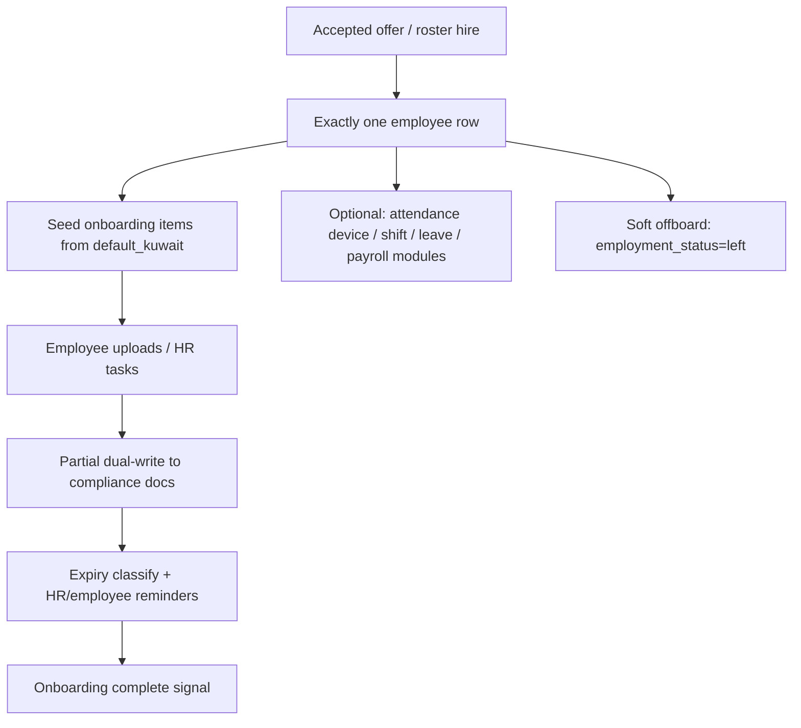

# Kuwait / GCC Country-Pack Readiness Audit

**Date:** 2026-07-25  
**Mode:** read-only — no code changes, no deploy, no migration, no frozen-workflow reopen  
**Scope:** post-hire + company setup readiness for a Kuwait-first country pack, with GCC extensibility notes  
**Authority stack audited:** `wathefni-orchestrator` (SOE), `apps/wathefni-dashboard`, `apps/wathefni-hr-mobile`, `apps/wathefni-employee-mobile`, `workforce-os` templates, related `ops/` evidence  
**Context:** complete pre-hiring lifecycle is already production-qualified and frozen; this audit does **not** reopen it  

---

## Executive verdict

Wathefni is **Kuwait-first operational software**, not a finished Kuwait legal-compliance product and not a multi-country pack engine.

| Layer | Status |
|---|---|
| Software capability for a first Kuwait HR client (ops + documents + attendance + leave requests + soft offboard) | **Partially ready** — usable with employer-configured policy and counsel-reviewed templates |
| Automatic Kuwait legal compliance | **Not claimed and not present** |
| Country-pack architecture (country · legal entity · policy version · template version · effective date · applicability · audit) | **Seed exists on offers only**; post-hire does not yet consume it |
| Saudi Arabia / other GCC packs | **Not ready** — only timezone/currency defaults exist |

**Do not claim automatic legal compliance.** This audit distinguishes:

1. **Software capability** — what the product can store, route, remind, calculate, or block.  
2. **Employer-configured policy** — what each client must set (leave days, OT treatment, required docs, signatory, templates).  
3. **Kuwait legal guidance** — statements about Law 6/2010, PAM, MOI, PACI, Article 18/20/22, fines, etc. that must be verified by **qualified counsel or the relevant authority** before enforcement.

---

## Classification legend

| Class | Meaning |
|---|---|
| **Ready now** | Present, tenant-scoped, and usable for a Kuwait client without inventing a new abstraction |
| **Configurable but incomplete** | Surfaces exist; defaults, wiring, enforcement, or handoff are incomplete |
| **Kuwait-specific gap** | Needed for Kuwait go-live / first real client; missing or broken today |
| **GCC-extensibility gap** | Not required for first Kuwait client; required before SA/AE/etc. |
| **Legal or policy decision required** | Product cannot choose alone; counsel / PAM / MOI / client HR policy must decide |
| **Outside Wathefni’s responsibility** | Government portals, filings, payments to banks/authorities, counsel opinions |

---

## 1. Current-state inventory

### 1.1 What already exists (strongest assets)

| Asset | Where | Reuse for country-pack |
|---|---|---|
| Company `country` + timezone + currency | `companies` / `company_settings`; Setup Console; `company_setup.GCC_PROFILE_DEFAULTS` | Pack root identity |
| GCC TZ/currency map | KW/SA/AE/QA/BH/OM → timezone + currency only | Thin GCC bootstrap — **not** labor packs |
| Offer document governance | `country_of_employment`, `employing_legal_entity`, `document_language`, `currency`, `template_id`, `template_version`, `template_approval_ref`, `employer_policy_version`, `authorized_signatory`, `configuration_effective_date` | **Best seed** for pack versioning |
| Module entitlements | `module_catalog`: onboarding, compliance, attendance, shifts, leave, payroll, analytics, employee_app | Pack can enable modules; does not encode law |
| Kuwait onboarding checklist | `DEFAULT_KUWAIT_ONBOARDING_TEMPLATE` / `default_kuwait` | Kuwait pack content |
| Compliance expiry engine | `compliance_documents` + warnings + reminders | Pack content + reminder windows |
| KW compliance intent file | `workforce-os/templates/data/compliance-rules/KW.json` (PACI/MOI/PAM/MOH, Articles 18/20/22) | Reference pack — **not proven as sole runtime driver** |
| Leave product + inert KW preset | `leave_*` tables; `kuwait_private_2010` seeded `enforced=false`, `legal_reviewed=false` | Policy shell awaiting counsel |
| Attendance / shifts / OT minutes | Full operational product; OT policy `review_only\|paid\|ignored\|capped` | Employer policy, not statutory multipliers |
| Soft offboarding | `employment_status` `active\|left`; dual approval; session revoke; audit | Status flip only — no EOS |
| Tenant isolation + RBAC + audits | `company_code` everywhere; manager scope; post-hire permissions; admin/status audits | Pack-agnostic safety |
| Bilingual mobiles + public assessment RTL | HR/employee apps EN/AR; public assessment bilingual | Strong UX base; dashboard post-hire still EN-first |

### 1.2 What does **not** exist

- No `country_pack` object, table, loader, or effective-dated pack binding to employees.  
- No first-class `legal_entities` master (offer free-text only).  
- No SA/AE/QA/BH/OM compliance JSON packs on disk (only `KW.json`).  
- No GOSI / social insurance / tax / PAM fee engines.  
- No end-of-service / indemnity / notice-period / final settlement engines.  
- No offer → employee copy of country, legal entity, currency, policy version, or effective date (explicitly deferred in Offers remediation).  
- No statutory overtime rate tables (1.25× / 1.5× / holiday) as enforced law.  
- Payment processing permanently disabled (`payment_processing: "disabled"`).

### 1.3 Explicit prior backlog (Offers remediation)

From `ops/PREHIRING_OFFERS_HIRING_LOCAL_REMEDIATION.md` §“Kuwait/GCC fields still too generic”:

- employee creation copies only name, phone, email, position, company, application link;  
- does not copy employment country, legal entity, currency, accepted offer/version, policy version, effective date;  
- onboarding/compliance not country-pack/effective-date based;  
- employee keys are company/phone, not legal-employer scoped;  
- EOS, leave enforcement, notice, visa, social insurance, payroll statutory rules are out of pre-hire scope.

This audit is that separate assessment.

---

## 2. Minimum country-pack architecture required

The platform already proves the right **shape** on employment offers. Post-hire must adopt the same spine.

### 2.1 Required objects

```text
CountryPack
  country_code                 # e.g. KW | SA | AE
  pack_id                      # e.g. kuwait_private_v1
  status                       # draft | legal_reviewed | active | retired
  legal_reviewed_at / by       # human counsel attestation — never auto
  notes / counsel_ref

LegalEntity
  company_code
  legal_entity_id
  country_code
  registered_name / name_ar
  commercial_registration / license refs (employer-supplied)
  default_currency
  status
  audit history

PolicyVersion
  pack_id + policy_family      # leave | overtime | attendance | offboarding | payroll_input
  version
  effective_from / effective_to
  enforced                     # false until counsel + owner enable
  legal_reviewed
  body (JSON) + audit history

DocumentTemplateVersion
  pack_id + template_family    # offer | employment_contract | NDA | …
  template_id / template_version
  document_language(s)
  approval_ref / signatory rules
  effective_from
  storage / upload policy (e.g. AR upload-only)
  audit history

EmployeeApplicability
  employee_key
  legal_entity_id
  country_of_employment
  pack_id + pack_version at hire (snapshot)
  policy_bindings[]            # leave_policy_version, ot_policy_version, …
  document_template_bindings[]
  governing_effective_date
  accepted_offer_id / version (if hired via offers)
  audit history
```

### 2.2 Non-negotiable rules

1. **Snapshot at hire** — changing a pack later must not silently rewrite historical employee terms.  
2. **Effective dating** — new hires and mid-cycle policy changes use explicit effective dates.  
3. **Applicability** — pack binds via legal entity + employment country, not only `companies.country`.  
4. **Audit** — every enablement, disablement, version bump, and counsel attestation is append-only.  
5. **Enforcement ≠ content** — seeding Law 6/2010 figures is not compliance; `enforced=true` requires counsel attestation.  
6. **Offers already store the seed fields** — country-pack work should **copy** them into employee applicability, not invent a parallel vocabulary.

### 2.3 Classification of this architecture

| Item | Class |
|---|---|
| Offer governance fields as pattern | **Ready now** (pre-hire) |
| Post-hire pack objects + hire snapshot | **Kuwait-specific gap** (needed before claiming “country pack”) |
| Multi-country pack registry (SA/AE…) | **GCC-extensibility gap** |

---

## 3. Kuwait onboarding journey (as software today)



### Journey steps and readiness

| Step | Software capability | Class | Notes |
|---|---|---|---|
| Hire creates one employee | Ready now | Ready now | Frozen pre-hire path |
| Seed Kuwait checklist | Ready now | Configurable but incomplete | Only `default_kuwait`; metadata override exists but no other templates |
| Civil ID / passport / photo / residency / work permit / contract | Document checklist | Configurable but incomplete | Residency id drift (`residency_iqama` vs `residency`) |
| Bank + IBAN | Kuwait bank list + KW IBAN check | Kuwait-specific gap if non-KW banks needed; else Ready now for KW | Hardcoded `KUWAIT_BANKS` |
| Visa article / probation end | Free-text / date tasks | Configurable but incomplete | Not validated enums tied to pack |
| Compliance expiry tracking | Engine exists | Configurable but incomplete | Seed types omit residency; KW.json escalation not fully proven as runtime driver |
| Copy offer country/legal entity/policy into employee | Missing | **Kuwait-specific gap** | Explicit deferred backlog |
| Arabic offer/contract PDF generation | Upload-only for Arabic | Kuwait-specific gap for Arabic-generated docs | EN generate OK; AR requires uploaded Unicode PDF |
| Employee app self-service (EN/AR) | Strong | Ready now | Module-gated |
| Dashboard post-hire RTL | Weak | Configurable but incomplete | English chrome |

---

## 4. Field and document gap matrix

### 4.1 Identity / employment fields

| Field / concept | Today | Needed for first KW client | Class |
|---|---|---|---|
| Employee name, phone, email, position, start_date | On employee row | Yes | Ready now |
| Department / manager / branch | Partial (org + onboarding tasks) | Usually yes | Configurable but incomplete |
| `employment_status` active/left | Yes | Yes | Ready now |
| Civil ID **number** as governed employee field | Document/onboarding artifact; encrypted civil_id on persons (recruiting) | Usually yes for KW residents | Kuwait-specific gap |
| Nationality | OCR/fixtures only — not employee master | Yes for expat vs national rules | Kuwait-specific gap |
| Residency status / Article 18/20/22 | Free-text onboarding task | Yes for expats | Configurable but incomplete + **Legal decision** on required set |
| Residency / work-permit numbers | Document-centric | Recommended | Configurable but incomplete |
| Passport number | Document-centric | Recommended | Configurable but incomplete |
| Country of employment | Offer only | Yes | Kuwait-specific gap (handoff) |
| Employing legal entity | Offer free-text only | Yes for multi-entity groups | Kuwait-specific gap |
| Currency / compensation on employee | Offer allowances JSON; not employee master | Recommended | Configurable but incomplete |
| Probation end | Onboarding date task | Recommended | Configurable but incomplete |
| Iqama (Saudi) | Label alias confusion only | SA later | GCC-extensibility gap |
| Emirates ID / QID / CPR | Absent | Later GCC | GCC-extensibility gap |

### 4.2 Documents

| Document | Onboarding item | Compliance type | KW.json | Class |
|---|---|---|---|---|
| Civil ID | `civil_id` | `civil_id` | Yes (PACI) | Ready now (tracking); authority notes = **Legal guidance** |
| Passport | `passport` | `passport` | Yes | Ready now |
| Personal photo | `personal_photo` | — | — | Ready now |
| Residency | `residency_iqama` | `residency` (**different id**) | Yes (MOI, fine note) | **Kuwait-specific gap** (vocabulary drift) |
| Work permit | `work_permit` | `work_permit` | Yes (PAM) | Ready now / Configurable |
| Medical | onboarding/compliance | `medical` | Yes (MOH) | Configurable but incomplete |
| Employment contract | `employment_contract` | — | — | Configurable; template pack = gap |
| Offer letter | `offer_letter` (HR) | — | — | Ready now as checklist |
| Education cert | optional | `education_cert` | — | Ready now |
| Bank details | text item | — | — | Ready now for KW IBAN |
| NDA / policy ack | ack items | — | — | Employer-configured policy |

**Known drift (Phase 7C):** `residency_iqama` (onboarding) is intentionally **not** silently merged to `residency` (compliance). Dual vocabulary is a Kuwait go-live hazard.

### 4.3 Compliance seed vs journey

Default compliance seed types: `civil_id`, `passport`, `work_permit` — **residency not seeded**.  
Upload dual-write allowlist: `civil_id`, `passport`, `medical`, `education_cert` — residency/work_permit reconciliation incomplete.

| Issue | Class |
|---|---|
| Residency not in default compliance seed | Kuwait-specific gap |
| Onboarding↔compliance type mismatch | Kuwait-specific gap |
| Fine/escalation text in KW.json | Legal guidance (must verify) — software may remind, must not assert fines as law |

---

## 5. Module-by-module readiness

### 5.1 Company and legal-entity setup

| Aspect | Class | Detail |
|---|---|---|
| Company create with country/TZ/currency | Ready now | Setup Console; GCC defaults |
| Modules / channels / branches / teams | Ready now | Tenant-scoped |
| Legal-entity master | Kuwait-specific gap | Free-text on offers only |
| Multi-entity under one company | Kuwait-specific gap / GCC later | Needed for groups with K.S.C.C. + sister entities |
| Choosing SA country today | Configurable but incomplete | Sets SAR/Riyadh only — still runs Kuwait onboarding/banks/leave |

### 5.2 Employee profile

| Aspect | Class |
|---|---|
| Operational roster card | Ready now |
| Identity master (nationality, civil ID no., residency) | Kuwait-specific gap |
| Offer governance → employee snapshot | Kuwait-specific gap |
| Import of civil_id/nationality | Kuwait-specific gap |

### 5.3 Employment contracts and templates

| Aspect | Class |
|---|---|
| Offer terms + bilingual wording fields | Ready now (pre-hire) |
| Template/policy/effective-date metadata on offers | Ready now |
| Statutory KW contract PDF pack | Outside Wathefni + Legal decision | Employer counsel / PAM-aligned templates |
| Arabic generated PDF | Kuwait-specific gap | Upload path is the supported AR path |
| Contract as post-hire governed artifact linked to pack | Configurable but incomplete |

### 5.4 Onboarding

| Aspect | Class |
|---|---|
| Kuwait checklist engine + seeding | Ready now |
| Multi-template registry | Configurable but incomplete | Hook exists; only `default_kuwait` |
| Country-selected template by pack | Kuwait-specific gap |
| Employee mobile upload EN/AR | Ready now |
| Reminder / kickoff outbound | Ready now (module/flag gated) |

### 5.5 Compliance and document expiry

| Aspect | Class |
|---|---|
| Store docs + expiry classify + reminders | Ready now |
| KW.json as intent pack | Configurable but incomplete | Not a full runtime country-pack |
| Authority-accurate fine calculation | Legal decision + Outside Wathefni | Software may display employer-configured amounts only after counsel |
| Residency seed + id unification | Kuwait-specific gap |
| SA/AE packs | GCC-extensibility gap |

### 5.6 Attendance, shifts, overtime

| Aspect | Class |
|---|---|
| Shifts, swaps, attendance, imports | Ready now |
| OT minutes + employer OT policy | Ready now as **employer policy** |
| Statutory OT multipliers / rest-day rules | Legal decision; encoding = Kuwait-specific gap if client requires enforcement |
| `kuwait_today()` / Asia/Kuwait defaults vs company TZ | Configurable but incomplete / GCC gap |
| Weekend model fri–sat (leave) vs sun–thu workweek templates | Configurable but incomplete + Legal/policy decision |

### 5.7 Leave policies

| Aspect | Class |
|---|---|
| Request / approve / ledger product | Ready now |
| `kuwait_private_2010` annual 30-day seed | Configurable but incomplete | **Inert** (`enforced=false`, `legal_reviewed=false`) |
| Graduated sick tiers | Legal decision | Structure exists; bands empty by design |
| Claiming Law 6/2010 compliance | **Not allowed** without counsel | Legal guidance only |
| Public holidays | Configurable but incomplete | Per-company; must be employer-maintained |
| Other leave types (maternity, hajj, etc.) | Legal decision + Configurable |

### 5.8 Payroll inputs, allowances, deductions

| Aspect | Class |
|---|---|
| Timesheet hours preview (worked/OT/late/absence) | Ready now |
| Employer payroll policy (deductions flags, OT treatment) | Ready now as config |
| Offer allowances JSON | Ready now (pre-hire terms) |
| Statutory deductions / tax / social insurance | Outside Wathefni for filings; software gap = GCC/KW gap if needed in-app |
| Bank salary files / payment | Outside Wathefni for now | Explicitly `payment_processing: disabled` |
| `*_kwd` field naming | GCC-extensibility gap |

### 5.9 Termination and offboarding

| Aspect | Class |
|---|---|
| Mark left + dual control + session kill + audit | Ready now |
| Notice period | Kuwait-specific gap + Legal decision |
| End-of-service / indemnity / gratuity | Kuwait-specific gap + Legal decision + often Outside for calculation sign-off |
| Visa cancel / transfer / PAM workflows | Outside Wathefni (government) | Software can checklist only |
| Final settlement payroll | Kuwait-specific gap |
| Exit clearance checklist pack | Configurable but incomplete |

### 5.10 Arabic / English / RTL

| Surface | Class |
|---|---|
| HR mobile + employee mobile | Ready now |
| Public assessment pages | Ready now |
| Jobs / recruiting dashboard locale | Ready now / partial |
| Post-hire dashboard | Configurable but incomplete (EN-first) |
| Offer AR document generation | Kuwait-specific gap (upload-only) |
| Onboarding bilingual labels (workforce-os template) | Ready now as content intent |

### 5.11 Permissions, audit, isolation

| Aspect | Class |
|---|---|
| Company tenant isolation | Ready now |
| Post-hire RBAC (`leave.*`, `payroll.*`, `compliance.*`, `employees.status.approve`, …) | Ready now |
| Manager scope fail-closed | Ready now |
| Civil ID sensitive permissions (candidates) | Ready now (recruiting) |
| Pack-level audit (counsel attestation, pack enable) | Kuwait-specific gap |
| Cross-legal-entity isolation inside one company | Kuwait-specific gap |

### 5.12 GCC later-country configuration

| Aspect | Class |
|---|---|
| Country → TZ/currency defaults | Ready now (thin) |
| Country → onboarding/compliance/leave/payroll packs | GCC-extensibility gap |
| GOSI / MOL / WPS / iqama models | GCC-extensibility gap + Legal + Outside portals |
| Multi-currency payroll naming | GCC-extensibility gap |

---

## 6. Priority findings

### P0 — must resolve before first real Kuwait client (software)

1. **Offer → employee country-pack snapshot** — copy country, legal entity, currency, accepted offer/version, policy/template versions, effective date into employee applicability.  
2. **Unify residency document vocabulary** — resolve `residency_iqama` vs `residency` without silent wrong merges; seed residency into compliance when required.  
3. **Legal-entity master (at least one per Kuwait company)** — stop relying only on offer free-text for the employing entity.  
4. **Employee identity fields for Civil ID / nationality / residency article** — governed fields or strictly validated document-extracted values with HR confirmation.  
5. **Arabic document path for contracts/offers** — keep upload-only if generation is not ready; make the supported path operationally clear for clients.  
6. **Residency/work-permit onboarding↔compliance dual-write** — close the Phase 7C allowlist holes that drop expat docs.

### P0 — legal / policy (not software alone)

7. **Counsel review of leave preset** before any `enforced=true`.  
8. **Employer document set** — which docs are mandatory for nationals vs Article 18 expats.  
9. **OT and leave weekends** — confirm client policy vs any claimed statutory interpretation.  
10. **No product claim of PAM/MOI/PACI/MOH compliance** — reminders ≠ filings.

### P1 — should have for a clean Kuwait pack, can stage after first pilot if mitigated

11. Versioned `CountryPack` registry binding onboarding + compliance + leave presets.  
12. Post-hire dashboard EN/AR + RTL.  
13. Probation / compensation as governed employee fields (not only checklist tasks).  
14. Offboarding checklist (assets, access, doc return) without EOS math.  
15. Replace hardcoded `kuwait_today()` call sites with company timezone.

### P2 — wait for Saudi / other GCC

16. SA/AE/… compliance JSON packs and GOSI/WPS models.  
17. Non-KW bank/IBAN packs.  
18. Multi-country leave presets.  
19. Statutory payroll engines and payment files.  
20. Iqama/Emirates ID/QID as first-class identity types.

---

## 7. Smallest safe remediation sequence

**Constraint:** do not reopen frozen pre-hire modules except for an explicit, contained “hire snapshot” handoff that copies already-qualified offer governance fields.

| Step | Work | Risk | Outcome |
|---|---|---|---|
| 0 | Owner + counsel define Kuwait private-sector pilot scope (nationals only vs expats; docs required; leave/OT employer policy) | Process | Boundaries for software |
| 1 | Introduce `legal_entities` (minimal) + bind company default entity | Low–med | Entity master |
| 2 | On hire: snapshot pack applicability from accepted offer / company defaults | Med | Closes largest architectural hole |
| 3 | Normalize residency document ids + compliance seed + dual-write allowlist | Med | Expat file integrity |
| 4 | Add employee identity fields (or confirmed extracted attributes) for civil_id, nationality, visa article | Med | HR-usable master data |
| 5 | Register onboarding/compliance content under `pack_id=kuwait_private_v1` with effective date (still `enforced=false` for leave) | Med | Real country-pack object |
| 6 | Operationalize Arabic **upload** contract path + client runbook | Low | Bilingual docs without claiming PDF generation |
| 7 | Pilot with one synthetic + one willing Kuwait client; leave/payroll remain employer-configured, payment off | — | Evidence |
| 8 | Only after counsel attestation: optionally set leave `legal_reviewed` / `enforced` | High (legal) | Still not “automatic compliance” |

**Do not** in this sequence: build GOSI, EOS engines, SA packs, or enable payroll money movement.

---

## 8. What is required before the first real Kuwait client

### Must have (software)

- [ ] Company country=`KW`, currency=`KWD`, timezone=`Asia/Kuwait` configured.  
- [ ] At least one employing legal entity recorded and used on offers + employee snapshot.  
- [ ] Hire path snapshots country / entity / currency / template & policy versions / effective date.  
- [ ] Onboarding `default_kuwait` (or named pack) seeding proven for that client.  
- [ ] Civil ID + contract checklist working; residency/work permit path fixed if hiring expats.  
- [ ] Compliance expiry reminders working for the client’s required doc set.  
- [ ] Arabic document handling runbook (upload vs generate) agreed.  
- [ ] Modules enabled intentionally (onboarding/compliance ± attendance/leave).  
- [ ] Permissions, manager scope, and audit reviewed with the client admin.  
- [ ] Payment processing remains disabled unless a separate payroll project starts.

### Must have (employer + counsel — not Wathefni alone)

- [ ] Counsel-reviewed employment contract / offer templates (EN and/or AR).  
- [ ] Written employer policy for leave, OT, weekends, probation, required documents.  
- [ ] Confirmation that product reminders are **not** relied on as PAM/MOI filings.  
- [ ] Data-protection / Civil ID handling agreement.  
- [ ] Clear statement: Wathefni does not provide legal advice or automatic legal compliance.

### Nice-to-have for pilot

- [ ] Employee app live for self-service uploads (EN/AR).  
- [ ] Public holidays calendar loaded for the client.  
- [ ] Leave requests on, balances observe-only until counsel signs enforcement.

---

## 9. What can wait until Saudi Arabia or another GCC country

| Item | Why it can wait |
|---|---|
| SA/AE/QA/BH/OM compliance JSON packs | Kuwait pack must exist first |
| GOSI / WPS / MOL integrations | SA-specific; Outside portals dominate |
| Iqama / Emirates ID / QID models | Wrong abstraction if forced into KW Civil ID |
| Multi-currency payroll engines + bank files | KW pilot can stay hours-preview + export later |
| Country-selected leave libraries beyond KW | One counsel-reviewed KW policy is enough for pilot |
| Replacing every `kuwait_today()` call | Soften for GCC; KW pilot can run on Asia/Kuwait |
| Full EOS/indemnity calculators | Even KW clients often keep this in counsel/payroll vendor; checklist first |
| Dashboard post-hire full i18n | Mobiles cover frontline bilingual; polish later |

---

## 10. Responsibility boundaries (explicit)

| Concern | Wathefni software | Employer policy | Counsel / authority | Outside platform |
|---|---|---|---|---|
| Store Civil ID image + expiry reminder | Yes | Retention policy | Lawfulness of processing | PACI renewal filing |
| Article 18 vs 20 classification | Capture field | Required or not | Correct legal category | MOI issuance |
| 30-day annual leave preset | Seed inert figures | Adopt / edit | Verify Law 6/2010 applicability | Court / dispute outcome |
| OT 1.25× / 1.5× | Can encode later if decided | Pay rules | Statutory interpretation | — |
| Residency late fine KD/day | Must not auto-assert | May configure alert text after counsel | Verify current fine schedule | MOI payment |
| Salary transfer to bank | Preview/export maybe later | Bank choice | — | Bank / CBK rails |
| Visa cancellation on exit | Checklist only | Process owner | — | MOI / PAM |

---

## 11. Summary scorecard

| Area | Classification |
|---|---|
| Company setup (country/TZ/currency/modules) | Ready now |
| Legal-entity master | Kuwait-specific gap |
| Employee identity master | Kuwait-specific gap |
| Offer document governance | Ready now (pre-hire seed) |
| Offer → employee pack snapshot | Kuwait-specific gap |
| Onboarding Kuwait checklist | Ready now / Configurable but incomplete |
| Compliance expiry engine | Ready now / Configurable but incomplete |
| Residency doc vocabulary | Kuwait-specific gap |
| Contracts / Arabic PDF generation | Legal decision + Kuwait-specific gap (upload path Ready now) |
| Attendance / shifts | Ready now |
| Overtime statutory rules | Legal decision (software Configurable) |
| Leave product | Ready now |
| Leave Law 6/2010 enforcement | Legal decision (seed Configurable but incomplete) |
| Payroll hours preview | Ready now |
| Payroll payments / statutory deductions | Outside Wathefni / GCC gap |
| Termination soft offboard | Ready now |
| EOS / notice / visa cancel | Kuwait-specific gap + Outside + Legal |
| AR/EN mobiles | Ready now |
| Post-hire dashboard RTL | Configurable but incomplete |
| Permissions / audit / isolation | Ready now |
| Country-pack architecture (full) | Kuwait-specific gap |
| SA/other GCC packs | GCC-extensibility gap |

---

## 12. Final audit statement

Wathefni can **operate** a Kuwait HR client for hiring handoff, document collection, expiry reminders, attendance/shifts, leave *requests*, and soft offboarding — provided the employer supplies templates and policies and **does not** treat the product as automatic legal compliance.

Wathefni **cannot yet** honestly claim a finished **Kuwait country pack**: legal-entity master, hire-time pack snapshot, identity master data, residency document consistency, and counsel-attested enforceable policies are still missing.

Saudi Arabia and other GCC countries should wait until the Kuwait pack spine (country · legal entity · policy version · template version · effective date · employee applicability · audit) exists and is proven on one real Kuwait client.

**Stop.** No implementation in this phase.
