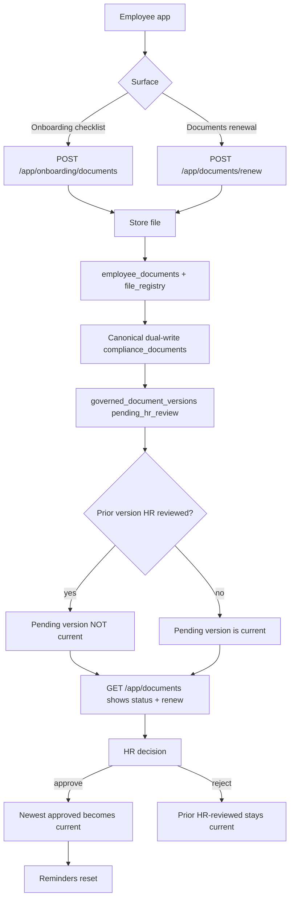
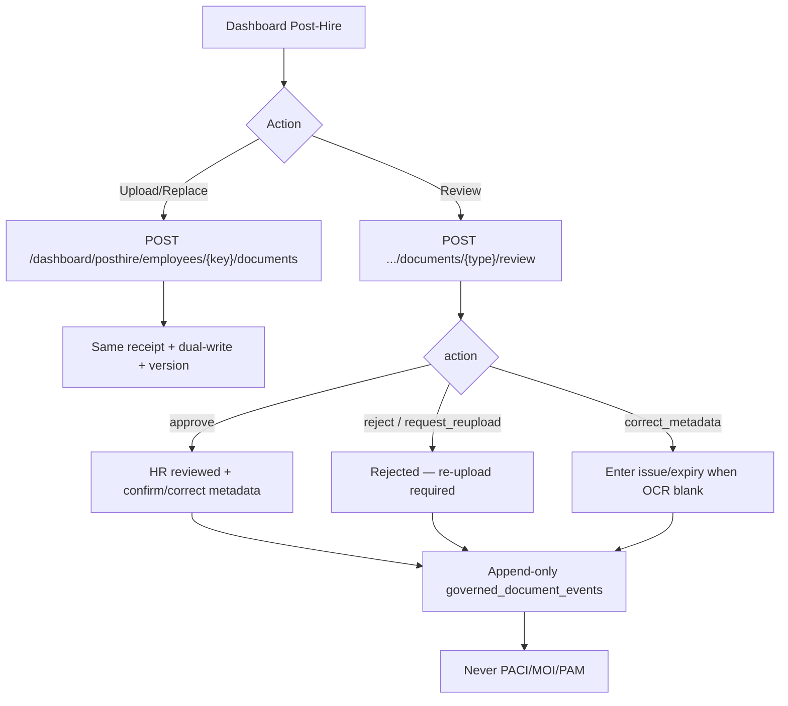

# Kuwait Pilot Document Journey — Local Remediation

**Date:** 2026-07-25  
**Mode:** contained local remediation — **no deploy**  
**Status:** local qualification **GREEN** (`kuwait-pilot-document-journey-local-v1` · **100/100**)  
**Authority:** `wathefni-orchestrator/kuwait_pilot_document_journey.py` + surgical wiring in `app.py`, employee mobile Documents, dashboard Post-Hire  
**Non-goals (unchanged):** PACI / MOI / PAM verification, automatic legal compliance, government API integrations

---

## Executive verdict

The Kuwait pilot document journey is now locally remediated for:

employee or HR upload → stored file → metadata → optional OCR proposal → HR review (approve / reject / request re-upload / correct dates) → expiry tracking → employee renewal from Documents → historical versions preserved.

Residence and work-permit uploads dual-write to `compliance_documents` via the approved canonical map. Status copy is **HR reviewed**, never government verified.

---

## Exact journey diagrams

### A. Employee journey (onboarding + Documents renewal)



### B. HR journey (upload + review)



---

## Screens and routes

| Actor | Screen / route | Capability |
|---|---|---|
| Employee | `/documents` (`app/documents.tsx`) | List file vault + **compliance journey** (status, expiry, rejection, renew) |
| Employee | `POST /app/documents/renew` | Upload replacement from Documents (not only unfinished onboarding) |
| Employee | `GET /app/documents` | Returns `documents` + `compliance` + legitimacy note |
| Employee | `/onboarding` → `POST /app/onboarding/documents` | Existing checklist upload (now dual-writes residence/WP) |
| HR | Post-Hire Compliance / Employee 360 | Upload, **HR reviewed**, Reject, Enter dates |
| HR | `POST /dashboard/posthire/employees/{key}/documents/{type}/review` | approve / reject / request_reupload / correct_metadata |
| HR | `GET /dashboard/posthire/employees/{key}/documents/compliance` | Versioned journey payload |

Employee feature `documents` actions: `view`, `download`, **`upload_document`** (renewal).

---

## Document state machine

```
missing
  → pending_hr_review   (upload received; OCR proposal optional, non-authoritative)
  → hr_reviewed         (authorized HR approve; confirmed metadata)
  → rejected_reupload   (reject / request re-upload; prior hr_reviewed remains current)
  → expiring_soon       (display derived from confirmed expiry ≤ warning_days)
  → expired             (display derived from confirmed expiry < today)
  → superseded          (previous current after a newer version is approved)

Rules:
- Replacement while an HR-reviewed current exists → new version pending, NOT current.
- Rejected replacement never displaces the prior valid document.
- Newest approved version becomes current; history retained.
- Stale reminders (`reminder_count` / `last_alerted_at`) clear only after approved renewal.
```

---

## Permission map

| Action | Permission | Scope |
|---|---|---|
| Employee list/renew own docs | employee app session + `documents` feature | self `employee_key` only |
| HR upload | `onboarding.manage` (+ doc upload flag) | tenant + manager scope |
| HR approve / reject / correct | **`compliance.manage`** | tenant + manager scope |
| HR read journey | `compliance.read` or onboarding/compliance hub read | tenant + manager scope |

Unauthorized HR (missing `compliance.manage`) → `permission_denied`.  
Cross-tenant list → empty / 404 (company_code enforced).

---

## OCR authority boundary

| Layer | Authority |
|---|---|
| Automatic checks | file type, size, issue≤expiry consistency — **not** government verification |
| OCR extraction | **proposal only** (`ocr_proposal.authoritative = false`) |
| HR confirm/correct | authoritative metadata after review |
| OCR unavailable / skipped | uploads still succeed; HR **Enter dates** / `correct_metadata` |

Employee-app and dashboard uploads may still pass `extraction={}` (no sync OCR). WhatsApp path can still propose values; HR must confirm. UI distinguishes proposed vs confirmed via review flow (confirm OCR vs enter dates).

---

## Expiry and renewal behavior

- Display statuses: Pending HR review / HR reviewed / Rejected — re-upload required / Expiring soon / Expired.
- Employee Documents shows expiry, renewal required, rejection reason, upload renewal.
- Reminders close only when a renewal version is **approved**.
- Medical and education remain employer-configurable (not universally required onboarding items).

---

## Compatibility handling

| Input | Behavior |
|---|---|
| Canonical `residence` | New writes use `residence` |
| Historical `residency_iqama` / `residency` | Dual-write updates existing legacy row; no silent rename; no duplicate `residence` row |
| Saudi `iqama` terminology | Not introduced in labels, sensitive keys, or canonical types |

Article 18 expatriates: onboarding seed marks `residence` + `work_permit` **required**.  
Kuwaiti nationals: those items **not required**.

---

## Legitimacy language (enforced)

1. **Automatic checks** — file/date hygiene only.  
2. **HR review** — authorized HR reviewed uploaded evidence.  
3. **Government verification** — **not available** (no PACI/MOI/PAM implication in UI, APIs, or notifications).

---

## Changed files

| File | Change |
|---|---|
| `wathefni-orchestrator/kuwait_pilot_document_journey.py` | **New** journey authority: dual-write, versions, review, audit, labels, OCR boundary |
| `wathefni-orchestrator/app.py` | Dual-write via map; category requiredness; schema hook; renew + review routes; status labels; documents `upload_document` |
| `wathefni-orchestrator/ops/lib/doc_type_map.py` | (pre-existing) canonical map consumed by dual-write |
| `wathefni-orchestrator/ops/kuwait-pilot-document-journey-local-matrix.py` | Local synthetic matrix |
| `apps/wathefni-dashboard/src/posthire/PostHire.tsx` | Sensitive `residence`; HR review buttons; legitimacy copy |
| `apps/wathefni-dashboard/src/lib/api.ts` | `reviewEmployeeDocument` / compliance journey helpers |
| `apps/wathefni-employee-mobile/app/documents.tsx` | Renewal from Documents |
| `apps/wathefni-employee-mobile/src/features/remaining/RemainingViews.tsx` | Compliance journey UI |
| `apps/wathefni-employee-mobile/src/api/types.ts` | Compliance journey types |
| `apps/wathefni-employee-mobile/src/i18n/en.json` | EN labels + status copy |
| `apps/wathefni-employee-mobile/src/i18n/ar.json` | AR labels + status copy |

---

## Full test matrix

Runner: `PYTHONPATH=. python ops/kuwait-pilot-document-journey-local-matrix.py`  
Result artifact: `wathefni-orchestrator/ops/kuwait-pilot-document-journey-local-matrix-result.json`  
**Outcome: 100 passed / 0 failed**

| Scenario | Result |
|---|---|
| Kuwaiti national requiredness (residence/WP not required) | PASS |
| Article 18 expatriate requiredness (residence/WP required) | PASS |
| Employee upload dual-write residence | PASS (synthetic) |
| HR upload dual-write work_permit | PASS (synthetic) |
| Residence + work-permit compliance handoff | PASS |
| Correct OCR proposal / wrong OCR corrected by HR | PASS |
| OCR unavailable + HR enter expiry | PASS |
| Missing expiry entered by HR | PASS |
| Approve → HR reviewed | PASS |
| Reject + request re-upload | PASS |
| Employee renewal before expiry (pending not current) | PASS |
| Renewal after expiry + approve | PASS |
| Rejected replacement preserves prior valid | PASS |
| Historical `residency_iqama` compatibility (no duplicate) | PASS |
| Unauthorized HR | PASS |
| Cross-tenant access attempt | PASS |
| Arabic + English labels/UX copy | PASS |
| Reminders close after approved renewal | PASS |
| Version history + audit events + zero residue | PASS |
| Static: no hardcoded upload allowlist; routes present | PASS |
| Frozen module/smoke parse (foundation, onboarding, compliance, document hub/upload) | PASS |

### Frozen foundation matrix (local)

`ops/kuwait-first-client-foundation-local-matrix.py` re-run with `PYTHONPATH=.`: early architectural gates **PASS**; full matrix aborted on pre-existing local schema drift (`employment_offers.country_of_employment` missing in minimal local schema). **Not caused by this remediation.** Staging/prod foundation remains pinned green from prior promote (`73cccafd…`).

---

## Remaining limitations

- Sync OCR is still not enabled on every upload surface (employee app / dashboard may skip extraction); HR metadata entry covers the gap.
- HR mobile remains review/view oriented; primary HR mutate path is dashboard.
- Medical / education employer toggles are policy/seed configurable, not a new admin settings UI in this change.
- Classifier may still emit legacy bucket codes (`needs_review` / `valid`); HR-facing labels map to Pending HR review / HR reviewed.
- Foundation full local matrix needs schema alignment before treating as a local green re-run (staging/prod already green).

---

## Staging deployment order (do not execute now)

1. Deploy orchestrator with `kuwait_pilot_document_journey.py` + `app.py` schema ensure (creates `governed_document_versions` / `governed_document_events`).  
2. Deploy dashboard (review buttons + sensitive residence).  
3. Deploy employee mobile (Documents renewal + i18n).  
4. Staging synthetic matrix: Art.18 + national tenants; residence/WP handoff; reject/approve/renew.  
5. Confirm no UI/report copy implies PACI/MOI/PAM.  
6. Only then consider production promote (separate approval).

**This report stops at local remediation. No deploy performed.**
