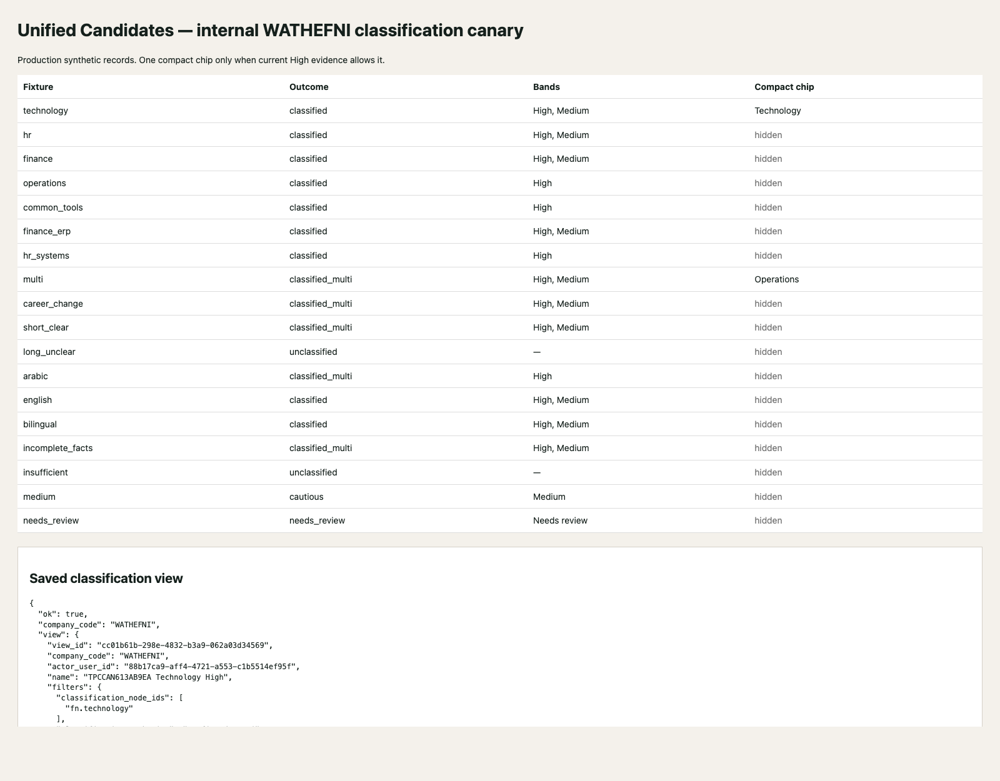

# Pre-Hiring Talent Pool Classification — Production Canary Qualification

**Date:** 2026-07-25 / 2026-07-26 (UTC+3)  
**Production classifier:** `classifier.deterministic_v1.2`  
**Classifier SHA-256:** `d97bae99e9d181daaadd384e070951902fa35243d14c92776bd20b712de0505b`  
**Backend canary:** **125/125 PASS**  
**Final governance verdict:** **NO-GO — LIVE PRODUCTION UI ARTIFACT NOT DEPLOYED**  
**Final classification leave-state:** **FULLY OFF FOR EVERY TENANT**

## Executive verdict

The exact v1.2 classifier and its qualified unit-test artifact were promoted successfully. Phase A
remained production-dark and passed:

- dark qualification: **42/42**;
- frozen production packs: **26/26**, no missing or LIMITED result;
- Candidates C0/C1: **44/44**;
- optional-module boundary: **301/301**;
- pre/post frozen database counts: exact match;
- classifier execution sidecars: empty;
- persistent classification workers: absent/inactive.

The contained internal `WATHEFNI` backend canary then passed **125/125** using only synthetic,
namespaced Talent Pool records and explicit manual execution. It proved classification quality,
HR review authority, immutable history, rollback/re-enable behavior, tenant isolation, held-record
communication authority, zero OCR, zero protected mutations, and zero synthetic residue.

The phase cannot be frozen and classification cannot remain enabled because the live production
dashboard asset was deliberately not included in the authorized Phase A promotion. Its tree SHA is
still the accepted dark SHA:

`c7b8b954a48f14c2c3c03d4c7e330772259a4527a53fe6c612524868dbc91e02`

The deployed tree contains none of:

- `classification/feature`;
- `classification-filter-bar`;
- `candidate-classification-section`.

Therefore the requested live `WATHEFNI` UI, filters, profile presentation, and tenant-flag hide/show
behavior cannot be truthfully qualified in the deployed dashboard. Rendered production-payload
screenshots are included as contract evidence, but they are not substituted for a live deployed UI
test.

Per the approved stop rule, classification was returned fully OFF:

- master OFF;
- tenant allowlist empty;
- schema runtime OFF;
- manual execution OFF;
- workers OFF;
- UI OFF.

Unified Candidates remains unchanged: master OFF with the existing internal `WATHEFNI` override.

## 1. Artifact identity and provenance

| Item | Exact value |
| --- | --- |
| Source commit | `40a4e2621f4818bf7c0f6ce3642032297bfbe7b2` |
| Classifier version | `classifier.deterministic_v1.2` |
| Classifier SHA-256 | `d97bae99e9d181daaadd384e070951902fa35243d14c92776bd20b712de0505b` |
| Test artifact SHA-256 | `66e42f9997af46bd4ed5dc6e64c0d0c1d53c7eea2532ddc49e6bed79bd7f63e7` |
| Deploy manifest SHA-256 / final composite identity | `d421f28d02689eabbd29915c55e66127773aff6ead4b8bdc8cd44eba45483abc` |
| Previous production classifier | `827e92cda2754a6d90f1aefce96f125cc725c385ab9241b07fb388d529628fe7` (v1.1) |
| Remote evidence root | `/opt/wathefni/production-evidence/talent-pool-classification-canary/20260725T221918Z` |
| Local sealed evidence | `ops/evidence/tpc-production-canary-20260725T221918Z/` |

The composite identity is the SHA-256 of the two-entry deploy manifest containing only:

1. `talent_pool_classification.py`;
2. `test_talent_pool_classification.py`.

No v1.1 byte was promoted as the active classifier.

## 2. Backup and rollback evidence

Fresh backup:

`/opt/wathefni/backups/production-pre-talent-pool-classification-v12-20260725T221918Z`

| Evidence | Result |
| --- | --- |
| Daily backup | `20260725T222000Z` SUCCESS |
| Contained PostgreSQL dump | 5.3 MiB |
| Dump SHA-256 | `20db4f8c37706cf638145a9e0c2942559c465ba723141a77f1a2a8ace5fbcd14` |
| `pg_restore --list` | PASS, 1,130 entries |
| Rollback script | present and executable |
| Rollback script SHA-256 | `7f0ab80cfdc3d1e5310a2b9ab0b4dc437a7fe289a5c4f7f63d07aeaf11e10ea1` |
| Saved v1.1 classifier SHA | `827e92cda2754a6d90f1aefce96f125cc725c385ab9241b07fb388d529628fe7` |
| Saved v1.1 test SHA | `c9afab55180110523ff7ffc2549c093be59986be91a55573d01256d65a94b058` |

The artifact rollback restores the prior classifier, prior classifier test, prior classification
drop-in, and unchanged Unified Candidates drop-in, then restarts and health-checks the service.
Additive schema is intentionally preserved.

## 3. Phase A — exact v1.2 dark replacement

Before replacement:

- production health: 200;
- classifier: v1.1 SHA `827e92…`;
- all six classification controls: OFF/empty;
- classification worker unit/process: inactive;
- classification runs, suggestions, reviews, jobs, and tenant nodes: zero;
- held communication authority SHA unchanged:
  `8a3949eac6d72c7f18514810171298615e1fded40e81afba2ee91239305aab53`;
- Unified Candidates: master OFF, `TENANTS=WATHEFNI`.

Only the classifier and classifier test were copied into the production orchestrator. The service
restarted healthy and reported `classifier.deterministic_v1.2`.

Dark controls remained:

```text
WATHEFNI_TALENT_POOL_CLASSIFICATION=off
WATHEFNI_TALENT_POOL_CLASSIFICATION_TENANTS=
WATHEFNI_TALENT_POOL_CLASSIFICATION_SCHEMA=off
WATHEFNI_TALENT_POOL_CLASSIFICATION_MANUAL=off
WATHEFNI_TALENT_POOL_CLASSIFICATION_WORKERS=off
WATHEFNI_TALENT_POOL_CLASSIFICATION_UI=off
```

No Phase A classification run, suggestion, review event, queue job, or tenant taxonomy assignment
was created.

### Dark proof

Final result: **42/42 PASS**.

Proved:

- health 200 and correct production database binding;
- exact v1.2 hash;
- every classification control OFF;
- no tenant enabled;
- functional classification routes fail closed;
- production classification UI absent;
- additive taxonomy/schema present;
- execution sidecars empty;
- no queue-claim implementation and no worker;
- no OCR, extraction, embedding, lifecycle, Job, ranking, or outbound delta;
- held/import-review/archived/restricted communication fails closed;
- normal live Job-application communication remains authorized;
- direct notify has no provider or registry call when denied;
- Unified Candidates `WATHEFNI` override unchanged.

The first dark-verifier pass reported 41/42 only because it contained a stale hardcoded outbound
baseline of 713. The sealed predeployment snapshot already recorded 721. The verifier was changed
to compare against `PREDEPLOY.json`; no production mutation occurred. The corrected run passed
42/42.

## 4. Frozen production regressions

Final runner result:

| Result | Count |
| --- | ---: |
| PASS | 26 |
| FAIL | 0 |
| MISSING | 0 |
| LIMITED | 0 |
| Final cleanup exact | yes |

Exact database baseline and final counts both remained:

- applications: 17;
- candidates: 20;
- positions: 11;
- lifecycle events: 2;
- outbound delivery events: 721;
- classification runs/suggestions/reviews/jobs/tenant nodes: zero;
- non-`WATHEFNI` companies: zero;
- `WATHEFNI` applications: 17.

Pack results:

- held communication authority: PASS;
- v1.2 classifier unit suite: PASS;
- Unified Candidates: PASS;
- Candidates C0/C1: **44/44**;
- Candidates C2: PASS;
- Candidates C3 + read-only audit: PASS;
- Jobs Stage A and B: PASS;
- Ranking and ranking presentation: PASS;
- Reports: PASS;
- Assistant and Assistant Jobs/Ranking UX: PASS;
- Interviews: PASS;
- Offers/Hiring: PASS;
- Assessments: PASS;
- canonical lifecycle: PASS;
- inbound email: PASS;
- bulk and tiered intake: PASS;
- communication router: PASS;
- optional permissions/module boundary: **301/301**;
- tenant isolation: PASS;
- dashboard contract: PASS;
- HR mobile contract: PASS.

### Regression harness corrections

The first aggregate pass exposed test-environment issues only:

- production had an older communication-router smoke fixture;
- the dashboard source-contract smoke expected source files absent from the runtime host;
- Assessments and optional-boundary dry-run packs left namespaced synthetic outbound evidence rows.

Corrections were limited to evidence/test harnesses:

- current communication smoke ran from the evidence root;
- dashboard source-contract smoke ran against sealed source files from the evidence root;
- exact timestamp-bounded deletion removed only the current run’s synthetic dry-run rows;
- the optional-boundary wrapper now removes only `PRODBND%` dry-run rows created during that run.

No product authority or publishability rule changed. The final complete rerun was 26/26 with exact
baseline restoration.

## 5. Phase B — contained internal backend canary

Temporary canary posture:

```text
master=off
allowed_tenants=[WATHEFNI]
schema=on
manual=on
ui=on
workers=off
```

This architecture supports an explicit tenant override while the global master remains OFF.
`EXTERNAL` and every tenant not named in the singleton allowlist remained disabled.

Only 18 newly created synthetic `needs_role` records were used. They had:

- namespaced app keys and surrogate phones;
- `example.invalid` email addresses;
- stored normalized text;
- no uploaded document/file;
- no OCR request;
- no real candidate identity;
- no Job assignment;
- no outreach.

Every classifier execution used the explicit manual HTTP route. No persistent worker or historical
backfill existed.

### Execution notes

The canary fail-stop mechanism was exercised during verifier correction:

1. the first attempt stopped before fixture creation because its process-local Unified Candidates
   check omitted the existing tenant override environment;
2. two attempts reached 103 passing gates but used the legacy live-app default Candidates view,
   which correctly excludes held `needs_role` records;
3. the final harness used `view=talent_pool` and passed 125/125.

Every stopped attempt removed its synthetic rows and returned all classification controls OFF.
The final accepted metrics below come only from the final successful namespace
`TPCCAN613AB9EA`.

## 6. Classification quality results

| Fixture | Outcome | Bands | Key proof |
| --- | --- | --- | --- |
| clear Technology | Classified | High, Medium | Technology, Software Engineer, Python, CS |
| HR | Classified | High, Medium | HR, HR Generalist, Recruiting |
| Finance | Classified | High, Medium | Finance, Accountant, Audit, Treasury |
| Operations | Classified | High | Operations, Operations Coordinator |
| common software tools | Classified | High | Excel skill only; **no Technology** |
| Finance + ERP | Classified | High, Medium | Finance retained; **no Technology** |
| HR systems | Classified | High | HR retained; **no Technology** |
| Technology + Operations | Multi-label | High, Medium | Operations High; Technology Medium |
| career changer | Multi-label | High, Medium | supported Technology retained |
| short/junior | Multi-label | High, Medium | Technology retained; no length penalty |
| long unclear | Unclassified | none | no forced Technology |
| Arabic | Multi-label | High | Arabic evidence and Arabic taxonomy labels |
| English | Classified | High, Medium | English labels and language |
| bilingual | Classified | High, Medium | bilingual marketing/retail evidence |
| sparse structured facts | Multi-label | High, Medium | raw stored text recovered grounded evidence |
| genuinely insufficient | Unclassified | none | explicit insufficient-evidence outcome |
| useful Medium | Cautious | Medium | Technology remains available as Medium |
| weak/conflicting support | Needs review | Needs review | no overconfident promotion |

Every active suggestion contained evidence. The output remained multi-label and advisory. No
candidate-quality or CV-quality judgment was emitted.

Technology precision proof:

- common Word/Excel/email usage did not produce Technology;
- Finance using SAP ERP did not produce Technology;
- HR using HR systems did not produce Technology;
- supported multidisciplinary Technology remained present as Medium;
- short, junior, career-change, Arabic, and raw-text cases remained useful.

## 7. HR authority and immutable history

The production canary performed one of each explicit action:

- confirm: 1;
- reject: 1;
- add: 1;
- correct: 1.

Proof:

- all actions required explicit confirmation;
- four review events remained append-only;
- effective profile layers marked HR facts `hr_confirmed` and model output `ai_suggested`;
- the rejected Software Engineer suggestion was excluded from current effective AI output;
- correction removed the previous current language and confirmed the replacement;
- reclassification created a new run rather than rewriting the original;
- confirmed Technology survived reclassification;
- rejected Software Engineer did not return as current;
- both old and new runs remained queryable during rollback proof;
- document versions `doc-canary-v1` and `doc-canary-v2` were recorded;
- extraction, taxonomy, and classifier versions were present.

## 8. Unified Candidates and UX qualification

Backend/data-contract gates passed:

- no classification column was added to `applications` or `candidates`;
- one compact chip was produced only for a current High-confidence row;
- Medium, Needs review, and Unclassified rows produced no chip;
- a classification saved view was created and round-tripped with node, confidence, and authority
  filters;
- profile payload included evidence, confidence, taxonomy/classifier versions, HR authority, and
  review history;
- confirmed and suggested authority were distinct;
- Talent Pool search retained every synthetic candidate, including Unclassified;
- disabling the tenant flag made classification routes return 404 while Unified Candidates stayed
  healthy;
- re-enabling restored the same classification history without rewriting data.

Rendered production-payload evidence:

- `evidence/tpc-production-canary-20260725T221918Z/ux-table-and-filters.png`
- `evidence/tpc-production-canary-20260725T221918Z/ux-production-canary.png`



These screenshots were generated from the successful production canary payload and demonstrate the
approved density/presentation contract. They are not screenshots of a deployed live dashboard.

### Blocking live-UI result

The production dashboard asset tree was unchanged from the accepted dark deployment and had zero
classification markers. Consequently:

- no live High-confidence chip could be observed;
- no live classification filter or saved-view control could be exercised;
- no live profile Classification section could be observed;
- no live tenant-flag hide/show behavior could be captured.

This is the only final canary gate preventing leave-enabled and phase-freeze approval.

## 9. Authority, isolation, and side-effect proof

The canary proved classification did not:

- assign a Job or change `position_code`;
- call `intake_admit`;
- shortlist or reject;
- change lifecycle;
- create Interviews;
- create Offers;
- hire or create Employees;
- contact a candidate;
- create outbound delivery;
- generate Job suitability ranking;
- mutate HR-confirmed CV fact snapshots;
- rerun OCR, extraction, embeddings, or semantic indexing.

Shortlist, reject, intake-admit, and hire probes failed closed on held synthetic records.

Held communication proof:

- pure authority denied `needs_role`;
- dashboard notify denied before delivery;
- outbound count and latest timestamp stayed unchanged;
- Phase A also proved valid live Job-application communication remains authorized.

Tenant proof:

- allowed tenant list contained only `WATHEFNI`;
- `EXTERNAL` feature status was disabled;
- cross-tenant taxonomy access failed with `talent_pool_classification_disabled`;
- no external company or candidate was created;
- no external candidate was classified.

Protected before/after snapshots were byte-equivalent as serialized evidence for all monitored
tables, including lifecycle, Jobs, ranking, outbound, OCR/extraction, embeddings, semantic
documents, interviews, offers, employees, and HR fact snapshots.

## 10. Monitoring

| Metric | Result |
| --- | ---: |
| Synthetic fixtures | 18 |
| Persisted immutable runs | 19 |
| Initial fixture manual calls | 18/18 successful |
| Reclassification calls | 1/1 successful |
| Failed manual calls | 0 |
| Minimum latency | 19.73 ms |
| Median latency | 24.89 ms |
| Mean latency | 27.42 ms |
| Maximum latency | 74.01 ms |
| Technology suggestions | 8/18 (44.44%) |
| Needs review | 1/18 (5.56%) |
| Unclassified | 2/18 (11.11%) |
| HR confirm/reject/add/correct | 1 each |
| OCR triggers | 0 |
| Worker starts | 0 |
| Protected mutations | 0 |

The Technology rate is fixture-set-specific: the matrix deliberately contains clear Technology,
multidisciplinary, career-change, junior, Arabic, sparse-fact, Medium, and Needs-review technical
cases. Precision was evaluated against the dedicated non-technical tool, Finance ERP, and HR-system
negative controls.

## 11. Rollback/re-enable proof

The tenant rollback sequence passed:

1. tenant allowlist was emptied;
2. schema/manual/UI controls were disabled;
3. classification profile functionality returned 404;
4. Unified Candidates Talent Pool search remained healthy;
5. all 19 runs and four HR events remained preserved;
6. only `WATHEFNI` was re-enabled;
7. the same history returned with no new run and no rewrite.

Because the separate live UI asset gate failed, the system was then deliberately returned fully
OFF rather than left enabled.

## 12. Cleanup and zero residue

Final successful canary cleanup removed:

- synthetic saved views: 1;
- review events: 4;
- suggestions: 69;
- immutable runs: 19;
- completed-manual queue rows: 19;
- applications: 18;
- candidates: 18;
- semantic documents: 0 (none created);
- tenant taxonomy nodes: 0 (none created).

No CV file rows existed because the canary used stored synthetic normalized text only.

Final direct audit:

- classification runs: 0;
- suggestions: 0;
- review events: 0;
- queue jobs: 0;
- tenant taxonomy nodes: 0;
- synthetic canary applications: 0;
- synthetic canary candidates: 0;
- protected production snapshot: restored exactly;
- health: 200;
- worker: inactive.

Final fully-off dark requalification: **42/42 PASS**.

## 13. Final feature-flag leave-state

```text
WATHEFNI_TALENT_POOL_CLASSIFICATION=off
WATHEFNI_TALENT_POOL_CLASSIFICATION_TENANTS=
WATHEFNI_TALENT_POOL_CLASSIFICATION_SCHEMA=off
WATHEFNI_TALENT_POOL_CLASSIFICATION_MANUAL=off
WATHEFNI_TALENT_POOL_CLASSIFICATION_WORKERS=off
WATHEFNI_TALENT_POOL_CLASSIFICATION_UI=off

WATHEFNI_UNIFIED_CANDIDATES_TALENT_POOL=off
WATHEFNI_UNIFIED_CANDIDATES_TENANTS=WATHEFNI
```

The exact v1.2 classifier remains deployed dark. No classification tenant is enabled.

## 14. Changed-file allowlist

Production artifact:

- `wathefni-orchestrator/talent_pool_classification.py`
  - `d97bae99e9d181daaadd384e070951902fa35243d14c92776bd20b712de0505b`
- `wathefni-orchestrator/test_talent_pool_classification.py`
  - `66e42f9997af46bd4ed5dc6e64c0d0c1d53c7eea2532ddc49e6bed79bd7f63e7`

Qualification/test harness:

- `ops/talent-pool-classification-production-canary-qualify.py`
  - `caaf4874cfd37c037d79c1eac379254b784d058f153482003a0cc1bee7df34bd`
- `ops/talent-pool-classification-production-dark-qualify.py`
  - `a527bfcf5f863f5b0be6541176c24676a62da1d76925e6b16c622995bd493c57`
- `ops/run-talent-pool-classification-production-dark-regressions.py`
  - `b69d6912234cc344446df3ebce0b801c7bfdd8a6b5f3877ebb24d40ca8e06514`
- `wathefni-orchestrator/smoke-test-communication-router.py`
  - `276e1d8b608dd104f1d188abc420de64453fc7a3e913e1398e6bbdae9a18f09c`
- `wathefni-orchestrator/smoke-test-dashboard-auth.py`
  - `bfd94df293f27861f20c55ceb1a9a55a0e80bdf19478b084ff42b0d663cf499e`
- `wathefni-orchestrator/ops/candidates-c01-production-matrix.py`
  - `acd6491e26c50cf8151be7d8183e56bba6b7d80d689b965a7a343b37f3aab375`
- `wathefni-orchestrator/ops/optional-module-boundary-production-matrix.py`
  - `ca68083379ac29658d85decda7d026b90a6ff25cab534c073f294d90328c2d22`

Report and evidence:

- `ops/PREHIRING_TALENT_POOL_CLASSIFICATION_PRODUCTION_CANARY_QUALIFICATION.md`
- `ops/evidence/tpc-production-canary-20260725T221918Z/`

No production app, authority, routing, Job, lifecycle, ranking, outreach, Person Registry, Role
Profile, or dashboard runtime byte was changed in this phase.

## 15. Unresolved risks and final decision

Resolved:

- exact v1.2 dark promotion;
- classifier Technology precision;
- unclear/insufficient behavior;
- HR authority and immutable history;
- manual-only execution;
- tenant and authority isolation;
- rollback/re-enable mechanics;
- frozen backend regressions;
- zero synthetic residue.

Unresolved blocker:

- no qualified classification-enabled dashboard artifact is deployed to production.

Explicitly not started:

- external tenant enablement;
- persistent workers;
- historical backfill;
- Role Profiles;
- ranking integration;
- Person Registry;
- outreach;
- Job assignment;
- lifecycle integration.

### Final verdict

**NO-GO for freezing the Talent Pool Classification phase.**

**NO-GO for leaving internal production classification enabled.**

The v1.2 backend is qualified and remains safely deployed dark, but a separately sealed,
tenant-gated dashboard artifact must be promoted and live-qualified before `WATHEFNI`
classification can be left enabled.

## 16. Evidence index

- `ops/evidence/tpc-production-canary-20260725T221918Z/PREDEPLOY.json`
- `ops/evidence/tpc-production-canary-20260725T221918Z/DEPLOY-MANIFEST.sha256`
- `ops/evidence/tpc-production-canary-20260725T221918Z/COMPOSITE-ARTIFACT.sha256`
- `ops/evidence/tpc-production-canary-20260725T221918Z/dark-production-qualification.json`
- `ops/evidence/tpc-production-canary-20260725T221918Z/frozen-production-regressions.json`
- `ops/evidence/tpc-production-canary-20260725T221918Z/production-canary-qualification.json`
- `ops/evidence/tpc-production-canary-20260725T221918Z/ux-production-canary.html`
- `ops/evidence/tpc-production-canary-20260725T221918Z/ux-table-and-filters.png`
- `ops/evidence/tpc-production-canary-20260725T221918Z/ux-production-canary.png`
- `ops/evidence/tpc-production-canary-20260725T221918Z/FINAL-POSTURE.json`
- `ops/evidence/tpc-production-canary-20260725T221918Z/final-dark-qualification.json`
