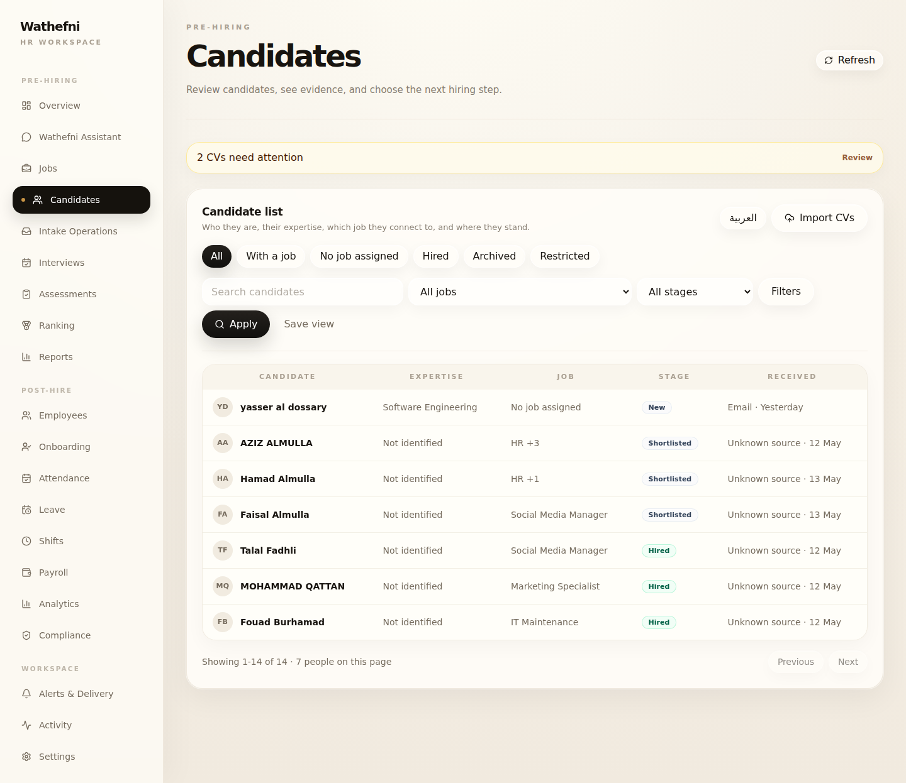
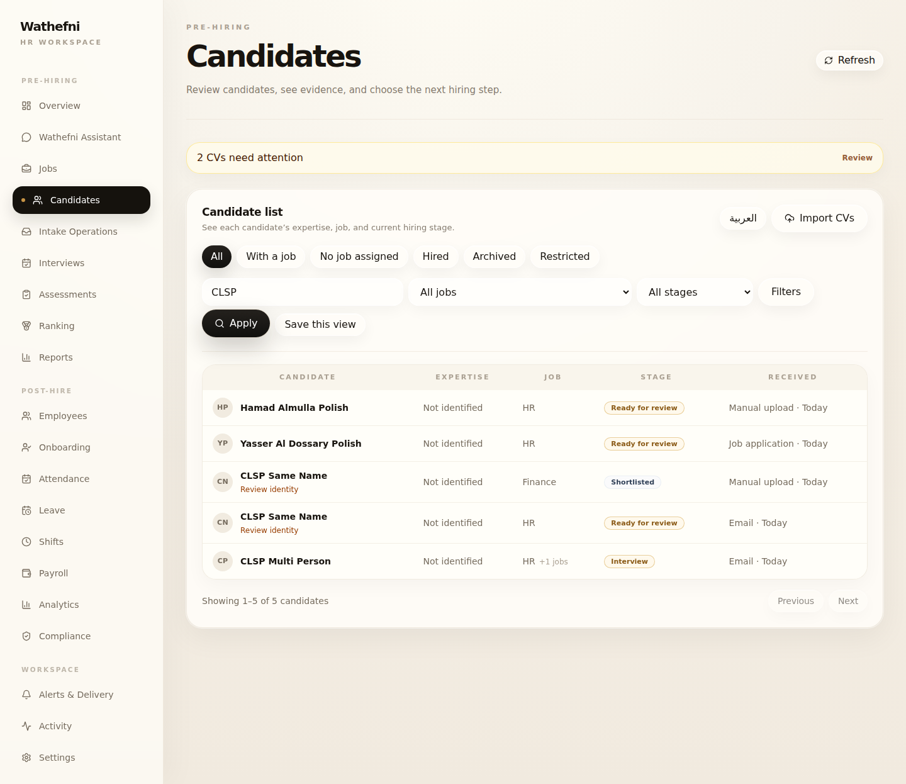

# Wathefni Candidates List — Final Polish

**Date:** 2026-07-27 (UTC)  
**Stamp:** `20260727T141613Z`  
**Scope:** Candidates list polish only  
**Host:** `root@76.13.63.68`  
**Dashboard:** `https://api.wathefni.ai/dashboard/`

**Not done:** colors/branding, Candidate profile redesign, Link to Job, other workspace pages, backend authorities/data/permissions/lifecycle/aggregation rules

---

## Final PASS / FAIL

| Gate | Result |
|---|---|
| Person-level footer and pagination | **PASS** |
| Multi-application `+N jobs` clarity + hover | **PASS** |
| Conservative display-name casing | **PASS** |
| Save this view intentional UX | **PASS** |
| Clearer page description EN/AR | **PASS** |
| Restricted view permission-aware | **PASS** (UI gate; backend unchanged) |
| Five default columns preserved | **PASS** |
| Source / expertise honesty preserved | **PASS** |
| Backend unchanged | **PASS** |
| No lasting candidate/app/person/CV/binding mutation | **PASS** (residue 0/0) |
| Health 200 before / after / rollback / restore | **PASS** |
| Rollback + restore | **PASS** |
| EN/AR + RTL | **PASS** |

**Verdict: PASS — Candidates list polish is live on production.**

---

## Before / after

Local mirror: `ops/screenshots/candidates-list-polish/20260727T141613Z/`

### Before (prior simplification)



Observed issues:

- Footer mixed application totals with person counts: `Showing 1-14 of 14 · 7 people on this page`
- Ambiguous multi-job: `HR +3`
- Mixed name casing: `yasser al dossary`, `AZIZ ALMULLA`
- Floating incomplete **Save view**
- Description: “Who they are, their expertise…”
- Restricted tab visible to all list users

### After (polish)



- Footer: `Showing 1–5 of 5 candidates`
- Multi-job: `HR` + `+1 jobs` (hover: `2 active applications`)
- Names: `Yasser Al Dossary Polish`, `Hamad Almulla Polish`
- **Save this view** only when filters/search differ from default
- Description: “See each candidate’s expertise, job, and current hiring stage.”
- Arabic/RTL and tablet shots captured under `after/`

---

## Count and pagination logic

1. Candidates fetch loads the **full filtered application set** in batches of 100 (hard cap 1000). Backend list/query rules are unchanged.
2. Frontend `aggregateCandidatesForList` still merges only on confirmed email/phone.
3. UI paginates **person rows** with page size **25**.
4. Footer uses person totals only via `candidateListFooterLabel`:
   - `Showing 1–7 of 7 candidates`
   - `1 candidate`
   - Arabic: `عرض 1–7 من 7 مرشحاً`
5. Application totals are no longer shown in the list footer.

---

## Name-formatting rules

`formatCandidateDisplayName` is display-only (canonical/source name untouched):

| Input shape | Behavior |
|---|---|
| Arabic script present | Preserve as-is |
| Already mixed Latin case | Preserve |
| All-lowercase Latin | Title-case tokens (`yasser al dossary` → `Yasser Al Dossary`) |
| All-uppercase Latin | Title-case tokens (`HAMAD ALMULLA` → `Hamad Almulla`) |
| Empty | `Unnamed candidate` / `مرشح بدون اسم` |

---

## Multi-application display

| Before | After |
|---|---|
| `HR +3` | `HR` + compact `+3 jobs` |
| No explanation | Hover/focus title: `4 active applications` |

Profile remains the place to inspect every application. Aggregation rules unchanged.

---

## Permission behavior (Restricted)

- Restricted pill hidden unless `canViewRestrictedCandidates`:
  - role `owner` / `admin`, or
  - permission `users.manage` or `settings.manage`
- If Restricted was selected without permission, UI falls back to All and clears the filter.
- Backend restricted predicates/access controls were **not** changed or weakened.

Owner qualify session correctly still sees Restricted.

---

## Save View behavior

- Default empty state: no unfinished Save control.
- When search/filters differ from default: secondary **Save this view** / **حفظ هذا العرض**.
- Opening it shows a named save panel; existing saved views remain reachable via **Saved views** when present.

---

## Deploy identity

| Item | Value |
|---|---|
| Dist manifest SHA | `aa0fe18a48b662b949765166e5c1c1c6fc9da54910f9aff24ded4b52acbb1ee7` |
| Live JS | `dashboard-DPkeDS49.js` |
| Evidence | `/opt/wathefni/production-evidence/candidates-list-polish/20260727T141613Z/` |
| Backup / rollback | `/opt/wathefni/backups/production-pre-candidates-list-polish-20260727T141613Z/ROLLBACK.sh` |
| Restore | `.../RESTORE_NEW.sh` |

Backend SHA unchanged throughout:

```
f6a5426fa97eb354e85cd5f9a0b5792ddf86a4474ba828140600ee2a65483dd4  app.py
945feb810285e1ae14e78f68432cf7c64d00b506519b442fbbcd11f23f165421  unified_candidates.py
```

---

## Regression results

| Gate | Result |
|---|---|
| Local vitest (presentation / table / classification / App) | **29/29 PASS** |
| Local `tsc -b` | **PASS** |
| Production after-qualify | **`ok: true`** |
| Bundle assert | **PASS** |
| Rollback markers → prior simplification | **PASS** |
| Restore markers → polish | **PASS** |
| Synthetic residue | apps **0** / cands **0** |

---

## Remaining limitations

1. Person totals are computed from the loaded filtered application set (cap 1000). Extremely large tenants may need a future person-aware API.
2. Restricted visibility is a **frontend gate** over existing elevated permissions; there is still no dedicated `candidate.privacy` permission string in the product.
3. Expertise still depends on API `classification_chip`; empty → `Not identified` (no invention).
4. Candidate profile may still show older Talent Pool / technical wording — intentionally unchanged.
5. Link to Job remains disabled.

---

## Stop line

Candidates-list final polish stops here. Do not begin profile redesign, color changes, or other workspace pages from this report.
