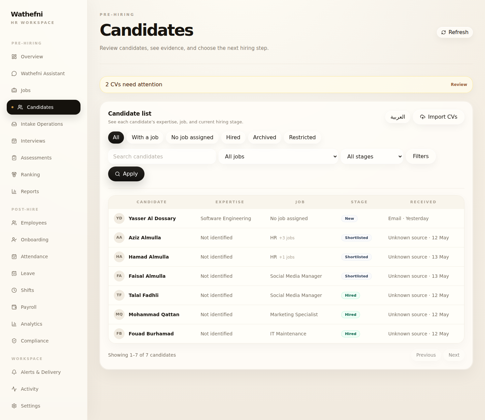
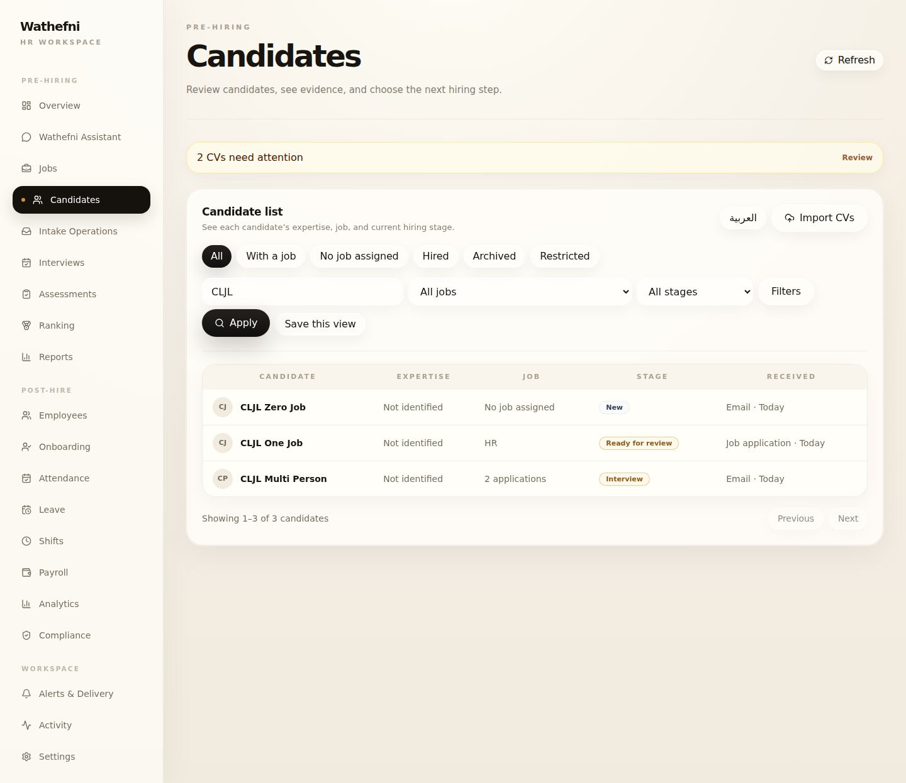

# Wathefni Candidates List — Multi-application Job Label Fix

**Date:** 2026-07-27 (UTC)  
**Stamp:** `20260727T143753Z`  
**Scope:** Candidates list Job-column copy only  
**Host:** `root@76.13.63.68`  
**Dashboard:** `https://api.wathefni.ai/dashboard/`

**Not done:** colors, Candidate profile, backend aggregation/identity/permissions/data, other list behavior

---

## Final PASS / FAIL

| Gate | Result |
|---|---|
| Zero-app → `No job assigned` | **PASS** |
| One-app → exact Job title | **PASS** |
| Multi-app → count only (`2 applications`) | **PASS** |
| No `HR +N jobs` / `+N` | **PASS** |
| EN/AR + RTL | **PASS** |
| Backend unchanged | **PASS** |
| No lasting data mutation | **PASS** (residue 0/0) |
| Health 200 before/after/rollback/restore | **PASS** |
| Rollback + restore | **PASS** |

**Verdict: PASS — multi-application Job label fix is live.**

---

## Before / after

Local: `ops/screenshots/candidates-job-label/20260727T143753Z/`

### Before



Ambiguous values such as `HR +3 jobs` / `HR +1 jobs` forced HR to decode the cell.

### After



Production after-qualify rows:

| Candidate | Job column |
|---|---|
| CLJL Zero Job | `No job assigned` |
| CLJL One Job | `HR` |
| CLJL Multi Person | `2 applications` |

Arabic/RTL: `after/after/after-candidates-ar.png` (`غير مرتبط بوظيفة`, `طلبان` / `طلبات`).

---

## Behavior

| Active applications | English | Arabic |
|---|---|---|
| 0 | No job assigned | غير مرتبط بوظيفة |
| 1 | Exact Job title (e.g. `HR`) | Exact Job title |
| 2 | 2 applications | طلبان |
| 3–10 | N applications | N طلبات |
| 11+ | N applications | N طلباً |

Job names for multi-application people remain inside the Candidate profile. The list stays scannable.

Five columns unchanged: Candidate · Expertise · Job · Stage · Received.

---

## Deploy identity

| Item | Value |
|---|---|
| Dist manifest SHA | `127c12c93e26bebecad224388138bcb19b8fb3eec3bfe831304d6c44e7d4dc50` |
| Live JS | `dashboard-DPQqbG1h.js` |
| Evidence | `/opt/wathefni/production-evidence/candidates-job-label/20260727T143753Z/` |
| Backup | `/opt/wathefni/backups/production-pre-candidates-job-label-20260727T143753Z/` |

Backend SHA unchanged:

```
f6a5426fa97eb354e85cd5f9a0b5792ddf86a4474ba828140600ee2a65483dd4  app.py
945feb810285e1ae14e78f68432cf7c64d00b506519b442fbbcd11f23f165421  unified_candidates.py
```

Files changed (presentation only):

- `apps/wathefni-dashboard/src/lib/candidatesListPresentation.ts`
- `apps/wathefni-dashboard/src/components/candidates/CandidatesTable.tsx`
- matching tests

---

## Regression

| Gate | Result |
|---|---|
| Local vitest presentation + table | **18/18 PASS** |
| Local `tsc -b` | **PASS** |
| Production after-qualify | **`ok: true`** |
| Bundle assert | **PASS** |
| Rollback → prior polish markers | **PASS** |
| Restore → new label markers | **PASS** |
| Synthetic residue | **0 / 0** |

---

## Remaining limitations

1. Multi-app people show a count only; individual Job titles are in the profile (by design).
2. Aggregation rules are unchanged; this is display copy only.
3. Candidate profile was not redesigned.

---

## Stop line

Multi-application Job label fix stops here. Do not begin the Candidate profile from this report.
