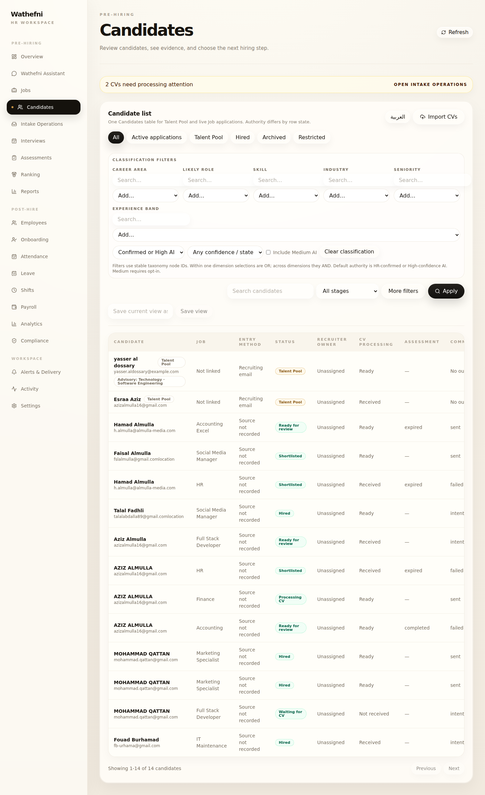
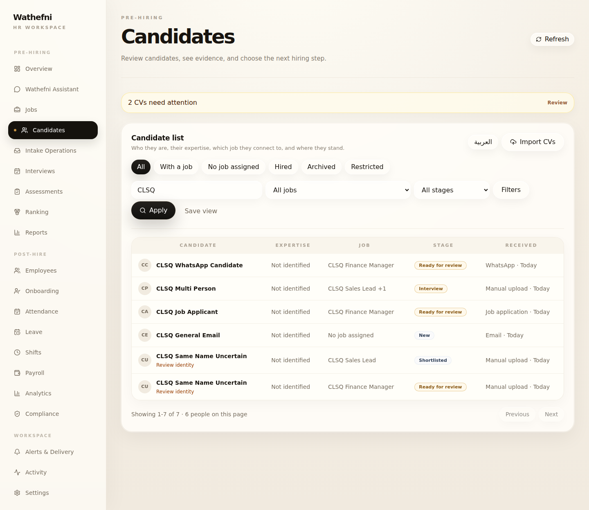

# Wathefni Candidates List — Production Qualification

**Date:** 2026-07-27 (UTC)  
**Stamp:** `20260727T135119Z`  
**Scope:** Normal HR Candidates list UI only  
**Host:** `root@76.13.63.68`  
**Dashboard URL:** `https://api.wathefni.ai/dashboard/`  
**Backend:** `wathefni-orchestrator.service` · `127.0.0.1:8010`

**Not in scope / not done:** candidate profile redesign, Link to Job, color/branding changes, other workspace pages, backend authorities, CV intake, verified Job binding, Candidate Knowledge mutations

---

## Final PASS / FAIL

| Gate | Result |
|---|---|
| Narrow Candidates list production deploy | **PASS** |
| Health 200 before and after | **PASS** |
| Production backend / APIs unchanged | **PASS** |
| Candidates page loads; five default columns only | **PASS** |
| Emails / Talent Pool badges absent from default rows | **PASS** |
| Technical advisory / classification wording absent from default list | **PASS** |
| Source-label normalization (Email / WhatsApp / Manual upload / Job application / Unknown source) | **PASS** |
| Confirmed multi-application person appears once with `+N` | **PASS** |
| Uncertain name-only identities remain separate + Review identity | **PASS** |
| General candidates show No job assigned | **PASS** |
| Job applicants retain Job + stage | **PASS** |
| Advanced classification filters only inside Filters | **PASS** |
| EN / AR + RTL | **PASS** |
| No lasting candidate / application / CV / person / binding mutation | **PASS** (synthetic qualify fixtures cleaned; residue 0/0) |
| Rollback + restore | **PASS** |
| Link to Job implemented | **FAIL / not attempted** (correctly left disabled) |
| Candidate profile redesign | **FAIL / not attempted** (correctly out of scope) |

**Verdict: GO for Candidates list simplification on production.**

---

## Deploy identity

| Item | Value |
|---|---|
| Dashboard dist manifest SHA | `46a668b1ff4dfbdb9ef64cb7c5ad43604f5800d3376cdaafd25af01258d86c7d` |
| Live JS asset | `/var/www/wathefni-dashboard/assets/dashboard-Cj-bOz7F.js` |
| Evidence (remote) | `/opt/wathefni/production-evidence/candidates-list-simp/20260727T135119Z/` |
| Evidence (local) | `ops/screenshots/candidates-list-simp/20260727T135119Z/` |
| Backup / rollback | `/opt/wathefni/backups/production-pre-candidates-list-simp-20260727T135119Z/ROLLBACK.sh` |
| Restore new | `/opt/wathefni/backups/production-pre-candidates-list-simp-20260727T135119Z/RESTORE_NEW.sh` |

### Build discipline (narrow allowlist)

Production `src` was the baseline. Only these overlays entered the build:

- `src/lib/candidatesListPresentation.ts` (+ test)
- `src/components/candidates/CandidatesTable.tsx` (+ test)
- `src/components/candidates/ClassificationFilters.tsx` (+ test)
- Surgical `CandidatesPage` / banner-locale patch in `App.tsx`

Unrelated dirty local worktree files (PostHire, setup-console onboarding, ImportCenter, api expansions) were **not** promoted. PostHire / api / ImportCenter SHAs matched production baseline.

### Backend unchanged

```
f6a5426fa97eb354e85cd5f9a0b5792ddf86a4474ba828140600ee2a65483dd4  app.py
945feb810285e1ae14e78f68432cf7c64d00b506519b442fbbcd11f23f165421  unified_candidates.py
```

Identical before cutover, after cutover, after rollback, and after restore.

---

## Health

| Checkpoint | Result |
|---|---|
| Before backup / before cutover | health **200**, dashboard **200** |
| After cutover | health **200**, dashboard **200** |
| After rollback proof | health **200**, dashboard **200** |
| After restore of new dist | health **200**, dashboard **200** |

---

## Before / after screenshots

Local mirror: `ops/screenshots/candidates-list-simp/20260727T135119Z/`

### Before (live production)



Observed before headers: Candidate, Job, Entry method, Status, Recruiter owner, CV processing, Assessment, Communication.  
Visible Talent Pool badges, emails under names, Advisory chips, Open Intake Operations CTA, classification panel on the default page.

### After (simplified list)



Default headers only: **Candidate · Expertise · Job · Stage · Received**. Soft banner: **2 CVs need attention** + Review.

### Representative cases

| Case | Screenshot | Proof |
|---|---|---|
| General email candidate | `after/after/after-general-email.png` | `No job assigned` · Stage `New` · Received `Email · Today` |
| WhatsApp candidate | `after/after/after-whatsapp.png` | Received `WhatsApp · Today` · Job retained |
| Job applicant | `after/after/after-job-applicant.png` | Job `CLSQ Finance Manager` · Stage `Ready for review` · `Job application · Today` |
| Confirmed multi-application person | `after/after/after-multi-person.png` | One row · `CLSQ Sales Lead +1` · `1 people on this page` while API still counted 2 apps |
| Uncertain duplicate identity | `after/after/after-uncertain-dup.png` | Two separate rows · both show **Review identity** |
| Filters drawer | `after/after/after-candidates-filters-open.png` | Classification / expertise filters only after Filters |
| Arabic / RTL | `after/after/after-candidates-ar-rtl.png` | `dir=rtl` · headers المرشح / الخبرة / الوظيفة / المرحلة / الاستلام |
| Tablet | `after/after/after-candidates-tablet.png` | Usable five-column layout |

Automated after-qualify: **`ok: true`** (`after/after-qualify.json`).

---

## Requirement matrix

| Requirement | Evidence |
|---|---|
| Five default columns | headers `CANDIDATE/EXPERTISE/JOB/STAGE/RECEIVED` |
| No email under name / no Talent Pool badge on rows | page snippet + absent assertions |
| No Advisory / Career area / Likely role / Not linked / needs_role | absent::* assertions true |
| Source normalization | Email · WhatsApp · Manual upload · Job application observed on fixtures |
| Person-first confirmed merge | Multi Person → one row with `+1` |
| No false aggregation | Same Name Uncertain → 2 people + Review identity |
| General vs Job applicant | No job assigned vs titled Job + stage |
| Filters simplification | classification hidden by default; visible after Filters |
| Permissions / actions unchanged | profile open path unchanged; no Link-to-Job enablement; no backend route changes |
| No lasting data mutation | qualify cleanup deleted 7 apps + 7 cands; final residue apps=0 cands=0 |

Temporary synthetic `CLSQ*` fixtures were used only for screenshot/assert qualification and removed.

---

## Rollback and restore

1. **Rollback** via `ROLLBACK.sh` restored prior `/var/www/wathefni-dashboard` from `dashboard-public.tgz`. Bundle markers returned to pre-change (`Open Intake Operations` present; `No job assigned` / `Review identity` absent). Health 200.
2. **Restore** via fixed `RESTORE_NEW.sh` re-promoted `dashboard-Cj-bOz7F.js` and source overlays. Bundle markers confirmed. Health 200.
3. Production left on the **new** Candidates list dist after restore proof.

---

## Local gates used before promote

| Gate | Result |
|---|---|
| Surgical build from production `src` + candidates allowlist | PASS |
| `vitest` presentation / table / classification tests | **20/20** PASS |
| `tsc -b && vite build` | PASS |

---

## Remaining limitations

1. **Person-first aggregation remains page-local.** Pagination totals are still application-based (`Showing 1-2 of 2 · 1 people on this page`). Server-side person pagination needs a future API.
2. **Expertise depends on API `classification_chip`.** Synthetic rows without enriched chips correctly showed `Not identified` (no invented field). Live rows that already expose chips continue to display cleaned labels.
3. **Link to Job remains disabled** — not implemented in this deploy.
4. **Candidate profile** may still show Talent Pool / technical wording — intentionally unchanged.
5. **Intake Operations** nav/page still exists; only the Candidates-entry banner copy was softened.
6. **`Entry method` / `Talent Pool` strings can still exist inside the JS bundle** (profile, lifecycle copy, Intake Ops). They are absent from the default Candidates list surface.
7. Stage filter value **New** still maps to backend `awaiting_cv` only.

---

## Stop line

Production Candidates list simplification is qualified and live.  
Do not begin profile redesign, Link-to-Job, color changes, or other workspace pages from this report.
