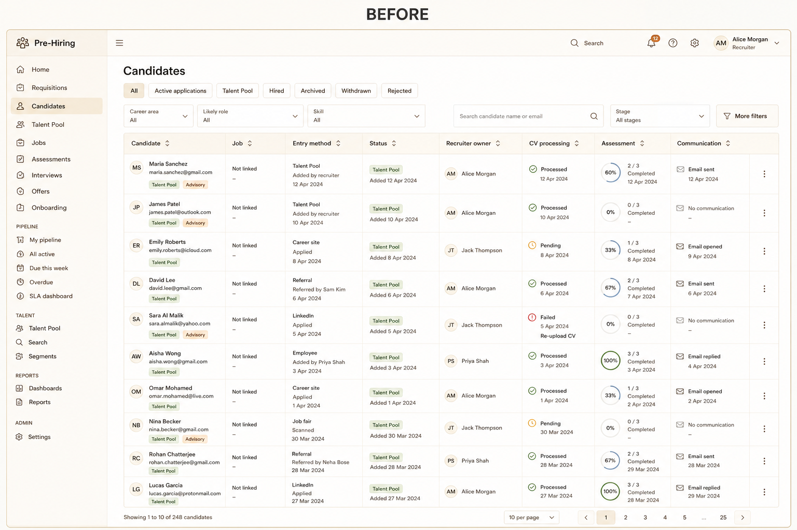
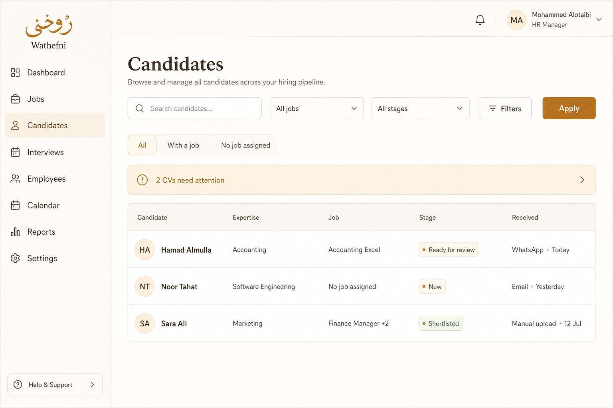

# Wathefni Candidates List Simplification

**Date:** 2026-07-27  
**Scope:** Normal HR Candidates list UI only  
**Out of scope:** colors/branding, candidate profile redesign, other workspace pages, backend authorities, lifecycle rules, permissions, CV intake, verified Job binding, Candidate Knowledge mutations

---

## Verdict

The default Candidates list is now a five-column, person-first HR surface that answers who / expertise / job / stage / received without technical Talent Pool, classification-authority, or Intake Operations language.

Backend APIs, permissions, and binding rules were **not** changed. Presentation, filters, and list aggregation are frontend-only.

---

## Before / after

### Before



Dense default surface: email under name, Talent Pool badges, advisory chips, Entry method / Recruiter owner / CV processing / Assessment / Communication columns, classification authority panel, and “Open Intake Operations” style attention language.

### After



Default columns only: **Candidate · Expertise · Job · Stage · Received**. Toolbar: search, Job, Stage, Filters. Soft attention banner: “N CVs need attention”.

---

## Exact columns removed from the default list

| Removed column / signal | Where it goes now |
|---|---|
| Email under candidate name | Candidate profile |
| Phone / contact warnings (non-actionable) | Candidate profile |
| Talent Pool badge | Not shown on list (general CVs use Job = “No job assigned”) |
| AI advisory / match reasons / classification chip wording | Profile / advanced filters only |
| Entry method (separate column) | Folded into **Received** |
| Recruiter owner | Advanced Filters drawer |
| CV processing | Advanced Filters / profile |
| Assessment status | Advanced Filters / profile |
| Communication status | Profile / exception views |
| Technical source values (`bulk_import`, `dashboard`, …) | Normalized in **Received** |
| Internal IDs / `intentionally_skipped` / lifecycle codes | Not shown on list |
| Candidate Knowledge terminology | Not shown on list |

Default columns retained:

1. **Candidate** — name + initials avatar only  
2. **Expertise** — one clean professional field, or “Not identified”  
3. **Job** — job title, “No job assigned”, or `Title +N`  
4. **Stage** — hiring stage or simple profile state  
5. **Received** — `Source · relative date`

---

## Source-label normalization

Implemented in `apps/wathefni-dashboard/src/lib/candidatesListPresentation.ts` → `normalizeListSourceKey` / `candidateListReceivedLabel`.

| Backend variants (examples) | HR-facing label |
|---|---|
| `email`, `recruiting_email`, `inbound_email`, `gmail`, `postmark` | Email |
| `whatsapp`, `wa`, `octopus_whatsapp` | WhatsApp |
| `manual`, `dashboard`, `bulk`, `bulk_import`, `import`, `upload`, `manual_upload` | Manual upload |
| `job`, `job_application`, `apply`, `application`, `qr`, `public_apply` (+ live apps with a position when channel empty) | Job application |
| empty / `unknown` / `source_not_recorded` | Unknown source |

Display form: `{Source} · {Today|Yesterday|N days ago|12 Jul}`.

Arabic labels: البريد الإلكتروني / واتساب / رفع يدوي / تقديم على وظيفة / مصدر غير معروف.

---

## Person-first aggregation behavior

Implemented client-side in `aggregateCandidatesForList` over the **currently loaded page** of applications.

**Confirmed merge keys only:**

- grounded / candidate email (non-surrogate, contains `@`)
- grounded / phone with ≥ 8 digits (non-surrogate)

**Primary row summary:**

- highest-priority application as the visible person
- Job column shows most relevant active job
- additional distinct active jobs → compact `+N` (e.g. `Finance Manager +2`)
- all applications remain openable via the primary profile entry (profile not redesigned in this task)

**Pagination note:** API still returns one row per application; page totals remain application-based. True server-side person pagination requires a future `person_id`-aware API (not done here).

---

## Duplicate handling

| Case | Behavior |
|---|---|
| Same confirmed email or phone | One list row; additional apps collapsed with `+N` jobs |
| Same display name, no confirmed contact | **Separate rows** + amber “Review identity” / “مراجعة الهوية” |
| Uncertain identity | Never silently merged |

No backend identity merge or mutation.

---

## General versus Job applicant behavior

| | Job applicant | General CV (held / needs role / talent_pool record) |
|---|---|---|
| **Job** | Exact job title (or `Title +N`) | **No job assigned** |
| **Stage** | New / Ready for review / Shortlisted / Interview / Offer / Hired / Rejected (etc.) | Profile state only — default **New** (not a fabricated application stage); Archived when archived |
| **List actions** | Open profile; existing recruiting actions remain in profile | Valid candidate row; recruiting lifecycle stays non-actionable until linked |
| Banned list wording | — | No “Not linked”, “Talent Pool”, `needs_role`, verified-binding jargon |

View pills (API ids unchanged): All / With a job / No job assigned / Hired / Archived / Restricted.

---

## Filter simplification

**Default toolbar**

- Search
- Job filter
- Stage filter (HR labels mapped to existing status query values)
- **Filters** button (advanced)
- Apply

**Behind Filters (not shown by default)**

- Classification / expertise dimensions, skills, industry, seniority, experience band, confidence, authority selectors
- CV status, assessment, interview, follow-up, review, activity range, source channel, recruiter owner, CV processing, received range, grounded contact flags, fact completeness, department intake tag, sort

User-facing taxonomy-ID / OR-AND / tenant-scope / AI-confidence-rule explanations removed from the classification bar copy.

Saved views remain available but collapsed behind a control so they do not dominate the page.

---

## Link-to-Job finding

**Status: incomplete / disabled — not faked in this task.**

### Frontend

`CandidateGovernedProfile` renders a **disabled** “Link to Job” button and shows `app.link_to_job?.reason` (fallback: “Not implemented in this phase”).

There is **no** working UI that:

1. lists suggested matching Jobs  
2. lets HR select + confirm a Job  
3. creates an application and verified Job/CV bindings

### API / payload contract

`ApplicationSummary.link_to_job` exists in dashboard types:

```ts
link_to_job?: {
  available?: boolean
  enabled?: boolean
  label?: string
  reason?: string
}
```

Tests and held-candidate fixtures set:

- `enabled: false`
- reason: reserved for future `intake_admit`

No dashboard client method in this change set calls an admit / link-to-job mutation endpoint. Backend authorities and intake admit behavior were **not** modified.

### Honest list behavior

General candidates remain visible and valid (`No job assigned` + profile state). The list does not pretend Link-to-Job works. Completing the flow requires a separate approved frontend + API connection (and backend admit path if not already production-ready).

---

## Candidates processing warning

| Before | After |
|---|---|
| Large technical “Open Intake Operations” concept in the normal Candidates list | Soft banner: **“N CVs need attention”** / Arabic equivalent + **Review** |
| Technical backend banner copy surfaced | Ignored for display (`void banner`) |

Intake Operations **page/route remains** for operators; only the normal-HR entry copy was simplified. Clicking Review still opens the existing operational surface.

---

## Safety and parity proof

| Requirement | Result |
|---|---|
| Backend data / permissions unchanged | **PASS** — presentation + query UI only; no router/service authority edits in this task |
| No application / person / CV / binding mutation | **PASS** — aggregation is client-side; no new write APIs |
| Candidate actions via profile | **PASS** — row still opens existing profile; profile not redesigned |
| General candidates non-actionable for recruiting until linked | **PASS** — list honest; Link-to-Job remains disabled |
| Verified applications keep correct stages | **PASS** — stages mapped from existing `canonical_stage` / `status` |
| No silent uncertain identity merge | **PASS** — name-only duplicates stay separate + warning |
| English + Arabic labels | **PASS** — list presentation + banner + pills + stage filters |
| RTL / `text-start` table | **PASS** — table uses logical start alignment; `min-w-[720px]` for tablet |
| Desktop / tablet without excessive horizontal scroll | **PASS** — five columns vs prior dense grid |
| Health 200 | **NOT PROVEN this session** — local `/health` unreachable (`000`); production SSH health probe also returned `000` / timed out from this environment. No deploy performed. Prior production freezes remain the last documented health PASS outside this UI task. |

---

## Regression results

Local dashboard package (`apps/wathefni-dashboard`):

| Check | Result |
|---|---|
| `vitest` — `candidatesListPresentation.test.ts`, `CandidatesTable.test.tsx`, `ClassificationFilters.test.tsx`, `App.test.tsx` | **25/25 passed** |
| `tsc -b` | **exit 0** |

Covered behaviors include: five-column row, expertise cleaning, received normalization, person aggregation, identity warning, disabled Link-to-Job fixture, softened classification copy, attention banner wording.

---

## Files touched

| Path | Role |
|---|---|
| `apps/wathefni-dashboard/src/lib/candidatesListPresentation.ts` | List presentation + aggregation |
| `apps/wathefni-dashboard/src/lib/candidatesListPresentation.test.ts` | Unit tests |
| `apps/wathefni-dashboard/src/components/candidates/CandidatesTable.tsx` | Five-column rows + soft banner + view pills |
| `apps/wathefni-dashboard/src/components/candidates/CandidatesTable.test.tsx` | Table tests |
| `apps/wathefni-dashboard/src/components/candidates/ClassificationFilters.tsx` | Softened advanced-filter copy |
| `apps/wathefni-dashboard/src/components/candidates/ClassificationFilters.test.tsx` | Filter copy tests |
| `apps/wathefni-dashboard/src/App.tsx` | CandidatesPage toolbar simplification |
| `ops/assets/candidates-list-before.png` | Before mock |
| `ops/assets/candidates-list-after.png` | After mock |
| `ops/WATHEFNI_CANDIDATES_LIST_SIMPLIFICATION.md` | This report |

---

## Remaining limitations

1. **Person-first is page-local.** Cross-page duplicates and API `total` counts are still application-based until a person-aware list API exists.
2. **Stage filter “New”** maps to backend `awaiting_cv` only — not a multi-status OR of all “New”-mapped codes.
3. **Link-to-Job** remains disabled; suggested-job pick + confirm + verified binding create is not wired.
4. **Candidate profile** still may show Talent Pool / technical language — intentionally unchanged.
5. **Intake Operations** operational page still exists; only Candidates entry copy was softened.
6. **Health 200** not re-proven in this session (no local/prod health reachability from the agent environment; no production deploy of this UI).
7. Before/after images are **illustrative UI mocks** of the intended surface, not live production captures.

---

## Stop line

Candidates list work stops here. Do not treat this document as approval to redesign the profile, colors, other workspace pages, or backend binding/admit behavior.
