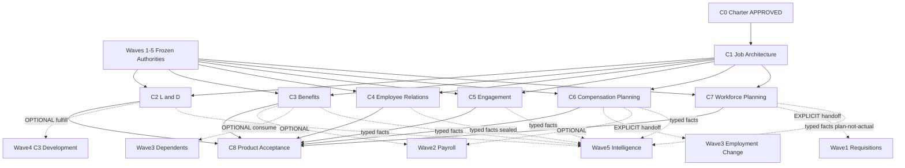

# Wave 6 — HCM Expansion Build Charter

**Status:** APPROVED — `WAVE6_HCM_EXPANSION_CHARTER: APPROVED` (owner 2026-08-12; binding locks §0.7–§0.8)  
**Execution authority parent:** `ops/WATHEFNI_HCM_EXECUTION_ROADMAP.md` §8  
**Prior gate:** `WAVE5_PRODUCT_FULL_PASS` **ACCEPTED** 2026-08-12 — Wave 5 remains frozen (`ops/WAVE5_PRODUCT_FREEZE.md`)  
**Wave 4 freeze:** `WAVE4_PRODUCT_FULL_PASS` ACCEPTED — Performance + Talent remains frozen  
**Wave 3 freeze:** `WAVE3_PRODUCT_FULL_PASS` ACCEPTED — Employee Lifecycle remains frozen  
**Wave 2 freeze:** `WAVE2_PRODUCT_FULL_PASS` ACCEPTED — Workforce Truth remains frozen  
**Wave 1 freeze:** `WAVE1_PRODUCT_FULL_PASS` ACCEPTED — Hire→Ready remains frozen (WATHEFNI-canary)  
**Audit SoT:** 111-capability HCM gap audit + roadmap §8  
**Charter date:** 2026-08-12 · **Approved:** 2026-08-12  
**Scope:** Wave 6 — HCM Expansion (Job Architecture foundation → L&D → Benefits → Employee Relations → Engagement → Compensation Planning → Workforce Planning → product acceptance)  
**Implementation gate:** Open for **C1 Job Architecture only**; stop after each C-slice stamp for owner review. Binding locks §0.7–§0.8 in force.

---

## 0. Charter principles (non-negotiable)

### 0.1 Product honesty over feature-count completeness

Wave 6 expands Wathefni into the remaining major HCM domains. It must **not** optimize for a shallow “complete HCM” checkbox suite.

> Prefer **six well-separated product authorities** with explicit optional integration contracts over a hard-dependent mega-bundle.

Each domain must be able to stand alone for a real customer when others are disabled.

| Forbidden | Required instead |
|---|---|
| One giant Wave 6 hard dependency graph | Independent modules + OPTIONAL contracts |
| Shadow employees / jobs / org / employment states | Reference existing canonical person/employee/employment/org/manager/position authorities |
| Duplicate `development_plan` for L&D | Fulfill Wave 4 C3 development actions; L&D may also run independently for compliance |
| Benefits requiring Wathefni Payroll | Benefits SoT independent; optional payroll deduction/contribution consume |
| Comp plan silent salary rewrite | Comp Planning ≠ Payroll; explicit handoff into employment-change / payroll authorities |
| Scenario headcount leaking into Wave 5 actual headcount | Actual vs Plan vs Scenario vs Approved execution remain distinct |
| Domain-specific analytics engines | Typed facts → frozen Wave 5 Registry / evaluator |
| Fake anonymity / manager-identifiable lone respondents | Engagement anonymity fails closed with real thresholds |
| Free-text ER leakage into Intelligence | ER confidentiality stronger than ordinary HR; no ER narrative dump into analytics |
| Env-variable customer configuration | Setup Console owns company policy; env = gates/kill switches only |
| Assistant silent mutations | Read / explain / deep-link unless a separate mutation charter is approved |

### 0.2 Modularity

| Rule | Requirement |
|---|---|
| Domain independence | Each commercial/product module enables without requiring sibling Wave 6 domains |
| Domain-off honesty | Disabled modules disappear cleanly — no empty shells, no fake fallback truth |
| Optional integrations | Cross-domain links are OPTIONAL contracts, never hidden HARD deps |
| Commercial keys | Distinct module keys per domain (see §3); no duplicate commercial modules |
| No reopen | Do **not** reopen Waves 1–5 for Wave 6 convenience / safe debt |

### 0.3 Dependency classes

| Class | Definition |
|---|---|
| **HARD DEPENDENCY** | Slice/domain cannot ship honestly without named prior authority |
| **OPTIONAL INTEGRATION** | Domain works from its own SoT; another domain enriches when enabled |
| **ENHANCEMENT WHEN ENABLED** | Core works; extra facts/surfaces enrich when present |

### 0.4 Dynamic navigation

Runtime nav = `enabled company modules ∩ permission grants ∩ surface capability matrix`.  
Zero visible children for a domain → omit the group entirely.

### 0.5 Prior freeze boundaries (do not reopen)

| Freeze | Rule for Wave 6 |
|---|---|
| Wave 1 Hire→Ready | Requisitions remain approved hire-request SoT; job publish gate untouched; Attention remains Ops |
| Wave 2 Workforce Truth | Payroll remains money/execution authority; attendance/leave/shifts not rewritten |
| Wave 3 Employee Lifecycle | Employment-change cases + dependents remain SoT; real termination stays locked |
| Dependents C2 | Benefits may **consume** dependents; must not mutate Wave 3 dependent SoT into insurance product |
| Wave 4 Performance + Talent | C3 remains **sole** development-plan/action authority; no universal talent score; HiPo explicit only; 9-box non-SoT |
| Wave 5 HR Intelligence | Single Registry evaluator; Wave 6 emits typed facts only — no second analytics engine |
| Succession honesty | `no_duplicate_job_architecture` — Wave 6 must provide shared JA, not per-domain grade trees |
| Real termination | `WATHEFNI_REAL_TERMINATION_CANARY=off` until separate owner unlock |
| Global Wave 5 | Remains **off / company-gated**; broad production rollout separately owner-gated |

### 0.6 Out of scope for this charter / first Wave 6 MVP posture

- Full LMS marketplace / SCORM/xAPI vendor platform as HARD MVP (may be later enhancement)
- Full insurance claims administration as HARD MVP (claims only if intentionally opted into MVP)
- Broad AI mutations (discipline, enroll, approve plans, change pay)
- Replacing Wave 1 requisitions with a second requisition state machine
- Publishing Wave 5 actual headcount from workforce scenarios
- Unblocking FTE via Comp/Workforce Planning assumptions alone
- Parallel “complete HCM” marketing before individual domain FULL_PASS stamps

### 0.7 Owner decisions (LOCKED 2026-08-12)

| # | Decision | Locked |
|---|---|---|
| 1 | Job Architecture = **shared internal/platform capability**, not a separate customer-facing SKU for now. May run independently. Comp Planning + Workforce Planning may **HARD**-depend; other integrations remain **OPTIONAL** | **Locked** |
| 2 | Legacy grade/title migration is **non-destructive**. Preserve raw values + provenance. Auto-map **only** deterministic unique matches. Ambiguous/unmatched remain explicitly unmapped. **No** fuzzy/AI canonical mapping | **Locked** |
| 3 | C1 career-path MVP = versioned **promotion / lateral / specialist / manager** progression edges with optional skill/competency requirements. **No** employee eligibility scoring or AI recommendations | **Locked** |
| 4 | L&D may explicitly link learning assignments/completions to Wave 4 C3 development actions as **fulfillment evidence**. Does **not** duplicate or silently close canonical development plans/actions | **Locked** |
| 5 | Benefits **claims/adjudication OUT** of Wave 6 MVP | **Locked** |
| 6 | Comp Planning approval does **not** mutate salary/payroll. Creates explicit governed change package/handoff requiring separate authorization + effective-date application through existing employment/payroll authority | **Locked** |
| 7 | Approved Workforce Planning demand may explicitly create a **linked draft requisition only**. No automatic posting/hiring | **Locked** |
| 8 | ER uses **strict case-level need-to-know RBAC**. Ordinary HR/manager permissions do **not** grant ER access. Separate view / manage / investigate / outcome / sensitive-evidence permissions | **Locked** |
| 9 | Anonymous Engagement default **`min_respondent_n = 5`**, configurable **upward only**; below threshold fails closed. No respondent↔answer mapping may leak through any surface | **Locked** |
| 10 | Setup = **one coherent Wave 6 area** with **module-specific cards** (not a mega-form; not duplicate settings stores) | **Locked** |
| 11 | Every Wave 6 capability remains **global-OFF / company-gated** through qualification; **FULL_PASS does not authorize broad rollout** | **Locked** |
| 12 | Assistant mutations = **OUT** of Wave 6 MVP unless separate mutation charter | **Locked** |
| 13 | Kuwait Benefits MVP = plan / eligibility / enrollment / dependents / coverage / contributions / documents / provider identifiers — **no claims engine** | **Locked** |
| 14 | Recognition = **OUT** of Engagement MVP | **Locked** |

### 0.8 Binding product locks (LOCKED 2026-08-12)

#### 0.8.1 No new employee/org truth

All Wave 6 domains reference existing canonical:

`person/employee · employment · organization · manager scope · position/job (as extended by JA) · approvals/tasks/SLA · documents · Payroll · Performance/Talent · HR Intelligence`

Shadow employees, jobs, org units, or employment states are forbidden.

#### 0.8.2 Module independence (minimum)

| Independence | Must hold |
|---|---|
| L&D ↔ Talent | L&D works without Talent; Talent works without L&D |
| Benefits ↔ Payroll | Benefits works without Payroll; Payroll works without Benefits |
| ER ↔ Engagement | ER works without Engagement; Engagement works without ER |
| Comp ↔ Payroll | Comp Planning works without Wathefni Payroll execution (external payroll supported) |
| Workforce Planning ↔ Comp | Workforce Planning works without Compensation Planning |
| Performance ↔ Comp | Performance rating must **not** automatically determine compensation |
| Talent ↔ Comp | Talent classification must **not** automatically determine compensation |

#### 0.8.3 Job Architecture is shared foundation (platform capability)

`job_architecture` is a **shared internal/platform capability** (not a separate customer SKU for now).  
Compensation, Talent, L&D, and Workforce Planning must **not** invent independent grade/job hierarchies.  
JA (C1) is the long-term authority for: job family → job function → job profile → grade → level → career relationships.  
Recruiting job/opening ≠ JA profile · Talent critical role ≠ JA catalog · Org position ≠ reusable job profile.  
Salary bands are **out of C1** (Compensation Planning owns later).

#### 0.8.4 Development authority remains Wave 4 C3

L&D may fulfill development needs; it must not duplicate `development_plan` / `development_action` SoT.  
L&D also operates independently for mandatory/compliance training.

#### 0.8.5 Comp Planning ≠ Payroll; Planning ≠ Actual

- Compensation Planning owns planning decisions; Payroll owns pay execution.  
- Workforce scenarios must not mutate employment / headcount / requisitions / payroll until explicit approved handoff.  
- Actual vs Plan vs Scenario vs Approved execution remain distinct; scenarios never feed Wave 5 actual headcount.

#### 0.8.6 Confidentiality

- ER confidentiality stronger than ordinary HR records; manager visibility ≠ ER visibility.  
- Engagement anonymity uses real minimum-response thresholds and fails closed.  
- No free-text ER leakage into HR Intelligence.  
- Sensitive aggregates follow Wave 5 cohort principles where published as Intelligence facts.

#### 0.8.7 Intelligence consume-only

Wave 6 defines typed facts for the frozen Wave 5 spine.  
**No domain-specific analytics engines.** Registry/evaluator remains analytics authority.

#### 0.8.8 Setup ownership / bilingual

Customer configuration is Setup-owned. Env flags are gates/kill switches only.  
EN/AR designed from the data model upward (not UI patches later).

---

## 1. Architecture overview

```text
Waves 1–5 (FROZEN)
  person/employee · employment · org · manager scope
  requisitions · payroll · dependents · employment_change
  performance/talent (C3 development sole SoT)
  hr_intelligence (Registry + evaluator)

Wave 6 (PROPOSED)
  C1 Job Architecture ──shared refs──► Comp / WFP / Talent / L&D / Intelligence dims
  C2 L&D ──OPTIONAL fulfill──► Wave 4 C3 development actions
  C3 Benefits ──OPTIONAL consume──► Wave 3 dependents · Wave 2 payroll deductions
  C4 ER (sealed cases) ──OPTIONAL tasks/approvals──► Phase A workflow
  C5 Engagement (anonymous surveys) ──OPTIONAL action plans──► tasks
  C6 Comp Planning ──EXPLICIT handoff──► Wave 3 salary_change · Wave 2 payroll
  C7 Workforce Planning ──EXPLICIT handoff──► Wave 1 requisitions (no SM fork)
  C8 Product acceptance / modularity matrix

All domains ──typed facts──► Wave 5 Registry (consume-only)
```

### 1.1 Domain boundaries (product authorities)

| Domain | Owns | Does **not** own |
|---|---|---|
| Job Architecture | Versioned job families/functions/roles/jobs/grades/levels/career paths; mapping contracts to org positions / employment grade refs | Employment state; payroll money; Talent decisions |
| L&D | Catalog, programs, mandatory training, assignments, completions, certifications, expiries; fulfillment links to C3 actions | Development plan SoT; Talent HiPo |
| Benefits | Plans, eligibility, enrollment, elections, coverage effective dates; dependents **references**; optional claims if MVP | Dependent identity SoT; payroll finalize |
| Employee Relations | Case types, investigation, evidence, outcomes, corrective action, confidentiality | Ordinary performance ratings; Engagement survey truth |
| Engagement | Surveys/pulse/eNPS (config), anonymity thresholds, response aggregates, optional recognition/action plans | ER cases; Performance outcomes |
| Compensation Planning | Bands/ranges, merit/bonus cycles, budgets, recommendations, planning approvals | Live payroll contracts; silent salary mutation |
| Workforce Planning | Baselines, planned positions/HC, vacancies (plan sense), demand, cost assumptions, scenarios, gaps | Actual headcount KPI; Wave 1 requisition SM; employment |

---

## 2. Job Architecture decision (C1 required)

### 2.1 Repo evidence

Today there is **no** shared Job Architecture SoT:

- Employment grade is ad-hoc text (`employment_change_c1` / profile.grade)
- Org has `unit_type='position'` with title strings (`employee_org_wave4`)
- Requisitions have optional `position_id` text without FK to a job catalog
- Succession uses `canonical_role_key` / optional `canonical_position_id` text refs and already asserts **`no_duplicate_job_architecture`**
- Wave 5 workforce intelligence treats `grade` / `job_role` as text dimensions

### 2.2 Decision

**Job Architecture requires its own standalone slice (C1) before Compensation Planning and Workforce Planning.**

| Why not bury under Workforce Planning | Why not skip |
|---|---|
| Employment change, succession, Intelligence dimensions, Comp bands, and WFP seats all need the same refs | Leaving free-text grades forces each domain to invent a hierarchy — forbidden by succession honesty + this charter |
| Roadmap already says workforce planning is “after grades”; Comp depends on grades | Soft dual-write can preserve legacy text while JA becomes authority |

**L&D / Benefits / ER / Engagement** may start after C1 lands **or** proceed with only soft JA refs (OPTIONAL). Comp Planning and Workforce Planning treat JA as **HARD**.

Recommended commercial key: **`job_architecture`** (or platform catalog entitlement — owner decision §0.7 #1).

---

## 3. Commercial / platform module keys (LOCKED)

| Domain | Key | Kind | Internal namespace |
|---|---|---|---|
| Job Architecture | `job_architecture` | **Platform capability** (not separate customer SKU for now) | `job_architecture_*` / `ja_*` |
| L&D | `learning` | Commercial module | `learning_*` / `ld_*` |
| Benefits | `benefits` | Commercial module | `benefits_*` |
| Employee Relations | `employee_relations` | Commercial module | `er_*` |
| Engagement | `engagement` | Commercial module | `engagement_*` |
| Compensation Planning | `comp_planning` | Commercial module | `comp_planning_*` |
| Workforce Planning | `workforce_planning` | Commercial module | `workforce_planning_*` |

No duplicate commercial keys. Env flags remain per-slice kill switches / allowlists. FULL_PASS ≠ broad rollout.

---

## 4. Canonical models (charter-level)

### 4.1 Job Architecture (C1)

| Entity | Purpose |
|---|---|
| `job_family` | Top-level grouping (versioned) |
| `job_function` | Function within family |
| `job_role` / `job` | Canonical role/job definition (bilingual) |
| `grade` | Grade catalog entry |
| `level` | Level within/alongside grade (company policy) |
| `career_path` / `career_path_edge` | Optional progression graph |
| `position_job_link` | Optional link from org position → job_role |
| `employment_grade_assignment` | Effective-dated employment ↔ grade/level (does not invent employment) |

State: catalog entries `draft → published → retired` (retired retained for history).

### 4.2 L&D (C2)

| Entity | Purpose |
|---|---|
| `learning_item` / course / program | Catalog |
| `learning_assignment` | Assigned learning to employee |
| `learning_completion` | Completion / score / evidence |
| `certification` / expiry | Credentials |
| `mandatory_training_policy` | Compliance rules |
| `development_fulfillment_link` | OPTIONAL link: learning assignment fulfills `perf_development_actions` |

State machines: assignment `assigned → in_progress → completed|expired|waived|cancelled`.

### 4.3 Benefits (C3)

| Entity | Purpose |
|---|---|
| `benefit_plan` | Plan definition |
| `benefit_eligibility_rule` | Eligibility |
| `benefit_enrollment` | Employee enrollment |
| `benefit_election` | Employer/employee elections |
| `benefit_coverage_period` | Effective coverage dates |
| `benefit_dependent_link` | **References** Wave 3 `employee_dependents` (no second dependent SoT) |
| `benefit_payroll_instruction` | OPTIONAL deduction/contribution instruction for payroll consume |
| `benefit_claim` | Only if MVP includes claims |

### 4.4 Employee Relations (C4)

| Entity | Purpose |
|---|---|
| `er_case` | Sealed case header (type, status, confidentiality class) |
| `er_party` | Involved parties with visibility rules |
| `er_event` / timeline | Governed events |
| `er_evidence` | Evidence refs (documents) |
| `er_outcome` / corrective action | Outcomes |
| `er_task_link` | OPTIONAL Phase A task/approval links |

Case types (minimum): grievance · disciplinary · investigation · complaint · corrective_action.  
**Manager scope must not imply ER visibility.**

### 4.5 Engagement (C5)

| Entity | Purpose |
|---|---|
| `engagement_survey` / campaign | Survey definition |
| `engagement_question` | Questions (bilingual) |
| `engagement_response` | Raw responses (strict access) |
| `engagement_aggregate` | Threshold-safe aggregates |
| `engagement_action_plan` | OPTIONAL follow-up |
| `recognition` | OPTIONAL if owner includes in MVP |

Anonymity: `min_respondent_n` (default propose 5, upward-only); complementary suppression; fail closed when identifiable.

### 4.6 Compensation Planning (C6)

| Entity | Purpose |
|---|---|
| `comp_band` / range | Grade/level-linked bands (refs JA) |
| `comp_cycle` | Merit/bonus/promotion cycle |
| `comp_budget` | Budgets |
| `comp_recommendation` | Planner recommendations |
| `comp_worksheet_row` | Employee planning row |
| `comp_approval` | Planning approval |
| `comp_apply_handoff` | Explicit handoff record → employment_change / external payroll instruction |

**Approval of a plan must not silently change salary/payroll.**

### 4.7 Workforce Planning (C7)

| Entity | Purpose |
|---|---|
| `workforce_baseline` | Snapshot of actual workforce (read from employment/org/JA; not a second SoT) |
| `workforce_plan` | Named plan |
| `planned_position` / planned headcount | Plan seats |
| `workforce_scenario` | Scenario variant |
| `workforce_assumption` | Cost/skill assumptions |
| `workforce_gap` | Critical gaps / demand |
| `plan_execution_handoff` | Explicit handoff → Wave 1 requisition (or other approved execution) |

Preserve: **Actual · Plan · Scenario · Approved execution**.

---

## 5. Dependency graph



### 5.1 Safe parallelism (post-C1)

After C1 Job Architecture FULL_PASS:

| May proceed in parallel | Constraint |
|---|---|
| C2 L&D ‖ C3 Benefits ‖ C4 ER ‖ C5 Engagement | No shared write locks; each company-gated |
| C6 Comp Planning | HARD on C1; OPTIONAL Performance/Talent inputs |
| C7 Workforce Planning | HARD on C1; OPTIONAL Recruiting handoff; must not start before C1 |
| C8 | Only after C1 + all intended domain slices accepted (or accepted subset matrix proven) |

**Do not parallelize:** Comp or Workforce Planning before JA; Plan→Requisition fork of Wave 1 SM; Comp apply before employment-change/payroll handoff contract is defined.

---

## 6. Cross-module contracts (OPTIONAL unless noted)

| From → To | Class | Contract |
|---|---|---|
| L&D → Wave 4 C3 development | OPTIONAL | Fulfillment link: learning assignment satisfies development action |
| Talent skill/succession gap → L&D | OPTIONAL | Recommendation / assignment suggestion; never auto-HiPo |
| Benefits → Wave 3 dependents | OPTIONAL consume | Enrollment may reference dependent IDs; dependents work without Benefits |
| Benefits → Payroll | OPTIONAL | Deduction/contribution instructions; Benefits works without Payroll |
| Comp → Performance outcome | OPTIONAL input | Planner may view authorized outcomes; never auto-decide pay |
| Comp → Talent | OPTIONAL input | Never auto-decide pay from HiPo/potential |
| Comp → Employment change / Payroll | EXPLICIT handoff | Apply approved award → salary_change / external payroll instruction |
| WFP → Recruiting requisitions | EXPLICIT handoff | Create/link Wave 1 requisitions; no second SM |
| WFP → Comp assumptions | OPTIONAL | Cost assumptions may reference bands; WFP works without Comp |
| Any Wave 6 → Wave 5 | OPTIONAL facts | Typed fact emit; Registry remains evaluator |
| ER → Intelligence | OPTIONAL / sealed | Aging/outcome aggregates only under strict confidentiality; no free text |
| Engagement → Intelligence | OPTIONAL | Threshold-safe aggregates only |

---

## 7. Setup model

Mirror Waves 1–4:

| Artifact | Pattern |
|---|---|
| Backend | `setup_console_wave6_*_policies.py` (per domain or coordinated wave6 package) |
| UI | Per-domain Setup cards (recommended) wired in `SetupConsoleApp` |
| Ownership | Company policy in DB; bilingual labels; modularity matrix helpers |
| Env | `WATHEFNI_<DOMAIN>_*` gates + company allowlists only |

Setup must govern (as applicable):

- JA catalogs publication / mapping policy  
- Learning catalogs / mandatory policies  
- Benefit plans / eligibility  
- ER case types / confidentiality classes  
- Engagement survey + anonymity thresholds  
- Comp cycles / bands / approval policy  
- Workforce planning assumptions / scenario permissions / handoff policy  

---

## 8. Permission / confidentiality model

| Domain | Permission posture |
|---|---|
| Job Architecture | HR catalog admin vs read; managers see assigned grade/role as authorized |
| L&D | HR admin; manager assignment (scoped); employee self learning |
| Benefits | HR benefits admin; employee self enrollment; dependents via Wave 3 rules |
| ER | **Dedicated ER roles**; sealed case access; manager ≠ ER; investigator SoD where required |
| Engagement | HR engagement admin; managers see **aggregates only** when threshold met; raw responses restricted |
| Comp Planning | Comp admin / cycle planner; manager recommendations if policy allows; money-class sensitivity |
| Workforce Planning | WFP admin; scenario readers; execution handoff restricted |

Cross-cutting:

- Tenant isolation  
- Manager scope never expands ER/engagement raw/comp worksheets beyond policy  
- Export permissions explicit (aggregate ≠ person-level)  
- Intelligence facts inherit permission classes + cohort suppression  

---

## 9. Surfaces / channels / Assistant

| Surface | Posture |
|---|---|
| HR Web | Primary for all Wave 6 admin + deep workflows |
| Manager | Scoped: learning assignments, engagement aggregates, comp recommendations (if allowed), plan visibility (if allowed) — **not** ER by default |
| Employee App | Self: learning, benefits enrollment, engagement participation, limited letters/docs — **not** company ER/Comp/WFP admin |
| HR Mobile | Thin queues / approvals / alerts; not heavyweight planning studios |
| Channels | Reminders/notifications via existing Phase A patterns; no second inbox |
| Assistant | Read / explain / deep-link to authorized views; **mutations OUT** of Wave 6 MVP unless separate charter |

AI may later suggest learning / benefit explanations / engagement themes / scenarios / comp considerations.  
AI must not silently discipline, decide ER outcomes, change compensation, enroll benefits, approve workforce plans, or manipulate survey responses.

---

## 10. Wave 5 fact contracts (typed; Registry remains authority)

Each domain must define emit contracts (examples):

| Domain | Example fact types (non-exhaustive) |
|---|---|
| JA | `job_architecture.grade_assignment`, `job_architecture.role_fill` |
| L&D | `learning.completion`, `learning.mandatory_compliance`, `learning.certification_expiry` |
| Benefits | `benefits.enrollment_status`, `benefits.coverage_active` |
| ER | `er.case_aging` (sealed), `er.outcome_category` (no free text) |
| Engagement | `engagement.response_aggregate`, `engagement.enps`, `engagement.action_open` |
| Comp | `comp.cycle_outcome`, `comp.award_approved` (planning), never silent payroll money |
| WFP | `workforce_planning.planned_headcount`, `workforce_planning.gap` — **plan semantics, not actual headcount** |

Rules:

- Facts are inputs to Wave 5; definitions/publish remain Registry  
- Plan/scenario facts must carry `truth_plane ∈ {actual, plan, scenario, approved_execution}`  
- ER/Engagement facts must not leak suppressed raw populations  

---

## 11. Serial build order (C0–C8)

| Phase | Focus | Exit stamp |
|---|---|---|
| **C0** | Charter / shared contracts / binding locks | **APPROVED** — `WAVE6_HCM_EXPANSION_CHARTER: APPROVED` |
| **C1** | Job Architecture / Grades / Levels foundation | **ACCEPTED / FROZEN** `JOB_ARCHITECTURE_FULL_PASS` · evidence `ops/evidence/job-architecture-c1-20260812T110950Z` |
| **C2** | Learning & Development | **ACCEPTED / FROZEN** `LEARNING_DEVELOPMENT_FULL_PASS` · evidence `ops/evidence/learning-development-c2-20260812T112007Z` |
| **C3** | Benefits | **ACCEPTED / FROZEN** `BENEFITS_FULL_PASS` · evidence `ops/evidence/benefits-administration-c3-20260812T112934Z` |
| **C4** | Employee Relations | **ACCEPTED / FROZEN** `EMPLOYEE_RELATIONS_FULL_PASS` · evidence `ops/evidence/employee-relations-c4-20260812T113855Z` |
| **C5** | Engagement | **ACCEPTED / FROZEN** `ENGAGEMENT_FULL_PASS` · evidence `ops/evidence/engagement-c5-20260812T115608Z` |
| **C6** | Compensation Planning | **ACCEPTED / FROZEN** `COMPENSATION_PLANNING_FULL_PASS` · evidence `ops/evidence/compensation-planning-c6-20260812T124521Z` |
| **C7** | Workforce Planning | **ACCEPTED / FROZEN** `WORKFORCE_PLANNING_FULL_PASS` · evidence `ops/evidence/workforce-planning-c7-20260812T125335Z` |
| **C8** | Surfaces + modularity matrix + product acceptance | **QUALIFIED / frozen for owner** `WAVE6_PRODUCT_FULL_PASS` · evidence `ops/evidence/wave6-product-acceptance-20260812T130121Z` — **STOP for owner sign-off** |

Refinement vs initial expectation: **C1 Job Architecture is required** (repo has no shared SoT). Domain order C2–C7 matches owner direction; C2–C5 may parallelize after C1; C6/C7 HARD on C1; C8 last.

### 11.1 Per-slice requirements (every C1–C8)

| Item | Requirement |
|---|---|
| Scope | Narrow, stampable product authority |
| Canonical authority | Domain SoT + explicit OPTIONAL contracts |
| Dependencies | HARD / OPTIONAL / ENHANCEMENT declared |
| Migrations | Additive; no rewrite of Waves 1–5 history |
| Setup ownership | Company policies |
| Permissions / confidentiality | Domain-appropriate; ER/Engagement/Comp stricter |
| Surfaces | Web primary; Mobile thin; Employee self where appropriate |
| Channels | Existing reminder/task patterns |
| Assistant | Explain/deep-link; mutations out unless unlocked |
| Wave 5 facts | Typed emit contract documented |
| EN/AR | Data model upward |
| Flags | Fail-closed company allowlists |
| Staging | Qualify script + evidence pack |
| Rollback | Flags off; history retained |
| FULL_PASS stamp | Required before treating slice complete |
| Freeze amendment | Document; do not reopen prior waves for debt |

---

## 12. Per-slice definitions

### C1 — Job Architecture / Grades foundation

| Field | Definition |
|---|---|
| Product authority | Shared JA catalogs + effective assignments/links |
| Canonical entities | §4.1 |
| HARD | Company + org/employment refs; bilingual catalog |
| OPTIONAL | Succession role mapping; requisition position link; Intelligence dimensions |
| Setup | Catalog publish policy; mapping rules |
| Permissions | Catalog admin vs read |
| Surfaces | HR Web Setup + catalog; thin read elsewhere |
| Channels | None required |
| Assistant | Explain grade/role definitions; no catalog mutation |
| Wave 5 facts | Grade/role assignment facts |
| Migrations | Additive catalogs; soft dual-write for legacy text |
| Flags | `WATHEFNI_JOB_ARCHITECTURE_C1` + companies allowlist |
| Qualify / rollback / stamp | Staging prove; flag off retains catalogs; `JOB_ARCHITECTURE_FULL_PASS` |
| Freeze amendment | Document mapping to employment/org/requisition/succession |

### C2 — Learning & Development

| Field | Definition |
|---|---|
| Product authority | Learning catalog, assignments, completions, mandatory compliance |
| Canonical entities | §4.2 |
| HARD | Employee/employment; tasks/SLA patterns |
| OPTIONAL | C3 development fulfillment; Talent skill gap; JA role curriculum |
| Setup | Catalog/mandatory policies |
| Permissions | HR / manager scoped assign / employee self |
| Surfaces | HR Web; Employee App learning; HR Mobile thin |
| Assistant | Explain assignments/compliance; mutations out |
| Wave 5 facts | Completion / mandatory compliance / certification expiry |
| Flags | `WATHEFNI_LEARNING_C2` (+ companies) |
| Stamp | `LEARNING_DEVELOPMENT_FULL_PASS` |

### C3 — Benefits

| Field | Definition |
|---|---|
| Product authority | Plans, eligibility, enrollment, elections, coverage |
| Canonical entities | §4.3 |
| HARD | Employee; Setup plans |
| OPTIONAL | Wave 3 dependents; Wave 2 payroll instructions; KW medical pack depth |
| Setup | Plans/eligibility/enrollment windows |
| Permissions | Benefits admin / employee self |
| Surfaces | HR Web; Employee App enrollment |
| Assistant | Explain plans/enrollment; no silent enroll |
| Wave 5 facts | Enrollment/coverage |
| Flags | `WATHEFNI_BENEFITS_C3` (+ companies) |
| Stamp | `BENEFITS_FULL_PASS` |
| Note | Benefits must not require Wathefni Payroll |

### C4 — Employee Relations

| Field | Definition |
|---|---|
| Product authority | Sealed ER case lifecycle |
| Canonical entities | §4.4 |
| HARD | Employee; confidential RBAC; documents |
| OPTIONAL | Phase A approvals/tasks; Intelligence sealed aggregates |
| Setup | Case types; confidentiality classes; retention |
| Permissions | ER-only roles; manager ≠ ER |
| Surfaces | HR Web sealed workspace; Mobile thin alerts to authorized ER actors only |
| Assistant | Explain process metadata only; never case narrative dump; no outcome mutation |
| Wave 5 facts | Aging/outcome category only under confidentiality |
| Flags | `WATHEFNI_EMPLOYEE_RELATIONS_C4` (+ companies) |
| Stamp | `EMPLOYEE_RELATIONS_FULL_PASS` |

### C5 — Engagement

| Field | Definition |
|---|---|
| Product authority | Surveys/pulse/aggregates (+ optional recognition/action plans) |
| Canonical entities | §4.5 |
| HARD | Employee population; anonymity threshold policy |
| OPTIONAL | Action-plan tasks; Intelligence aggregates; recognition |
| Setup | Survey/anonymity/min respondents |
| Permissions | Raw vs aggregate split; manager aggregates threshold-gated |
| Surfaces | HR Web; Employee participation; Manager aggregate views |
| Assistant | Themes from authorized aggregates only; no response deanonymization |
| Wave 5 facts | eNPS/pulse aggregates; action open counts |
| Flags | `WATHEFNI_ENGAGEMENT_C5` (+ companies) |
| Stamp | `ENGAGEMENT_FULL_PASS` |

### C6 — Compensation Planning

| Field | Definition |
|---|---|
| Product authority | Bands, cycles, budgets, recommendations, planning approvals |
| Canonical entities | §4.6 |
| HARD | **C1 JA**; employee/employment |
| OPTIONAL | Performance outcomes; Talent evidence; Wathefni Payroll apply path; external payroll instruction |
| Setup | Cycles/bands/approval policy |
| Permissions | Comp-sensitive; manager recommend if allowed |
| Surfaces | HR Web planning worksheets; Mobile not heavyweight |
| Assistant | Explain cycle status/bands; no pay mutation |
| Wave 5 facts | Cycle outcomes / approved awards (planning plane) |
| Flags | `WATHEFNI_COMP_PLANNING_C6` (+ companies) |
| Stamp | `COMPENSATION_PLANNING_FULL_PASS` |
| Handoff | Explicit `comp_apply_handoff` → Wave 3 salary_change / external payroll |

### C7 — Workforce Planning

| Field | Definition |
|---|---|
| Product authority | Plans, scenarios, planned HC/positions, gaps, assumptions |
| Canonical entities | §4.7 |
| HARD | **C1 JA**; employment/org baseline read |
| OPTIONAL | Recruiting handoff; Comp cost assumptions; Talent critical gaps; L&D capability needs |
| Setup | Planning assumptions; scenario permissions; handoff policy |
| Permissions | WFP admin / scenario read / execution handoff |
| Surfaces | HR Web planning; Mobile thin |
| Assistant | Explain plan vs actual; no silent execution |
| Wave 5 facts | Planned HC / gaps with `truth_plane=plan|scenario` — never actual headcount |
| Flags | `WATHEFNI_WORKFORCE_PLANNING_C7` (+ companies) |
| Stamp | `WORKFORCE_PLANNING_FULL_PASS` |
| Handoff | Explicit → Wave 1 requisitions (no SM fork) |

### C8 — Product acceptance

| Field | Definition |
|---|---|
| Product authority | Acceptance/integration only — no new domain math |
| HARD | C1 + intended domain slices accepted |
| Prove | Modularity matrix §13; handoffs; confidentiality; Wave 5 fact consume; Waves 1–5 regressions |
| Stamp | `WAVE6_PRODUCT_FULL_PASS` |
| Stop | Owner sign-off; no Wave 7 assumed |

---

## 13. Charter-level modularity matrix

| Cell | Expectation |
|---|---|
| L&D alone | Catalog/assign/complete/mandatory works; no Talent/Perf required |
| Benefits alone | Enrollment works; no Payroll required; dependents optional |
| ER alone | Sealed cases work; no Engagement |
| Engagement alone | Surveys + anonymity work; no ER |
| Compensation Planning alone | Cycles/bands/worksheets work with JA; no Wathefni Payroll required |
| Workforce Planning alone | Plans/scenarios work with JA; no Recruiting/Comp required |
| L&D + Performance | OPTIONAL fulfillment of C3 actions; C3 remains SoT |
| L&D + Talent | OPTIONAL recommendations; no auto-HiPo |
| Benefits + Payroll | OPTIONAL deduction/contribution consume |
| Benefits without Payroll | Full Benefits product remains honest |
| Compensation + Payroll | Explicit apply handoff only |
| Compensation without Payroll | Planning + external payroll instruction path |
| Workforce Planning + Recruiting | Explicit requisition handoff |
| Workforce Planning without Recruiting | Plans/scenarios remain; execution handoff unavailable/governed |
| full Wave 6 | All domains compose without empty shells |
| all Wave 6 disabled | No Wave 6 nav shells; Waves 1–5 unaffected |

No fake fallback truth in any cell.

---

## 14. Rollout / flags (proposed)

| Flag family | Default | Meaning |
|---|---|---|
| `WATHEFNI_JOB_ARCHITECTURE_C1` + `_COMPANIES` | off / empty | JA foundation |
| `WATHEFNI_LEARNING_C2` + `_COMPANIES` | off / empty | L&D |
| `WATHEFNI_BENEFITS_C3` + `_COMPANIES` | off / empty | Benefits |
| `WATHEFNI_EMPLOYEE_RELATIONS_C4` + `_COMPANIES` | off / empty | ER |
| `WATHEFNI_ENGAGEMENT_C5` + `_COMPANIES` | off / empty | Engagement |
| `WATHEFNI_COMP_PLANNING_C6` + `_COMPANIES` | off / empty | Comp Planning |
| `WATHEFNI_WORKFORCE_PLANNING_C7` + `_COMPANIES` | off / empty | Workforce Planning |
| `WATHEFNI_HCM_EXPANSION_PRODUCT_C8` + `_COMPANIES` | off / empty | Product acceptance |
| Per-domain kill switches | off | Emergency disable |

Empty allowlist = nobody. Global defaults remain **off**. Broad production rollout separately owner-gated (same posture as Wave 5).

---

## 15. Rollback strategy

| Layer | Rollback |
|---|---|
| Flags | Slice/company off; kill switch blocks writes |
| Domain data | Retain history/cases/enrollments/plans for audit; stop new writes |
| Handoffs | Do not reverse Wave 1/2/3 domain history automatically |
| Waves 1–5 | **Never** mutated by Wave 6 rollback |
| UI | Disabled modules disappear cleanly |

---

## 16. Acceptance gates (charter-level; proven by C8)

| # | Gate |
|---|---|
| 1 | Each enabled domain is a standalone product authority |
| 2 | No shadow employee/org/employment truth |
| 3 | JA is sole grade/job hierarchy authority for Comp/WFP/Talent/L&D refs |
| 4 | L&D does not duplicate Wave 4 C3 development SoT |
| 5 | Benefits works without Payroll; dependents SoT remains Wave 3 |
| 6 | ER confidentiality proven; manager ≠ ER |
| 7 | Engagement anonymity fails closed |
| 8 | Comp approval does not silently change payroll/salary |
| 9 | WFP scenarios do not mutate actual HC/employment/requisitions/payroll |
| 10 | Plan/scenario facts never appear as Wave 5 actual headcount |
| 11 | No domain analytics engine; Wave 5 Registry remains authority |
| 12 | Performance/Talent never auto-determine compensation |
| 13 | Setup owns customer policy; env = gates only |
| 14 | EN/AR from data model upward; RTL surfaces understandable |
| 15 | Modularity matrix cells honest |
| 16 | Assistant mutations out (unless separate charter) |
| 17 | Waves 1–5 regressions remain green |
| 18 | Global flags remain off / company-gated |

---

## 17. Freeze amendments (required before/with slices)

| Prior freeze / surface | Wave 6 amendment intent |
|---|---|
| `ops/WAVE5_PRODUCT_FREEZE.md` | Wave 6 emits facts only; Wave 5 stays frozen |
| `ops/WAVE4_PRODUCT_FREEZE.md` | L&D fulfills C3 actions; C3 remains sole development SoT |
| `ops/WAVE3_PRODUCT_FREEZE.md` | Benefits consume dependents; Comp apply via employment-change; lifecycle untouched |
| `ops/WAVE2_PRODUCT_FREEZE.md` | Optional benefits payroll instructions; Payroll remains money authority |
| `ops/WAVE1_PRODUCT_FREEZE.md` | WFP handoff into requisitions; no second requisition SM |
| Succession / Talent | JA shared; no duplicate job architecture |
| Module catalog | Register commercial keys §3 |

Each slice ships: qualify script + evidence + `*_FULL_PASS` stamp + freeze amendment. Stop for owner review between major slices.

---

## 18. Global safety

- Wave 6 starts dark / company-gated after charter APPROVED  
- No global rollout from C8 alone  
- No mutation of Waves 1–5 canonical truth except via explicit handoff contracts  
- No reopening frozen modules merely to simplify Wave 6  
- No fake demo numbers in production paths  
- No Assistant-invented ER/Comp/WFP decisions  

---

## 19. Owner decisions — resolved

All §0.7 items are **LOCKED** as of 2026-08-12. No open charter blockers before C1.

---

## 20. Stop condition / implementation gate

**`WAVE6_HCM_EXPANSION_CHARTER: APPROVED`**

Implementation may proceed **serially**:

1. **C1** — ACCEPTED / FROZEN · `JOB_ARCHITECTURE_FULL_PASS` · evidence `ops/evidence/job-architecture-c1-20260812T110950Z`  
2. **C2** — ACCEPTED / FROZEN · `LEARNING_DEVELOPMENT_FULL_PASS` · evidence `ops/evidence/learning-development-c2-20260812T112007Z`  
3. **C3** — ACCEPTED / FROZEN · `BENEFITS_FULL_PASS` · evidence `ops/evidence/benefits-administration-c3-20260812T112934Z`  
4. **C4** — ACCEPTED / FROZEN · `EMPLOYEE_RELATIONS_FULL_PASS` · evidence `ops/evidence/employee-relations-c4-20260812T113855Z`  
5. **C5** — ACCEPTED / FROZEN · `ENGAGEMENT_FULL_PASS` · evidence `ops/evidence/engagement-c5-20260812T115608Z`  
6. **C6** — ACCEPTED / FROZEN · `COMPENSATION_PLANNING_FULL_PASS` · evidence `ops/evidence/compensation-planning-c6-20260812T124521Z`  
7. **C7** — ACCEPTED / FROZEN · `WORKFORCE_PLANNING_FULL_PASS` · evidence `ops/evidence/workforce-planning-c7-20260812T125335Z`  
8. **C8** — QUALIFIED / frozen for owner · `WAVE6_PRODUCT_FULL_PASS` · evidence `ops/evidence/wave6-product-acceptance-20260812T130121Z` — **STOP for owner sign-off; do not begin additional HCM domains automatically**  

**Do not reopen Waves 1–5 for Wave 6 convenience.**  
**Do not reopen C1–C7 for C8 convenience.**  
**Global Wave 5 remains off / company-gated; Wave 6 capabilities remain company-gated; FULL_PASS ≠ broad rollout.**

---

## Appendix A — Evidence driving JA = C1

| Finding | Path / signal |
|---|---|
| No job_family/grade catalog SoT | Repo scan (orchestrator + ops SQL) |
| Grade as free text | `employment_change_c1.py` |
| Org position titles not grade catalog | `employee_org_wave4.py` |
| Requisition `position_id` without job catalog FK | `ops/sql/requisitions_wave1_v1.sql` |
| Succession refuses duplicate JA | `talent_succession_c6.py` honesty |
| Roadmap Comp/WFP depend on grades | `ops/WATHEFNI_HCM_EXECUTION_ROADMAP.md` §8 / Phase G |
| C3 development sole SoT; learning not built | `performance_feedback_c3.py` honesty |
| Dependents without Benefits | Wave 3 dependents freeze |
| Wave 6 domains listed do-not-begin | `hr_intelligence_product_c7.py` |

---

**Final marker:** `WAVE6_HCM_EXPANSION_CHARTER: APPROVED`
