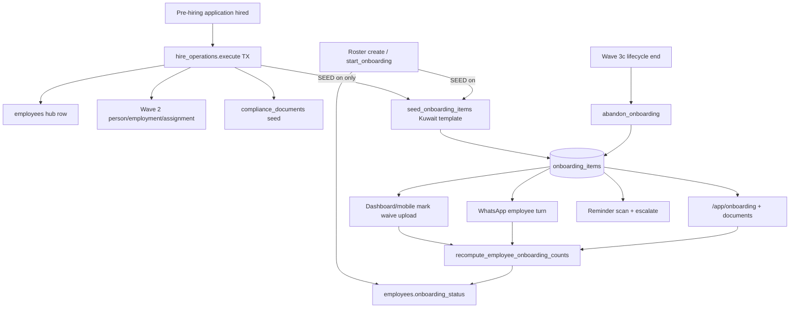

# Onboarding Wave 0 — Production truth & architecture audit

**Stamp:** `20260801T235617Z`  
**Evidence:** `ops/evidence/onboarding-wave0-prod-truth-20260801T235617Z/`  
**Tenant:** WATHEFNI  
**Mode:** Read-only (no code, deploy, UI redesign, E360/pre-hire/Wave D changes, or dark-feature enables)

---

## Objective verdict: **PARTIAL**

| Question | Answer |
|---|---|
| Production-ready to operate as the post-hire onboarding product? | **No** |
| Partially useful today? | **Yes** — observe/list, outbound reminders, doc-upload endpoint live; 4 real incomplete checklists exist |
| Architecturally strong? | **No** — checklist-centric with P0 loader corruption, dark mutation gates, legacy template drift, missing lifecycle controls |

**Do not enable `WATHEFNI_ONBOARDING_SEED` or `WATHEFNI_ONBOARDING_HR_MUTATE` until Wave 1 closes P0/P1.**

---

## 1. Current architecture & data-flow

**Canonical authority today**
- Hub identity: `employees.employee_key` (Wave 2 map is hire-time; checklist does **not** FK to person/employment)
- Checklist truth: `onboarding_items` PK `(employee_key, item_id)`
- Rollup status: `employees.onboarding_status` (**derived**, recomputed from required items)
- Hire durability: `hire_operations` idempotency (empty in WATHEFNI prod — hires likely via older/roster paths)
- Document bytes: storage fields on items + `employee_documents` / file registry / Kuwait governed journey (parallel)

**Duplicated / derived / parallel**
- Compliance expiry tasks on checklist vs real `compliance_documents` (template comments admit mirrors)
- ESS bank overlay (Employees 360 Wave 5) vs onboarding `bank_details` text item — dual collection surfaces
- Setup-console `OnboardingWizard` / `tc_onboarding_wizard_*` = **tenant** onboarding, not employee checklist
- Legacy `ai-recruiter/.../employee_onboarding.py` = non-authority parallel stack

---

## 2. Production truth (WATHEFNI, live)

### Flags (process environ)

| Flag | Live | Effect |
|---|---|---|
| `WATHEFNI_ONBOARDING_SEED` | **off** | New hires/start do not seed checklist |
| `WATHEFNI_ONBOARDING_HR_MUTATE` | **off** (unset) | Dashboard start/mark/waive blocked |
| `WATHEFNI_DOC_UPLOAD` | **on** | HR document upload endpoint live |
| `WATHEFNI_EMPLOYEE_APP` | **on** | App master on |
| `WATHEFNI_EMPLOYEE_APP_REQUIRE_ALLOWLIST` | **on** | |
| `WATHEFNI_EMPLOYEE_APP_REAL_ALLOWLIST` | Talal only | App onboarding only for canary |
| `WATHEFNI_OUTBOUND_FLOWS` includes `onboarding` | **on** | Reminders/welcome eligible |
| `WATHEFNI_ASSISTANT_HR_READS` | **on** | Assistant read tools eligible |
| Company module `onboarding` | **enabled** | Entitlement present |

Artifacts: `flags/live-flags.txt`, `raw/prod-truth.txt`, `data/item-breakdown.txt`.

### Counts

| Metric | Value |
|---|---|
| Employees | **4** (all four reals) |
| `onboarding_status=in_progress` | **4** |
| Checklist rows | **19** |
| Employees with items | **4** |
| Item statuses | pending **17**, received **2** |
| Orphan items (no employee) | **0** |
| `in_progress` with zero items | **0** |
| Completed-but-pending-required | **0** |
| `hire_operations` rows | **0** |

### Active cases

| Employee | Items | Pending required | Notes |
|---|---|---|---|
| Talal Fadhli `…252254` | 6 | 4 | ESS/app canary; legacy template labels |
| Fouad Burhamad `…363363` | 6 | 4 | reminder_count=2 on required docs |
| mohammad alqattan `…727743` | 6 | 2 | civil_id+bank **received**; passport/photo reminded **4×** |
| Brian Saleh `…411617` | 1 | 1 | only `personal_photo` (partial/aborted seed) |

**Template drift:** Live rows match an **older** short template (civil_id, passport required, education_cert, medical). Current code template `default_kuwait` is ~40 items with passport optional, owner/category populated. Prod rows have `owner`/`category` mostly **null**.

---

## 3. Routes & surfaces

| Surface | Path | Live usability |
|---|---|---|
| HR list | `GET /dashboard/posthire/onboarding` | Module+`onboarding.read`; counts via SQL |
| HR detail | `GET /dashboard/posthire/onboarding/{key}` | Uses `employee_onboarding_summary` → **corrupted loader** |
| HR actions | `POST /dashboard/posthire/action` (`start_onboarding`, `onboarding_mark_item`, remind) | **Blocked** by `HR_MUTATE=off` |
| Doc upload | `POST .../employees/{key}/documents` | **Live** (`DOC_UPLOAD=on`) + `onboarding.manage` |
| Mobile HR | `/dashboard/mobile/onboarding*` | Feature-gated review |
| Employee app | `/app/onboarding`, `/app/onboarding/documents` | Master on; **Talal allowlist only** |
| Internal | `/orchestrator/posthire/reminders/run`, `/orchestrator/onboarding/seed-missing` | Seed-missing no-ops while SEED off |
| WhatsApp | `handle_employee_onboarding_turn` | Parallel employee path |

OpenAPI onboarding paths: **8** (see `raw/prod-truth.txt`).

---

## 4. Permission & ownership matrix

| Actor | Permissions (prod) | Intended duties | Actual today |
|---|---|---|---|
| Owner (×2) | `onboarding.read`, `onboarding.manage` | Start, mark, waive, upload, remind | Read + upload only (mutate dark) |
| Viewer (×2) | `onboarding.read` | Observe | Read |
| Manager | scope via posthire helpers | Team visibility | Same gates + scope |
| Employee | app session + allowlist | Upload required docs / acks | Talal only; checklist legacy |
| HR (system owner tasks) | template `owner=hr\|system` | Readiness tasks | Not seeded on live rows |
| IT / Payroll | template readiness / bank | No dedicated roles | Bank item is employee text; payroll confirm task not in live data |
| Compliance | parallel module | Expiry truth | Checklist expiry tasks are mirrors only |

**Dual-control:** Not used for onboarding mark/waive (single HR action when mutate on). Lifecycle **abandon** is under Wave 3c dual-control employment end — keep that boundary.

---

## 5. Lifecycle / state model

### Employee rollup (`employees.onboarding_status`)
Observed: `not_started` | `in_progress` | `pending` | `complete`/`completed`/`done`  
Recompute: required pending → 0 and complete > 0 ⇒ completed.

### Item status
`pending` / `missing` / `requested` / `received` / `complete|completed|verified` / `waived` / `abandoned_employment_ended` (+ UI `rejected`)

### Missing product states / transitions
| Need | Status |
|---|---|
| Due dates / dependencies | **Absent** |
| Start-date change → reschedule | **Absent** |
| Delayed start | **Absent** |
| Withdraw / cancel onboarding | **Absent** (only lifecycle abandon on employment end) |
| Duplicate onboarding prevention | PK + seed skip existing ids; no “already completed restart” policy |
| Optimistic concurrency on mark | **Weak** (no expected_version on items) |
| Dedicated onboarding audit journal | **Absent** (admin audit on upload; hire_ops jsonb) |

---

## 6. Critical risks (ranked)

### P0
1. **`employee_onboarding_items` corrupted** (`app.py` ~32188–32208): checklist rows filtered as dashboard users via `candidates.read`. Detail/app/summary paths depend on it. Fragile/wrong; Employees 360 profile uses separate SQL (split brain).  
2. **Enabling SEED/HR_MUTATE on current code** would expand a broken loader + legacy/incomplete checklists without concurrency/cancel semantics.

### P1
3. **SEED off + status in_progress** with partial legacy items — silent incomplete onboarding; no path to Kuwait template without careful backfill.  
4. **HR_MUTATE off / DOC_UPLOAD on** — uploads without mark/waive authority mismatch.  
5. **No company_code on `onboarding_items`** — tenant only via employee_key join; reminder scans historically global then filtered (isolation risk).  
6. **Bank details on checklist vs ESS encrypted bank** — duplicate sensitive collection; freeze ESS bank allowlist empty while onboarding still asks IBAN as text.  
7. **Brian single-item checklist** — incomplete seed / inconsistent completion math.

### P2
8. Template registry only Kuwait; no company editor.  
9. No task dependencies / due dates / IT-Payroll swimlanes as real workflows.  
10. Setup-console “Onboarding” naming collision with employee checklist.  
11. Legacy ai-recruiter onboarding module confusion.  
12. EN/AR / mobile: dashboard i18n exists elsewhere; employee-app onboarding not qualified under E360 freeze for broad rollout.

---

## 7. Stay / remove / move / rebuild

| Asset | Recommendation |
|---|---|
| Kuwait template concept + categories/owners | **Stay** (rebuild seed to this; migrate legacy rows) |
| `onboarding_items` table + storage columns | **Stay** (add company_code / audit later) |
| Hire TX hook for seed | **Stay** (behind SEED, after P0 fix) |
| Reminder/outbound flow | **Stay** (after loader fix + tenant-safe queries) |
| Corrupted `employee_onboarding_items` body | **Remove/rebuild** immediately (Wave 1) |
| Legacy short template rows | **Migrate or replace** via controlled backfill |
| Checklist bank IBAN as plaintext goal | **Move** to ESS bank overlay (E360) — do not expand plaintext |
| Compliance expiry checklist mirrors | **Stay lightweight** or **move** fully to Compliance module |
| Shift/attendance readiness tasks | **Stay as HR tasks** — no auto-integration yet |
| Tenant setup OnboardingWizard | **Keep separate** (rename in docs to avoid confusion) |
| Cancel / start-date / dependencies | **Rebuild** as Wave 2+ product — do not fake in UI |
| Full UI redesign | **Defer** until authority/loader/template truth fixed |

---

## 8. Integration boundaries

| Module | Boundary |
|---|---|
| **Employees 360 (frozen)** | Profile can show checklist; must not bypass Wave 2 authority; do not redesign Workforce for onboarding |
| **Compliance** | Authoritative expiry/gov docs; checklist = prompts only |
| **Shifts / Attendance / Leave** | Readiness checkboxes only; no runtime coupling |
| **Payroll** | Owns money; onboarding must not compute pay; bank → ESS encryption path |
| **Pre-hire / Wave D (frozen)** | Hire handoff may seed later; do not change inbound/CV/Wave D to “fix” onboarding |
| **Employee app** | Allowlisted canary only; do not broaden for onboarding Wave 0 |

---

## 9. EN/AR, mobile, employee-app

- HR dashboard PostHire onboarding page exists (EN/AR shell via recruiting locale).  
- Operator mobile onboarding review routes exist.  
- Employee mobile `OnboardingView` exists behind app gates.  
- **Not production-qualified** as a multilingual end-to-end journey under current flags/corruption.  
- Broad employee-app onboarding = **out of scope** until E360 allowlist policy + Wave 1 fixes.

---

## 10. Recommended phased plan

| Wave | Goal | Exit |
|---|---|---|
| **0** (this) | Truth + architecture | **PARTIAL** verdict; no enables |
| **1** | Correctness & safety | Fix loader; unify read path; tenant-safe queries; decide bank→ESS; inventory migration for 4 reals; tests |
| **2** | Operate dark → controlled | Enable SEED+HR_MUTATE on staging then WATHEFNI with evidence; backfill template; reminder qualification |
| **3** | Lifecycle completeness | Cancel/withdraw, start-date change policy, concurrency tokens, audit journal |
| **4** | UX polish | Only after authority stable — no redesign-first |

---

## 11. Exact first implementation wave (**Wave 1**)

**Name:** Onboarding Wave 1 — loader repair & read-path single authority  

**In scope (implementation later — not this audit):**
1. Restore `employee_onboarding_items` to return checklist rows (delete recruiter filter).  
2. Make list/detail/app/profile use one read helper (no split brain).  
3. Assert tenant isolation on reminder/list SQL (`company_code` via join).  
4. Document bank-item policy: freeze plaintext IBAN expansion; point to ESS.  
5. Read-only migration plan for 4 reals (legacy → `default_kuwait` gaps) — apply only with SEED still off until approved.  
6. Regression tests: summary item count = SQL count; no `candidates.read` in onboarding loader; mark still gated by HR_MUTATE.

**Out of scope for Wave 1:** UI redesign, enabling SEED/HR_MUTATE in production, employee-app broaden, pre-hire/Wave D/E360 freeze changes, cancel/start-date features.

---

## 12. Tests & qualification required (before any enable)

| Gate | Requirement |
|---|---|
| Unit | Loader returns items; completion recompute; seed idempotent |
| Isolation | Manager scope; company join on list/remind |
| Staging canary | Seed → employee upload → HR mark → complete; SEED off leave-state |
| Corruption absence | Grep/ci: `employee_onboarding_items` must not reference `candidates.read` |
| E360 freeze regression | Still green (`smoke-test-employees360-freeze-regression.py`) |
| Prod enable checklist | Backup; SEED/HR_MUTATE drop-in; four-reals evidence; rollback |

---

## 13. Evidence index

| Path | Content |
|---|---|
| `raw/prod-truth.txt` | Flags, schema, counts, OpenAPI, corruption snippet |
| `flags/live-flags.txt` | Process environ subset |
| `data/item-breakdown.txt` | Per-item rows, gates, permissions |
| This `REPORT.md` | Verdict and plan |

---

## Bottom line

Onboarding is a **dark-launched checklist product** with **real incomplete cases** and **live reminder/upload plumbing**, but it is **not production-ready**. Treat as **PARTIAL**: observe only; **Wave 1 must repair the corrupted read path and template/authority truth** before any seed/mutate enablement.
