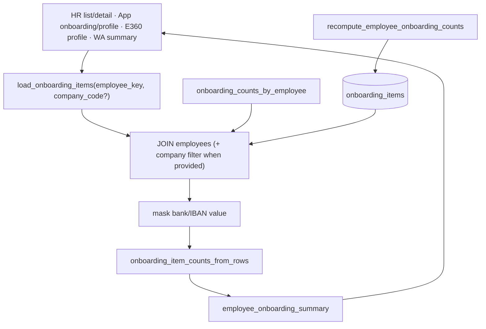

# Onboarding Wave 1 — Loader repair & single read authority

**Stamp:** `20260802T002257Z`  
**Evidence:** `ops/evidence/onboarding-wave1-loader-repair-20260802T002257Z/`  
**Scope:** Local + staging only (production app.py **not** deployed)  
**Constraints honored:** no SEED enable, no production deploy, no UI redesign, no employee-app broaden, Employees 360 / pre-hire / Wave D frozen

---

## Verdict

| Gate | Result |
|---|---|
| Wave 1 correctness (local/staging) | **PASS** |
| Employees 360 freeze regression (local) | **PASS** `54/54` |
| Production still on pre-Wave-1 loader | **Yes** (intentionally untouched) |
| Onboarding Wave 2 controlled operation | **NO-GO** until Wave 1 is production-deployed and migration/backfill plan is approved |

---

## Exact fixes

1. **Replaced corrupted `employee_onboarding_items`**  
   Removed recruiter/`candidates.read` filter. Loader now returns `onboarding_items` rows only.

2. **Canonical read helper `load_onboarding_items`**  
   Single authority for checklist reads. Always `JOIN employees`. Optional `company_code` enforces tenant. Masks bank/IBAN plaintext in `value`.

3. **Unified consumers**  
   - HR detail (`/dashboard/posthire/onboarding/{key}`)  
   - HR list counts (`onboarding_counts_by_employee`, waived-aligned)  
   - Employee app `/app/onboarding` + `/app/profile`  
   - Employees 360 profile onboarding section  
   - WhatsApp summary / next-item / missing-docs helpers  

4. **Tenant-safe reminders**  
   `pending_onboarding_reminder_candidates` **fail-closed** without `company_code`.  
   `run_onboarding_reminder_scan` iterates companies (or a single explicit company).  
   Reminder stamps join `employees` when company is known.  
   `employees_still_onboarding` / queue reply also company-scoped.

5. **Manager scope**  
   Detail already fail-closed via `context_manager_allows_employee`; list remains SQL-scoped via `_employee_scope_where`. Mark/mutate already gated.

6. **Count reconciliation**  
   `onboarding_item_counts_from_rows`, `recompute_employee_onboarding_counts`, and list SQL all treat `waived` as non-pending and align pending/received.

7. **Bank plaintext freeze**  
   - `onboarding_plaintext_bank_forbidden`  
   - WhatsApp receipt rejects `bank_details` / IBAN (`bank_via_ess_required`)  
   - App onboarding upload rejects bank item  
   - Next-item / reminders skip `bank_details`  
   - Template label points to encrypted ESS bank workflow  

8. **Flags**  
   Code defaults remain off. Production SEED stays off. Staging systemd still has pre-existing `WATHEFNI_ONBOARDING_HR_MUTATE=true` (not newly enabled by Wave 1).

9. **Read-only migration assessment**  
   `ops/onboarding-wave1-legacy-migration-assessment.py` — no writes.

---

## Canonical read-path design

**Authority rules**
- Checklist truth: `onboarding_items` via `load_onboarding_items` only (no parallel ad-hoc SELECT for profile/summary).
- Tenant: employee↔company join; wrong company → empty.
- Bank display: redacted; collection: ESS encrypted only.

---

## Four-real migration assessment (read-only, not applied)

Source: staging live DB (+ Wave 0 snapshot backup under `data/from-wave0-snapshot/`).

| Employee | Live items | Obsolete vs `default_kuwait` | Missing vs template | Conflicts |
|---|---|---|---|---|
| Talal `…252254` | 6 legacy | `education_cert`, `medical` | ~32 Kuwait template rows | passport required≠optional; bank→ESS |
| Fouad `…363363` | 6 legacy | same | ~32 | same |
| Mohammad `…727743` | 6 legacy | same | ~32 | bank already `received` (legacy plaintext path); passport conflict |
| Brian `…411617` | **0 on staging** (Wave 0 had 1 `personal_photo`) | — | full template | partial/absent seed |

**Policy:** do not backfill in Wave 1. Bank rows stay but plaintext collection is frozen.

Artifacts: `data/migration-assessment.md`, `data/migration-assessment.json`.

---

## Tests & evidence

| Proof | Result | Path |
|---|---|---|
| Local Wave 1 offline smoke | **28/28** | `tests/local-wave1-offline.txt` / `tests/wave1-read-authority.txt` |
| Staging Wave 1 smoke + DB | **38/38** | `tests/w1-smoke.txt` |
| Staging reconcile (3 reals present) | **ALL_MATCH** helper≡summary≡SQL; wrong-tenant empty; recompute match; bank blocked | `tests/w1-reconcile.txt` |
| Local E360 freeze regression | **54/54** | `tests/local-e360-freeze-regression.txt` |
| Static: no `candidates.read` in loader | staging **True**, prod still **True (corrupt)** | `flags/staging-and-prod-flags.txt` |
| SEED | staging process **False** | reconcile |
| HR_MUTATE | staging process **True** (pre-existing systemd) | flags + reconcile |
| Production deploy | **None** — prod loader still has `candidates.read` | flags |

New tests:
- `wathefni-orchestrator/smoke-test-onboarding-wave1-read-authority.py`
- `wathefni-orchestrator/ops/onboarding-wave1-legacy-migration-assessment.py`

---

## Remaining blockers

1. **Production still on corrupted loader** — Wave 1 code is staging/local only.  
2. **Legacy template drift** — four reals still on short legacy checklists; backfill not applied.  
3. **Brian incomplete/absent checklist** on staging.  
4. **Staging `HR_MUTATE=true`** pre-exists; Wave 2 must treat enablement as an explicit controlled step with evidence, not assume dark.  
5. **ESS bank allowlist still empty** — bank setup path is frozen to ESS, but real bank collection remains gated by E360 bank allowlist policy.  
6. **No cancel / start-date / concurrency** (Wave 3+).  

---

## Wave 2 GO / NO-GO

**NO-GO for production controlled operation.**

**Conditional GO for staging Wave 2 prep only if:**
- Wave 1 remains on staging (already true),
- SEED stays off until a written backfill plan for the four reals is approved,
- HR_MUTATE operations are exercised only under dual-control-style evidence (even if flag is currently true on staging),
- Bank plaintext remains blocked,
- Employees 360 freeze regression stays green after any Wave 2 changes.

**Do not enable production SEED/HR_MUTATE until Wave 1 is deployed to production and re-proven.**
