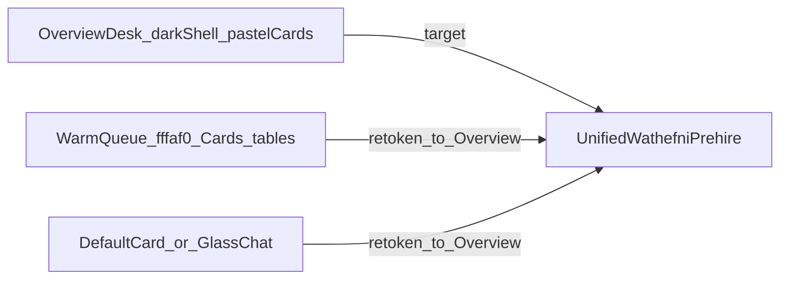

# Pre-hiring visual unification — locked direction

**Stamp:** `20260731T014945Z`  
**Phase:** Visual / UX consistency — shared system + distinct page personalities  
**Authority:** Current Overview  
**Direction status:** **LOCKED** (+ unity-without-repetition refinement; local implement authorized, **no deploy**)

Evidence pack: `ops/evidence/prehire-visual-direction-20260731T014945Z/`

---

## Image groups curated

| Label | Status | Path / method |
|---|---|---|
| Inspiration | Received | `inspiration/intelly-clinical.png`, `intelly-schedule.png`, `mobile-clinical-profile.png` |
| Current Overview | Received | `current-overview/overview-desktop.png` |
| Current Interviews | Received (prior evidence) | `current-interviews/interviews-en-desktop.png` |
| Current Assistant / Jobs / Candidates / Calendar / Assessments / Ranking / Reports | Not labeled by user | **Code-audited** from `apps/wathefni-dashboard` (see §3) |

Fresh labeled screenshots may refine page notes; they do **not** reopen Overview tokens or the do-not-copy list unless you explicitly reopen direction.

---

## 1. Visual system Overview establishes (authority)

| Rule | Spec |
|---|---|
| Canvas | Warm cream / bone (`#eee8da` framed stage on Overview; suite cream tokens in `index.css`) |
| Shell (Overview) | Dark framed rail `#23211d`; PRE-HIRING / POST-HIRE; active capsule + orange/red status dot; cream cut-out corner |
| Shell (target for all pre-hire) | **One shell:** promote Overview’s dark framed rail to Assistant→Reports (today other pages use a light glass sidebar — primary unification defect) |
| Radius | Panels ~1.45–1.55rem; rows ~1.1rem; CTAs `rounded-full` pills |
| Primary CTA | Solid near-black pill, white label |
| Accents | Semantic pastel **surfaces** only: yellow review, pink assessments, blue follow-up, green priority — not purple gradients |
| Type | Geometric sans on chrome/UI; Overview greeting bold sans. Prefer **sans for product UI** (Interviews serif titles are drift — align to Overview) |
| Depth | Color blocks + spacing; avoid multi-layer glow; soft shadow sparingly |
| Lists | Soft cream rows, circular initials, meta line, trailing black action |
| Calendar peek | Minimal month; today = filled black circle |

**Product feel:** friendly-premium HR ops desk.

---

## 2. Three families found in code (must collapse to one)

1. **Overview desk** — saturated flat sections, no shared `Card` chrome, **dark framed shell**  
2. **Warm queue ops** — Jobs / Interviews / Assessments / Ranking / Calendar board using `#fffaf0` sections/Cards  
3. **Token Card / glass** — Candidates & Reports (default cooler `Card`); Assistant (premium glass chat)

---

## 3. Page-by-page inconsistency map (refined)

| Page | Evidence | Keep | Change (visual only) |
|---|---|---|---|
| **Overview** | Screenshot | Pastel metric cards, work rows, calendar peek, black pills | Freeze as reference; extract tokens only |
| **App shell** | `App.tsx` | Overview dark framed rail | Apply same shell to all pre-hire routes (end light-sidebar fork) |
| **Jobs** | Code | Cream `#fffaf0` section, black status chips | Match Overview section radius/padding; FilterBar soft not gray-admin; keep table logic |
| **Candidates** | Code | Shared Button/Badge | Drop default cooler Card look; same cream section as Jobs/Overview; densify filters into soft FilterBar |
| **Interviews** | Screenshot + code | Warm cream, black active tabs | Replace serif headers with Overview sans; unify Card→cream panel language; StatusPill taxonomy |
| **Calendar** | Code | Cream board aligned to Overview peek | Pill-first view toggles (less `rounded-lg` ink squares); event chips use pastel taxonomy |
| **Assessments** | Code | Warm Cards | Button-tabs → SegmentedPillControl / Overview pill tabs; shared MetricActionCard where counts exist |
| **Ranking** | Code | Warm Cards, black Run | Same EntityRow / cream panel as Candidates; no separate “analytics skin” |
| **Reports** | Code | Shared Download pills | Apply `#fffaf0` / Overview surfaces (today untinted default Cards — furthest drift among lists) |
| **Assistant** | Code (`AdminAIPage`) | Capabilities, history, composer | Restyle to Overview cream stage + black CTAs; **do not** ship Intelly dark floating pink-X assistant brand |

---

## 4. Unity without repetition

**One Wathefni design system, distinct page personalities.**  
Do **not** interpret unification as cloning Overview’s metric-card grid, pastel blocks, or EntityRow onto every route.

### Shared across the suite (system)
- Dark framed shell + warm cream canvas  
- Typography hierarchy, radii, spacing rhythm  
- Black primary actions (used where the workflow needs a primary — not on every chip)  
- Semantic color taxonomy (review / assess / follow / priority / active)  
- Status language, responsive + RTL behavior  

### Avoid
- Identical page headers + identical four-card grids  
- Pastel block pattern on every page  
- Forcing every list into one EntityRow  
- Nested rounded containers inside rounded containers  
- Repetitive black pills on every surface  
- One layout template for different jobs  

### Page personalities + composition

| Page | Personality | Composition strategy |
|---|---|---|
| **Overview** | Editorial command desk | Varied metric cards, priority band, work queue, calendar peek — the only page that owns the multi-pastel “attention strip” |
| **Jobs** | Structured hiring portfolio | Strong list/table rhythm; job-state summary chips; denser columns; cream board without Overview’s colorful action grid |
| **Candidates** | People-focused workspace | Richer identity rows (avatar, signals, comparison cues); soft filter rail; higher row height / identity emphasis |
| **Interviews** | Schedule & coordination | Timeline / queue emphasis; tabbed states; detail drawer; less “card dashboard,” more coordination board |
| **Calendar** | Spatial time-planning | Full grid / day-week-month; event blocks as spatial objects — **not** another card dashboard |
| **Assessments** | Evaluation workspace | Score/progress hierarchy; cohort tabs; quieter surfaces; accent used for evaluation states, not decoration |
| **Ranking** | Comparison & decision support | Relative positioning, ranked list scale, clear winner/rank cues; minimal chrome |
| **Reports** | Analytical, quieter, data-led | Lower chroma, metric tiles, export lists; almost no pastel category blocks |
| **Assistant** | Conversational workspace | Focused transcript + composer composition; Wathefni cream/ink chrome — not a foreign dark floating product |

Shared primitives are **flexible variants** (density, scale, surface, accent role) — not rigid page templates. Controlled variation via composition, whitespace, and semantic accents only.

---

## 5. Shared tokens / components

**Tokens (Overview-first CSS variables)**  
`--wf-canvas`, `--wf-sidebar`, `--wf-surface`, `--wf-ink`, `--wf-ink-muted`,  
`--wf-accent-review|assess|follow|priority|active`,  
`--wf-radius-panel|card|pill`, `--wf-space-*`, `--wf-density-*`

**Primitives (variants, not templates)**  
AppShell · PageHeader (compact / editorial) · Surface (desk / board / quiet / chat) · MetricActionCard (**Overview-only pattern**) · SegmentedPillControl · WorkRow / PeopleRow / RankRow variants · StatusPill · EmptyState · FilterBar · CalendarChrome

**Out of scope:** permissions, entitlements, API contracts, workflow branching, product-rule copy.

**Seed files:**  
[`apps/wathefni-dashboard/src/index.css`](apps/wathefni-dashboard/src/index.css), [`App.tsx`](apps/wathefni-dashboard/src/App.tsx), [`pages/OverviewPage.tsx`](apps/wathefni-dashboard/src/pages/OverviewPage.tsx), shared [`components/ui/*`](apps/wathefni-dashboard/src/components/ui/)

---

## 6. Implementation order (local; no deploy)

1. Token + **AppShell lock** (kill light-sidebar fork)  
2. Overview freeze / token extract (personality unchanged)  
3. Jobs → Candidates → Interviews → Calendar → Assessments → Ranking → Reports (each keeps its composition)  
4. Assistant last (capabilities unchanged; chrome only)

---

## 7. Inspiration — do not copy

Healthcare IA · patient photo identity · pink multi-chip global search · floating dark Intelly Assistant · inventing Join/photo event UX · mobile wavy bottom nav · clinical score bars as Ranking language · accent proliferation · sticker clutter  

**Borrow only:** cream + dark rail, large radii, pastel category surfaces, black pills, soft rows with icon-circle + count pill, calendar today marker, low-shadow whitespace.

---

## 8. Direction approval

| Item | Status |
|---|---|
| Overview as visual authority | Approved |
| Unity without repetition | Approved |
| Intelly as polish reference only | Approved |
| No product/logic changes this phase | Approved |
| Do-not-copy list | Approved |
| Implementation order | Approved |
| UI code | **Local implement done** — see `IMPLEMENT_LOCAL.md` — visual qual pack `../prehire-visual-qual-20260731T021311Z/` — **do not deploy** |

Optional later: drop labeled Current screenshots for Assistant/Jobs/Candidates/Calendar/Assessments/Ranking/Reports into this evidence pack to replace code-audit notes only.
